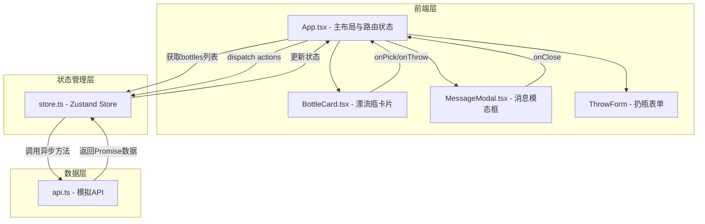

## 1. 架构设计



**数据流向**：
1. App.tsx 初始化时调用 `store.fetchBottles()` → `api.fetchBottles()` 获取瓶子列表
2. 用户捡起瓶子 → `store.pickBottle(id)` → `api.pickBottle(id)` → 更新bottles数组和currentBottleId
3. 用户扔掉瓶子 → `store.throwBottle(id)` → `api.throwBottle(id)` → 更新bottles数组
4. 用户扔回新瓶 → `api.throwBottle(newBottle)` → `store.fetchBottles()` 刷新列表

## 2. 技术说明

- **前端框架**：React 18 + TypeScript
- **构建工具**：Vite + @vitejs/plugin-react
- **状态管理**：Zustand
- **唯一标识**：uuid
- **样式方案**：CSS-in-JS（内联样式 + CSS模块）
- **数据来源**：模拟API（模块级数组存储，setTimeout模拟延迟）
- **后端**：无

## 3. 路由定义

| 路由 | 用途 |
|------|------|
| / | 主页，展示漂流瓶列表及所有交互功能 |

> 单页应用，无客户端路由，所有功能在一个页面内完成

## 4. API定义

```typescript
interface Bottle {
  id: string;
  url: string;
  comment: string;
  emoji: string;
  tag: string;
  passCount: number;
  height: number;
}

interface Message {
  id: string;
  url: string;
  comment: string;
  passCount: number;
  emoji: string;
}

// api.ts 导出函数
fetchBottles(): Promise<Bottle[]>
pickBottle(id: string): Promise<Message>
throwBottle(id: string): Promise<void>
throwNewBottle(bottle: Omit<Bottle, 'id' | 'passCount' | 'height'>): Promise<Bottle>
getMessage(id: string): Promise<Message>
```

## 5. 文件结构与调用关系

```
├── package.json          # 依赖声明与启动脚本
├── index.html            # 入口HTML，挂载#root
├── vite.config.ts        # Vite配置
├── tsconfig.json         # TypeScript配置
└── src/
    ├── main.tsx          # 入口，渲染App
    ├── App.tsx           # 主布局，管理路由状态 → 调用store
    ├── store.ts          # Zustand store → 调用api
    ├── api.ts            # 模拟API层，模块级数据存储
    └── components/
        ├── BottleCard.tsx  # 卡片组件，接收bottle+回调
        └── MessageModal.tsx # 模态框组件，接收message+onClose
```

**调用关系**：
- `main.tsx` → `App.tsx`
- `App.tsx` → `store.ts`（获取状态和actions）→ `components/BottleCard.tsx`、`components/MessageModal.tsx`
- `store.ts` → `api.ts`（异步数据请求）
