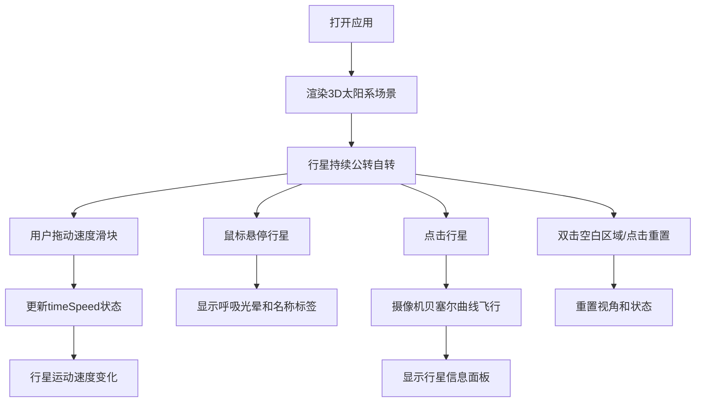

## 1. 产品概述

太阳系计时器是一款面向天文学爱好者的3D交互可视化应用，用户可在家中通过Web浏览器复现太阳系行星的真实运动，通过拖动滑块加速或减慢时间流速，沉浸式观察行星轨道和自转的实时变化。

- 目标用户：天文学爱好者、学生、教育工作者
- 核心价值：以直观的3D交互方式理解太阳系行星运动规律，提供可调速的沉浸式学习体验

## 2. 核心功能

### 2.1 功能模块

1. **3D太阳系场景**：发光太阳、8颗比例行星、椭圆轨道环、动态星空背景
2. **行星交互系统**：悬停光晕效果、名称标签、点击飞行视角、信息面板
3. **时间控制模块**：速度滑块（0.1x-10x）、行星选择下拉、重置按钮
4. **视角控制系统**：OrbitControls拖拽旋转、滚轮缩放、双击重置视角

### 2.2 页面详情

| 页面名称 | 模块名称 | 功能描述 |
|-----------|-------------|---------------------|
| 主场景 | 太阳渲染 | 黄色自发光球体，半径2单位，EmissiveMap自发光效果 |
| 主场景 | 行星系统 | 8颗按比例缩放的行星，随机噪点纹理，独立颜色材质 |
| 主场景 | 轨道系统 | 半透明白色圆环轨道（透明度0.2），按真实比例公转速度 |
| 主场景 | 星空背景 | 1000颗随机星星（大小0.02-0.1，白色到淡蓝色渐变），缓慢旋转 |
| 主场景 | 悬停交互 | 鼠标悬停行星时出现呼吸光晕（1.2x-1.5x半径正弦波动，周期1秒）和白色名称标签 |
| 主场景 | 点击交互 | 点击行星后摄像机2秒贝塞尔曲线飞行至近距视角（距离3单位，Zoom 80度），弹出信息面板 |
| 主场景 | 视角控制 | OrbitControls旋转阻尼0.1，滚轮缩放5-30单位，双击重置视角（距离15单位，俯角30度） |
| 控制面板 | 速度滑块 | 范围0.1x-10x，自定义渐变轨道样式，速度数字平滑变化 |
| 控制面板 | 行星选择 | 下拉菜单选择行星，摄像机自动飞行至对应行星 |
| 控制面板 | 重置按钮 | 重置时间速度、视角、选中状态 |
| 信息面板 | 行星数据 | 显示行星名称、平均轨道半径（公里）、公转周期（地球年）、卫星数量 |

## 3. 核心流程

用户打开应用 → 看到默认视角的太阳系场景（行星持续公转自转） → 拖动左下角速度滑块调整时间流速 → 鼠标悬停行星查看名称和光晕 → 点击行星飞行近距视角并查看信息面板 → 双击空白区域或点击重置按钮回到默认视角

## 4. 用户界面设计

### 4.1 设计风格

- **整体风格**：深空科幻风格，沉浸式宇宙体验
- **主色调**：深空蓝黑渐变背景 `#0A0A1A`，强调色青蓝 `#00E5FF`
- **辅助色**：行星各自的真实颜色，白色标签 `#FFFFFF`，信息文字 `#E0E0E0`
- **UI背板**：毛玻璃效果 `rgba(20,20,30,0.7)`，模糊10px，圆角16px
- **字体**：等宽字体用于速度数字，无衬线字体用于标签和信息面板

### 4.2 页面设计概述

| 页面名称 | 模块名称 | UI元素 |
|-----------|-------------|-------------|
| 主场景 | 3D渲染 | 全屏Canvas（100vw×100vh），无边框，WebGL渲染 |
| 主场景 | 控制面板 | 固定左下角，毛玻璃背景，内边距20px，包含滑块、下拉、按钮 |
| 主场景 | 滑块样式 | 轨道6px高，深蓝`#1A1A2E`到浅蓝`#4A90D9`渐变，滑块18px白色圆形带阴影 |
| 主场景 | 速度数字 | monospace字体，`#00E5FF`，24px |
| 主场景 | 信息面板 | 固定右上角，淡入动画（opacity 0→1，translateX 20→0，0.4s ease-out），标题18px加粗，数据14px，行间距8px |
| 主场景 | 行星标签 | 白色14px无衬线字体，带黑色描边，悬浮在行星上方 |
| 主场景 | 呼吸光晕 | 颜色与行星对应，大小正弦波动，周期1秒 |

### 4.3 响应式设计

- **桌面端（>768px）**：控制面板固定左下角，默认尺寸
- **平板（≤768px）**：控制面板宽度缩至90%，滑块宽度自适应
- **移动端（≤480px）**：控制面板折叠为底部横条，高度60px，滑块和速度指示器水平排列
- 所有状态切换（重置视角等）均有0.3秒过渡动画

### 4.4 3D场景指导

- **环境光照**：太阳作为点光源，强度2.0，颜色`#FFFFAA`，额外添加0.1强度的环境光
- **相机设置**：默认PerspectiveCamera，fov 60，near 0.1，far 1000，初始位置距离太阳15单位，俯角30度
- **后处理效果**：Bloom发光效果（太阳和行星光晕），不启用抗锯齿以保证性能
- **性能预算**：平均帧率≥45fps，每帧最多8次公转三角函数计算，自转与公转合并循环
- **星空背景**：1000颗Points，大小0.02-0.1，颜色`#FFFFFF`到`#ADD8E6`随机，每帧旋转0.0001弧度
