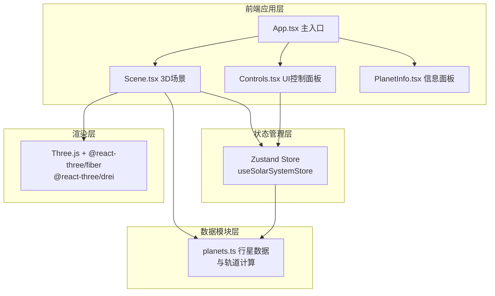

## 1. 架构设计



## 2. 技术描述

- **前端框架**：React@18 + TypeScript
- **构建工具**：Vite@5 + @vitejs/plugin-react
- **3D渲染**：Three.js + @react-three/fiber + @react-three/drei
- **状态管理**：Zustand
- **样式方案**：CSS Modules + 原生CSS（无需额外CSS框架）
- **无后端**：纯前端应用，所有数据内置

## 3. 项目结构

```
auto301/
├── package.json
├── vite.config.js
├── tsconfig.json
├── index.html
└── src/
    ├── App.tsx                    # 主布局组件
    ├── main.tsx                   # React入口
    ├── index.css                  # 全局样式
    ├── scene/
    │   ├── Scene.tsx              # 3D场景主组件
    │   ├── Sun.tsx                # 太阳组件
    │   ├── Planet.tsx             # 行星组件
    │   ├── Orbit.tsx              # 轨道环组件
    │   └── Starfield.tsx          # 星空背景组件
    ├── data/
    │   └── planets.ts             # 行星数据与轨道计算模块
    ├── store/
    │   └── useSolarSystemStore.ts # Zustand状态管理
    └── ui/
        ├── Controls.tsx           # 控制面板组件
        ├── PlanetInfo.tsx         # 行星信息面板组件
        └── styles/
            ├── Controls.module.css
            └── PlanetInfo.module.css
```

## 4. 数据模型

### 4.1 行星数据定义

```typescript
// src/data/planets.ts
export interface PlanetData {
  id: string;
  name: string;
  nameCN: string;
  radius: number;           // 行星半径（单位）
  color: string;            // 材质颜色
  orbitRadius: number;      // 轨道半径（单位）
  orbitPeriod: number;      // 公转周期（相对地球年）
  rotationPeriod: number;   // 自转周期（相对地球日）
  realOrbitRadius: number;  // 真实平均轨道半径（公里）
  realOrbitPeriod: number;  // 真实公转周期（地球年）
  satelliteCount: number;   // 卫星数量
  hasRings?: boolean;       // 是否有光环（土星）
}

export const PLANETS: PlanetData[] = [
  { id: 'mercury', name: 'Mercury', nameCN: '水星', radius: 0.2, color: '#B5B5B5', orbitRadius: 4, orbitPeriod: 0.24, rotationPeriod: 58.6, realOrbitRadius: 57910000, realOrbitPeriod: 0.24, satelliteCount: 0 },
  { id: 'venus', name: 'Venus', nameCN: '金星', radius: 0.4, color: '#E8C77A', orbitRadius: 6, orbitPeriod: 0.62, rotationPeriod: 243, realOrbitRadius: 108200000, realOrbitPeriod: 0.62, satelliteCount: 0 },
  { id: 'earth', name: 'Earth', nameCN: '地球', radius: 0.5, color: '#4B9CD3', orbitRadius: 8.5, orbitPeriod: 1, rotationPeriod: 1, realOrbitRadius: 149600000, realOrbitPeriod: 1, satelliteCount: 1 },
  { id: 'mars', name: 'Mars', nameCN: '火星', radius: 0.4, color: '#C1440E', orbitRadius: 11, orbitPeriod: 1.88, rotationPeriod: 1.03, realOrbitRadius: 227940000, realOrbitPeriod: 1.88, satelliteCount: 2 },
  { id: 'jupiter', name: 'Jupiter', nameCN: '木星', radius: 1.5, color: '#D4A574', orbitRadius: 15, orbitPeriod: 11.86, rotationPeriod: 0.41, realOrbitRadius: 778330000, realOrbitPeriod: 11.86, satelliteCount: 95 },
  { id: 'saturn', name: 'Saturn', nameCN: '土星', radius: 1.2, color: '#E3DAC4', orbitRadius: 19, orbitPeriod: 29.46, rotationPeriod: 0.45, realOrbitRadius: 1429400000, realOrbitPeriod: 29.46, satelliteCount: 146, hasRings: true },
  { id: 'uranus', name: 'Uranus', nameCN: '天王星', radius: 0.8, color: '#73B5D8', orbitRadius: 23, orbitPeriod: 84.01, rotationPeriod: 0.72, realOrbitRadius: 2870990000, realOrbitPeriod: 84.01, satelliteCount: 27 },
  { id: 'neptune', name: 'Neptune', nameCN: '海王星', radius: 0.7, color: '#3B5BA5', orbitRadius: 27, orbitPeriod: 164.8, rotationPeriod: 0.67, realOrbitRadius: 4504000000, realOrbitPeriod: 164.8, satelliteCount: 14 },
];
```

### 4.2 Zustand Store 定义

```typescript
// src/store/useSolarSystemStore.ts
interface SolarSystemState {
  timeSpeed: number;              // 时间流速 0.1-10
  selectedPlanetId: string | null; // 选中的行星ID
  hoveredPlanetId: string | null;  // 悬停的行星ID
  planetAngles: Record<string, number>; // 行星当前公转角度
  planetRotations: Record<string, number>; // 行星当前自转角度
  
  setTimeSpeed: (speed: number) => void;
  setSelectedPlanet: (id: string | null) => void;
  setHoveredPlanet: (id: string | null) => void;
  updatePlanetPositions: (deltaTime: number) => void;
  reset: () => void;
}
```

## 5. 核心算法

### 5.1 行星轨道计算

```typescript
// 每帧更新行星位置
// 公转角度增量 = (2π / 公转周期) * 时间流速 * deltaTime
// 位置x = orbitRadius * cos(angle)
// 位置z = orbitRadius * sin(angle)
```

### 5.2 摄像机飞行动画

- 使用贝塞尔曲线插值，2秒完成飞行
- 目标位置：行星位置 + 方向向量 * 3单位距离
- 使用 requestAnimationFrame 驱动动画帧

## 6. 性能优化策略

1. **计算优化**：每帧最多8次三角函数运算（8颗行星），自转与公转合并为单次循环
2. **渲染优化**：不启用抗锯齿，使用 Points 渲染星空
3. **状态优化**：Zustand 状态按需订阅，避免不必要的重渲染
4. **材质复用**：相同类型材质共享实例，噪点纹理使用 Canvas 程序化生成
