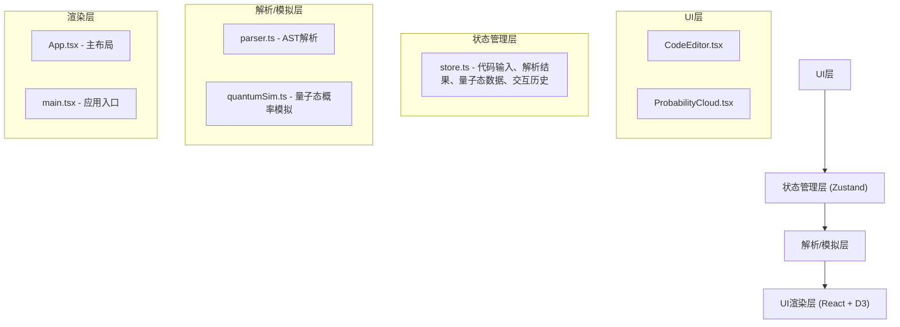

## 1. 架构设计



## 2. 技术描述

- **前端框架**：React 18 + TypeScript
- **构建工具**：Vite + @vitejs/plugin-react
- **状态管理**：Zustand
- **可视化库**：D3.js v7
- **代码解析**：自定义AST解析器
- **初始化方式**：手动配置项目结构

## 3. 项目文件结构

```
auto303/
├── package.json
├── vite.config.js
├── tsconfig.json
├── index.html
└── src/
    ├── main.tsx          # React应用入口
    ├── App.tsx           # 主应用组件，布局管理
    ├── store.ts          # Zustand状态管理
    ├── components/
    │   ├── CodeEditor.tsx      # 代码编辑器组件
    │   └── ProbabilityCloud.tsx # 概率云图组件
    └── utils/
        ├── parser.ts     # 代码AST解析工具
        └── quantumSim.ts # 量子态概率模拟工具
```

## 4. 核心类型定义

```typescript
// 代码结构节点类型
interface CodeNode {
  id: string;
  type: 'variable' | 'function' | 'loop' | 'condition';
  name: string;
  codeSnippet: string;
  nestDepth: number;
  occurrence: number;
}

// 代码连接关系
interface CodeEdge {
  source: string;
  target: string;
  type: 'assignment' | 'call' | 'flow';
}

// 解析结果
interface ParseResult {
  nodes: CodeNode[];
  edges: CodeEdge[];
  complexity: number;
}

// 量子态节点
interface QuantumNode {
  id: string;
  probability: number;
  color: string;
  radius: number;
  x?: number;
  y?: number;
  vx?: number;
  vy?: number;
}

// 量子态数据
interface QuantumState {
  nodes: QuantumNode[];
  edges: CodeEdge[];
}

// Store状态
interface AppState {
  codeInput: string;
  parseResult: ParseResult | null;
  quantumState: QuantumState | null;
  selectedNodeId: string | null;
  interactionHistory: string[];
  setCodeInput: (code: string) => void;
  selectNode: (id: string | null) => void;
  addToHistory: (action: string) => void;
  resetView: () => void;
}
```

## 5. 核心算法

### 5.1 代码解析算法（parser.ts）
- 基于正则表达式和关键字匹配提取代码结构
- 识别变量声明（const/let/var）、函数定义（function/=>）、循环（for/while）、条件分支（if/else/switch）
- 计算嵌套深度和出现次数
- 构建节点间连接关系（赋值、调用、控制流）

### 5.2 量子态模拟算法（quantumSim.ts）
- 节点权重 = 嵌套深度 × 2 + 出现次数 × 1.5
- 概率值 = 节点权重 / 所有权重之和
- 颜色映射：概率0→蓝色#00BFFF，概率1→紫色#8A2BE2，线性插值
- 节点半径：10px + 概率值 × 30px

### 5.3 D3力导向布局参数
- 电荷强度（charge）：-300
- 连接距离（linkDistance）：120
- 碰撞半径（collisionRadius）：30
- 拖拽惯性衰减：0.9
- 缩放范围：0.5 - 3倍
