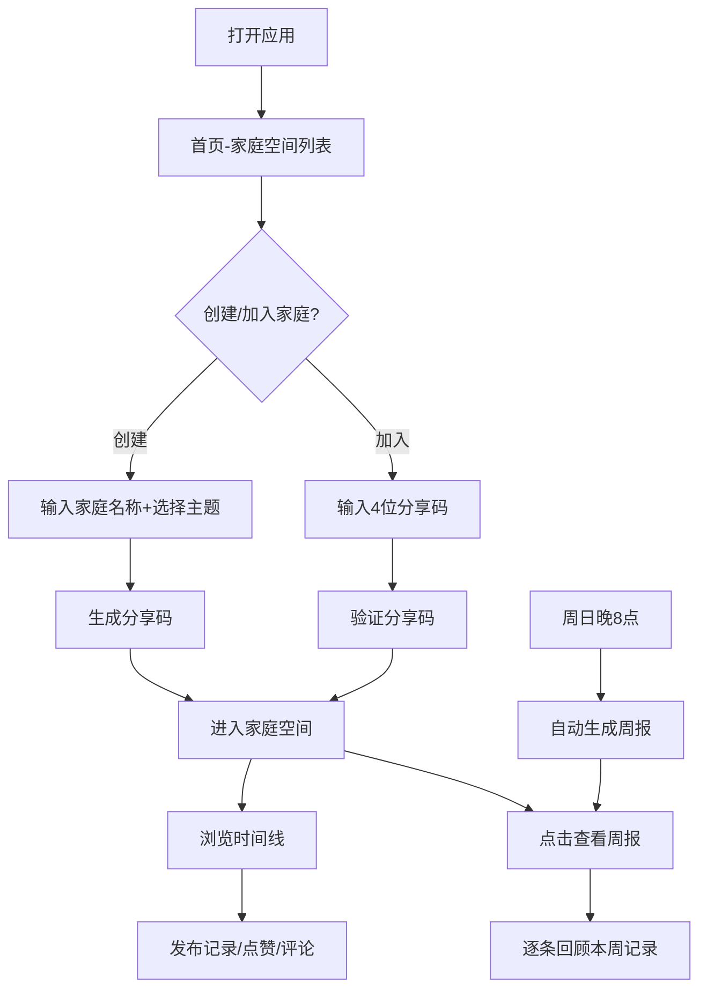

## 1. 产品概述
小确幸家庭记录册是一个帮助家庭成员记录和分享日常温馨瞬间的私密全栈应用。解决了传统社交平台过于公开、相册缺少趣味性的痛点，为家庭成员提供一个私密、有趣、带互动性的记录和回顾工具。
- 主要面向家庭用户，无需注册即可使用，通过4位数字分享码加入家庭空间
- 产品价值：珍藏家庭温暖瞬间，增强家庭成员间的情感连接

## 2. 核心 Features

### 2.1 用户角色
无需注册，通过昵称加入家庭空间即可使用所有功能。

| 角色 | 加入方式 | 核心权限 |
|------|----------|----------|
| 家庭成员 | 创建空间或输入分享码加入 | 发布记录、点赞、评论、查看周报、随机抽取 |

### 2.2 Feature Module
1. **首页**：家庭空间卡片列表、创建家庭空间入口、加入家庭空间入口
2. **家庭空间页**：时间线记录列表、发布记录表单、随机小确幸按钮
3. **周报页面**：周报封面、心情统计环形图、逐条回顾本周记录

### 2.3 Page Details
| 页面名称 | 模块名称 | Feature 描述 |
|----------|----------|--------------|
| 首页 | 家庭卡片列表 | 瀑布流布局显示已加入的家庭空间，卡片使用主题色背景，显示家庭名称、成员头像、最后记录时间 |
| 首页 | 创建/加入家庭 | 创建时输入家庭名称、选择主题色，生成4位分享码；输入分享码加入已有家庭 |
| 家庭空间页 | 记录发布表单 | 支持文字（≤140字）、图片（拍照/上传，≤2MB，压缩至800px宽）、心情标签选择 |
| 家庭空间页 | 时间线列表 | 按时间倒序排列记录卡片，支持分页加载（每页10条）、图片懒加载 |
| 家庭空间页 | 记录卡片 | 显示成员头像、文字内容、图片、心情标签、点赞按钮、评论区域 |
| 家庭空间页 | 随机小确幸 | 点击按钮随机抽取一条记录，居中弹窗展示，支持查看详情 |
| 周报页面 | 周报封面 | 随机本周图片做模糊背景+毛玻璃效果，显示周报标题 |
| 周报页面 | 心情统计 | Canvas绘制环形图，统计本周各心情类型占比 |
| 周报页面 | 逐条回顾 | 左右滑动翻页动画，逐条展示本周记录，显示点赞和评论数 |

## 3. 核心 User Flow
用户打开应用 → 查看已加入的家庭空间列表 → 创建新家庭或输入分享码加入 → 进入家庭空间 → 浏览时间线记录 → 发布新记录/点赞/评论 → 周日晚8点自动生成周报 → 查看周报并逐条回顾

## 4. User Interface Design

### 4.1 Design Style
- **设计理念**：温暖、圆润、治愈系，营造家的温馨感
- **主色调**：米白色背景 #FFF8E7，文字主色 #2D3436，辅助色 #636E72
- **主题强调色**：
  - 暖阳橙 #E17055
  - 森系绿 #00B894
  - 海洋蓝 #0984E3
  - 樱花粉 #E84393
- **心情标签色**：
  - 开心 #FF6B6B 😄
  - 感动 #4ECDC4 😢
  - 惊喜 #FFD93D 🎉
  - 温馨 #6BCB77 🏠
  - 有趣 #A29BFE 😆
- **卡片样式**：圆角 12px，阴影 0 4px 16px rgba(0,0,0,0.08)
- **按钮样式**：圆润按钮，最小高度 48px（移动端），悬停有缩放反馈
- **字体**：使用圆润无衬线字体，标题加粗，正文适中
- **动效**：卡片进入视口向上滑入动画，点赞缩放动画，弹窗中心放大动画

### 4.2 Page Design Overview
| 页面名称 | 模块名称 | UI 元素 |
|----------|----------|----------|
| 首页 | 家庭卡片列表 | 瀑布流2列布局，主题色卡片背景，成员圆形头像，进入动画依次延迟 |
| 首页 | 创建/加入模态框 | 圆角表单，主题色选择器，4位数字分享码显示/输入 |
| 家庭空间页 | 顶部导航 | 返回按钮，家庭名称，主题色装饰条 |
| 家庭空间页 | 发布表单 | 文本输入框，图片上传按钮，心情标签选择器，提交按钮 |
| 家庭空间页 | 时间线 | 瀑布流2列，图片懒加载，分页指示器 |
| 家庭空间页 | 记录卡片 | 头像+名称，心情标签，文字内容，图片，点赞按钮（爱心动画），评论区 |
| 家庭空间页 | 随机按钮 | 固定悬浮按钮，摇一摇动效 |
| 家庭空间页 | 随机弹窗 | 半透明模糊背景，居中圆角弹窗，中心放大进入动画 |
| 周报页面 | 封面 | 全屏模糊背景+毛玻璃，大标题，开始回顾按钮 |
| 周报页面 | 心情统计 | Canvas环形图，图例说明 |
| 周报页面 | 回顾卡片 | 全屏卡片，左右滑动切换，平移+透明度过渡动画 |

### 4.3 Responsiveness
- **桌面端**（≥1200px）：最大宽度1200px居中，瀑布流2列
- **平板端**（768px-1200px）：自适应宽度，瀑布流2列
- **移动端**（<768px）：瀑布流1列，弹窗全屏，按钮最小高度48px，字体适当缩小

### 4.4 性能要求
- 滚动性能保持60fps
- 图片懒加载（IntersectionObserver）
- 分页加载：每页10条，预加载下一页2条
- 动画使用CSS transform和opacity，确保硬件加速
