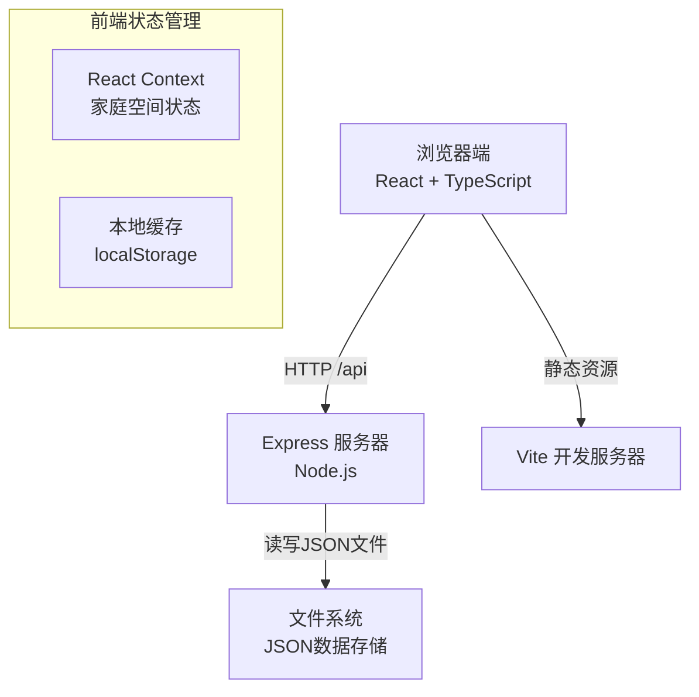
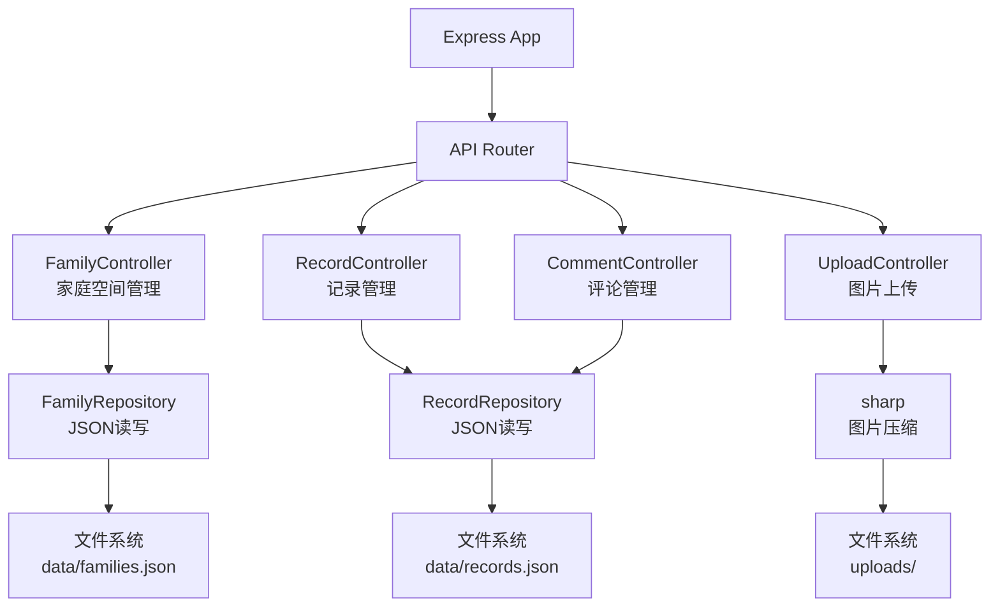
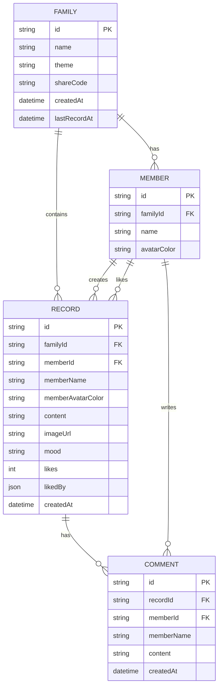

## 1. Architecture Design
前后端分离的全栈应用，前端使用React + TypeScript + Vite，后端使用Node.js + Express，数据存储使用JSON文件系统。



## 2. Technology Description
- **前端**：React 18 + TypeScript + Vite 5
  - 路由：react-router-dom v6
  - 状态管理：React Context
  - 图标：lucide-react
  - Emoji选择器：emoji-picker-react
  - 图片处理：浏览器Canvas压缩
- **后端**：Express 4 + Node.js
  - 跨域：cors
  - 文件上传：multer
  - 图片处理：sharp
  - 唯一ID：uuid
- **构建工具**：Vite 5，配置代理将/api请求转发到后端
- **数据存储**：JSON文件（families.json, records.json）
- **包管理器**：npm

## 3. Route Definitions
| Route | 用途 |
|-------|------|
| / | 首页 - 家庭空间卡片列表、创建/加入入口 |
| /family/:id | 家庭空间页 - 时间线、发布表单、随机小确幸 |
| /weekly/:id | 周报页面 - 封面、心情统计、逐条回顾 |

## 4. API Definitions

### 4.1 类型定义
```typescript
interface Theme {
  id: 'orange' | 'green' | 'blue' | 'pink';
  name: string;
  primaryColor: string;
  bgColors: string[];
}

interface Member {
  id: string;
  name: string;
  avatarColor: string;
}

interface Family {
  id: string;
  name: string;
  theme: Theme['id'];
  shareCode: string;
  members: Member[];
  createdAt: string;
  lastRecordAt: string | null;
}

interface Mood {
  id: 'happy' | 'touched' | 'surprised' | 'warm' | 'funny';
  name: string;
  emoji: string;
  color: string;
}

interface Comment {
  id: string;
  memberId: string;
  memberName: string;
  content: string;
  createdAt: string;
}

interface Record {
  id: string;
  familyId: string;
  memberId: string;
  memberName: string;
  memberAvatarColor: string;
  content: string;
  imageUrl: string | null;
  mood: Mood['id'];
  likes: number;
  likedBy: string[];
  comments: Comment[];
  createdAt: string;
}

interface WeeklyReport {
  familyId: string;
  weekStart: string;
  weekEnd: string;
  records: Record[];
  moodStats: Record<Mood['id'], number>;
}
```

### 4.2 接口定义
| 方法 | 路径 | 描述 | 请求参数 | 响应 |
|------|------|------|----------|------|
| POST | /api/families | 创建家庭空间 | `{ name: string, theme: string, creatorName: string }` | `Family` |
| POST | /api/families/join | 加入家庭空间 | `{ shareCode: string, memberName: string }` | `Family` |
| GET | /api/families/:id | 获取家庭空间详情 | `id` | `Family` |
| GET | /api/families | 获取所有家庭空间列表 | - | `Family[]` |
| GET | /api/families/:id/records | 获取家庭记录列表 | `id`, `page=1`, `limit=10` | `{ records: Record[], total: number, hasMore: boolean }` |
| POST | /api/families/:id/records | 发布新记录 | `id`, FormData: `{ content, mood, memberId, memberName, memberAvatarColor, image? }` | `Record` |
| POST | /api/records/:id/like | 点赞/取消点赞 | `id`, `{ memberId: string }` | `{ likes: number, liked: boolean }` |
| POST | /api/records/:id/comments | 添加评论 | `id`, `{ memberId, memberName, content }` | `Comment` |
| GET | /api/families/:id/weekly | 获取本周周报 | `id` | `WeeklyReport` |
| GET | /api/families/:id/random | 随机获取一条记录 | `id` | `Record` |
| GET | /images/:filename | 获取上传的图片 | `filename` | 图片文件 |

## 5. Server Architecture Diagram


## 6. Data Model

### 6.1 数据模型定义


### 6.2 JSON文件结构
**data/families.json:**
```json
[
  {
    "id": "uuid",
    "name": "温馨小家",
    "theme": "orange",
    "shareCode": "1234",
    "members": [
      {
        "id": "uuid",
        "name": "爸爸",
        "avatarColor": "#E17055"
      }
    ],
    "createdAt": "2026-01-01T00:00:00.000Z",
    "lastRecordAt": "2026-01-15T12:00:00.000Z"
  }
]
```

**data/records.json:**
```json
[
  {
    "id": "uuid",
    "familyId": "family-uuid",
    "memberId": "member-uuid",
    "memberName": "爸爸",
    "memberAvatarColor": "#E17055",
    "content": "今天孩子第一次叫爸爸！",
    "imageUrl": "/images/xxx.jpg",
    "mood": "touched",
    "likes": 3,
    "likedBy": ["member-id-1", "member-id-2"],
    "comments": [
      {
        "id": "comment-uuid",
        "memberId": "member-id-2",
        "memberName": "妈妈",
        "content": "太感动了😭",
        "createdAt": "2026-01-15T12:30:00.000Z"
      }
    ],
    "createdAt": "2026-01-15T12:00:00.000Z"
  }
]
```

## 7. 项目结构
```
auto305/
├── package.json          # 前后端统一依赖配置
├── vite.config.js        # Vite配置，含代理
├── tsconfig.json         # TypeScript配置
├── index.html            # 入口HTML
├── src/
│   ├── App.tsx           # 路由配置
│   ├── main.tsx          # 入口文件
│   ├── pages/
│   │   ├── HomePage.tsx
│   │   ├── FamilyPage.tsx
│   │   └── WeeklyReportPage.tsx
│   ├── components/
│   │   ├── RecordCard.tsx
│   │   ├── FamilyCard.tsx
│   │   ├── CreateFamilyModal.tsx
│   │   ├── JoinFamilyModal.tsx
│   │   ├── RecordForm.tsx
│   │   ├── RandomModal.tsx
│   │   ├── Avatar.tsx
│   │   ├── MoodTag.tsx
│   │   ├── LikeButton.tsx
│   │   └── CommentSection.tsx
│   ├── context/
│   │   └── FamilyContext.tsx
│   ├── hooks/
│   │   ├── useInfiniteScroll.ts
│   │   ├── useImageLazyLoad.ts
│   │   └── useIntersectionObserver.ts
│   ├── utils/
│   │   ├── storage.ts
│   │   ├── api.ts
│   │   ├── theme.ts
│   │   └── mood.ts
│   └── types/
│       └── index.ts
├── server/
│   ├── index.js          # Express服务入口
│   ├── controllers/
│   │   ├── familyController.js
│   │   ├── recordController.js
│   │   └── commentController.js
│   ├── data/
│   │   ├── families.json
│   │   └── records.json
│   └── uploads/          # 图片上传目录
└── .trae/
    └── documents/
        ├── prd.md
        └── tech-arch.md
```
