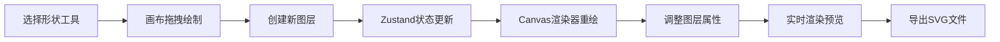

## 1. 产品概述
矢量层叠画布是一款面向数字艺术创作者的Web前端绘图工具，支持多层矢量图形绘制、独立变换与SVG导出。
- 目标用户：数字艺术创作者、UI设计师、插画师
- 核心价值：提供灵活的多图层矢量创作体验，无需安装软件即可在浏览器中完成专业级矢量图形创作

## 2. 核心特性

### 2.1 用户角色
| 角色 | 注册方式 | 核心权限 |
|------|----------|----------|
| 访客用户 | 无需注册 | 完整使用所有绘图、编辑和导出功能 |

### 2.2 功能模块
1. **主画布区域**：矢量图形绘制、实时渲染、拖拽交互
2. **图层面板**：图层列表管理、属性调整、拖拽排序
3. **顶部工具栏**：形状选择、颜色设置、透明度调整、旋转/模糊控制、撤销重做、导出
4. **变换系统**：移动、缩放、旋转、模糊、透明度等图层独立变换
5. **历史记录**：10步撤销/重做功能
6. **导出模块**：SVG格式导出，保留变换属性

### 2.3 页面详情
| 页面名称 | 模块名称 | 功能描述 |
|----------|----------|----------|
| 主页面 | 画布区域 | 占主体70%，浅灰棋盘格背景，支持最多8个图层绘制，选中显示蓝色虚线边框 |
| 主页面 | 图层面板 | 左侧280px宽，深灰蓝色背景，显示图层缩略图和属性，支持拖拽排序和删除 |
| 主页面 | 顶部工具栏 | 56px高，白色背景带阴影，形状选择、颜色、透明度滑块、数字输入框、操作按钮 |

## 3. 核心流程

### 3.1 绘图流程
用户选择形状工具→在画布拖拽绘制→图层自动添加→调整图层属性→实时预览→导出SVG

### 3.2 图层操作流程
选中图层→拖拽移动/缩放→调整透明度/旋转/模糊→删除/排序→自动保存历史记录

## 4. 用户界面设计

### 4.1 设计风格
- 主色调：深灰蓝#263238、蓝色#2196F3、浅蓝#E3F2FD
- 辅助色：矩形#FF5722、圆形#4CAF50、三角形#2196F3、星形#FFC107
- 背景色：画布棋盘格#E0E0E0/#F5F5F5、面板#263238、工具栏#FFFFFF
- 字体：Roboto（Google Fonts引入）
- 按钮风格：圆角6px，悬停浅蓝背景，0.2s平滑过渡
- 整体风格：Material Design，专业简洁，聚焦创作体验

### 4.2 页面设计概述
| 页面名称 | 模块名称 | UI元素 |
|----------|----------|----------|
| 主页面 | 画布区域 | 棋盘格背景、矢量形状、蓝色虚线选中边框、缩放手柄、transform/opacity过渡动画 |
| 主页面 | 图层面板 | 圆形缩略图20x20px、12px属性文字、3px蓝色高亮条、60px图层项高度、拖拽排序 |
| 主页面 | 顶部工具栏 | Material Icons图标按钮、彩色圆形形状按钮（缩放选中效果）、自定义透明度滑块、数字输入框 |

### 4.3 响应式
- 桌面端（≥768px）：左侧面板280px固定宽度，画布占剩余空间
- 移动端（<768px）：图层面板折叠为40px左侧图标按钮，点击后侧滑展开
- 触控优化：增加触控热区，支持触控拖拽和缩放

### 4.4 动画与过渡
- 所有操作0.2s平滑过渡（transform和opacity）
- 删除图层0.2s缩小消失动画
- 形状选中边框0.2s过渡动画
- 工具按钮悬停和选中缩放效果
- 面板展开/收起侧滑动画

## 5. 性能约束
- 8个图层同时存在且都有变换效果时，重绘帧率≥30FPS
- SVG导出耗时≤2秒
- 属性调整实时响应，无明显卡顿
