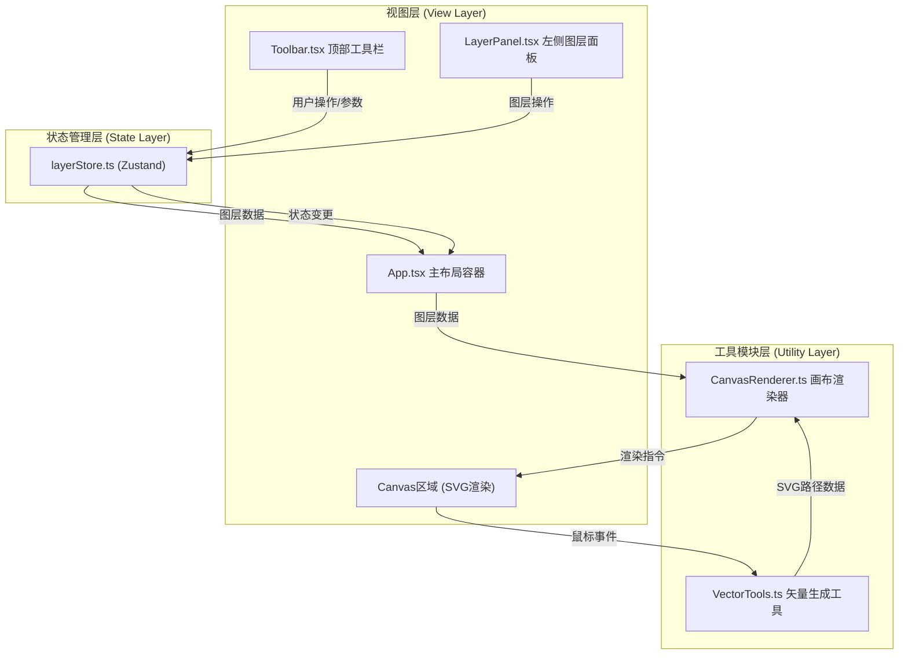

## 1. 架构设计



**数据流向说明：**
1. 视图组件（Toolbar/LayerPanel/Canvas）接收用户输入
2. 通过Zustand store的action更新状态
3. Zustand通知订阅组件重渲染
4. App.tsx将最新图层数据传递给CanvasRenderer
5. CanvasRenderer调用VectorTools生成路径并渲染到SVG

## 2. 技术描述

- **前端框架**：React 18 + TypeScript 5
- **构建工具**：Vite 5
- **状态管理**：Zustand 4
- **唯一ID生成**：uuid 9
- **React插件**：@vitejs/plugin-react 4
- **拖拽排序**：@dnd-kit/core + @dnd-kit/sortable
- **图标**：Material Icons（Google Fonts）
- **字体**：Roboto（Google Fonts）

## 3. 项目结构

```
auto311/
├── package.json
├── vite.config.js
├── tsconfig.json
├── index.html
└── src/
    ├── App.tsx                    # 主布局容器
    ├── main.tsx                   # 应用入口
    ├── index.css                  # 全局样式
    ├── store/
    │   └── layerStore.ts          # Zustand状态管理
    ├── canvas/
    │   ├── CanvasRenderer.ts      # 画布渲染器
    │   └── VectorTools.ts         # 矢量形状工具
    ├── components/
    │   ├── LayerPanel.tsx         # 左侧图层面板
    │   ├── Toolbar.tsx            # 顶部工具栏
    │   └── LayerItem.tsx          # 图层列表项组件
    ├── hooks/
    │   ├── useCanvasInteraction.ts # 画布交互hook
    │   └── useHistory.ts          # 历史记录hook
    └── types/
        └── index.ts               # 类型定义
```

## 4. 模块调用关系

| 模块 | 依赖 | 被依赖 | 职责 |
|------|------|--------|------|
| App.tsx | layerStore, CanvasRenderer, LayerPanel, Toolbar | - | 主布局，整合各模块，传递图层数据 |
| layerStore.ts | types, useHistory | App, Toolbar, LayerPanel | 管理图层列表、选中状态、操作历史 |
| CanvasRenderer.ts | VectorTools, types | App | 接收图层数据，应用变换矩阵，渲染SVG |
| VectorTools.ts | types | CanvasRenderer, useCanvasInteraction | 生成矩形/圆形/三角形/星形路径数据 |
| Toolbar.tsx | layerStore, types | - | 形状选择、颜色、透明度、旋转、模糊、撤销重做、导出 |
| LayerPanel.tsx | layerStore, types, LayerItem, @dnd-kit | - | 图层列表展示、拖拽排序、删除 |
| LayerItem.tsx | types | LayerPanel | 单个图层项UI，缩略图+属性 |
| useCanvasInteraction.ts | layerStore, VectorTools | App | 处理画布鼠标事件，绘制/移动/缩放 |

## 5. 数据模型

### 5.1 类型定义

```typescript
// 形状类型
export type ShapeType = 'rect' | 'circle' | 'triangle' | 'star';

// 图层变换属性
export interface LayerTransform {
  x: number;           // 位置X
  y: number;           // 位置Y
  width: number;       // 宽度
  height: number;      // 高度
  rotation: number;    // 旋转角度 -180~180
  opacity: number;     // 透明度 0.1~1.0
  blur: number;        // 高斯模糊 0~20px
}

// 图层数据
export interface Layer {
  id: string;
  name: string;
  shapeType: ShapeType;
  color: string;
  transform: LayerTransform;
  pathData: string;    // SVG路径数据
  isDeleting?: boolean; // 删除动画标记
}

// 画布状态
export interface LayerState {
  layers: Layer[];
  selectedLayerId: string | null;
  currentTool: ShapeType | null;
  currentColor: string;
  // 历史记录
  history: Layer[][];
  historyIndex: number;
  // Actions
  addLayer: (layer: Omit<Layer, 'id'>) => void;
  updateLayer: (id: string, updates: Partial<Layer>) => void;
  deleteLayer: (id: string) => void;
  selectLayer: (id: string | null) => void;
  reorderLayers: (fromIndex: number, toIndex: number) => void;
  setTool: (tool: ShapeType | null) => void;
  setColor: (color: string) => void;
  undo: () => void;
  redo: () => void;
  canUndo: () => boolean;
  canRedo: () => boolean;
  exportSVG: () => string;
}
```

### 5.2 状态管理设计

```typescript
// 使用Zustand管理图层状态，支持undo/redo
const MAX_HISTORY = 10;

export const useLayerStore = create<LayerState>((set, get) => ({
  layers: [],
  selectedLayerId: null,
  currentTool: 'rect',
  currentColor: '#FF5722',
  history: [[]],
  historyIndex: 0,

  // 保存历史记录
  saveHistory: () => {
    const { layers, history, historyIndex } = get();
    const newHistory = history.slice(0, historyIndex + 1);
    newHistory.push([...layers]);
    if (newHistory.length > MAX_HISTORY + 1) {
      newHistory.shift();
    }
    set({ 
      history: newHistory, 
      historyIndex: newHistory.length - 1 
    });
  },

  addLayer: (layer) => {
    if (get().layers.length >= 8) return;
    const newLayer = { ...layer, id: v4() };
    set((state) => ({ 
      layers: [...state.layers, newLayer],
      selectedLayerId: newLayer.id
    }));
    get().saveHistory();
  },

  updateLayer: (id, updates) => {
    set((state) => ({
      layers: state.layers.map(l => 
        l.id === id ? { ...l, ...updates } : l
      )
    }));
  },
  
  // ... 其他actions
}));
```

## 6. 核心算法

### 6.1 矢量形状生成 (VectorTools.ts)

```typescript
// 生成矩形路径
export function createRectPath(x: number, y: number, w: number, h: number): string

// 生成圆形路径（使用椭圆逼近）
export function createCirclePath(cx: number, cy: number, r: number): string

// 生成三角形路径
export function createTrianglePath(x: number, y: number, w: number, h: number): string

// 生成星形路径（5角星）
export function createStarPath(cx: number, cy: number, outerR: number, innerR: number): string

// 根据拖拽起点终点生成形状路径
export function createShapeFromDrag(
  type: ShapeType,
  startX: number,
  startY: number,
  endX: number,
  endY: number
): { path: string; transform: Partial<LayerTransform> }
```

### 6.2 SVG渲染 (CanvasRenderer.ts)

```typescript
// 应用变换矩阵
export function getLayerTransform(layer: Layer): string {
  const { x, y, width, height, rotation } = layer.transform;
  const cx = x + width / 2;
  const cy = y + height / 2;
  return `translate(${x}, ${y}) rotate(${rotation} ${width/2} ${height/2})`;
}

// 渲染单个图层
export function renderLayer(layer: Layer, isSelected: boolean): JSX.Element

// 导出完整SVG
export function exportSVG(layers: Layer[], width: number, height: number): string
```

### 6.3 性能优化策略

1. **requestAnimationFrame批量渲染**：属性调整时使用rAF合并多次重绘
2. **memo优化**：LayerItem、Toolbar等使用React.memo减少重渲染
3. **SVG filter复用**：模糊滤镜定义一次，所有图层引用
4. **浅层比较**：Zustand使用shallow选择器减少不必要的重渲染
5. **CSS transform优先**：使用transform而非top/left实现动画

## 7. API定义（无后端）

纯前端应用，无API调用。导出功能通过Blob和URL.createObjectURL实现客户端下载。

## 8. 启动脚本

- `npm run dev`：启动Vite开发服务器
- `npm run build`：生产构建
- `npm run preview`：预览生产构建
