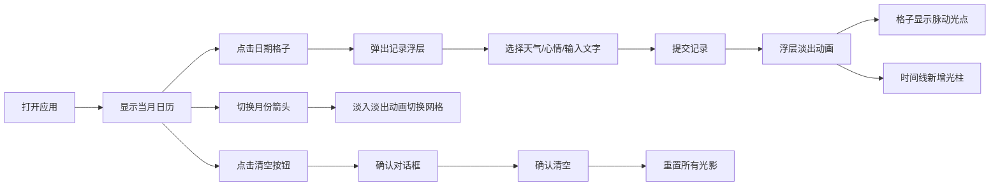

## 1. 产品概述
光影日记是一款极简风格的情绪记录Web应用，用户通过日历交互以彩色光点形式记录每日心情、天气与文字，生成可视化时间线回顾生活轨迹。
- 面向追求生活仪式感、喜欢记录情绪变化的普通用户
- 通过色彩与光效将抽象情绪可视化，打造有温度的个人记忆空间

## 2. 核心功能

### 2.1 功能模块
1. **日历网格模块**：月份切换、日期格子交互、光点展示、Tooltip提示
2. **记录编辑模块**：模态浮层、天气选择、心情选择、文字输入、字数统计
3. **时间线可视化模块**：彩色光柱、生长动画、情绪高度映射
4. **数据管理模块**：记录持久化、清空功能、确认对话框

### 2.3 页面详情
| 页面名称 | 模块名称 | 功能描述 |
|---------|---------|----------|
| 主页面 | 日历网格 | 展示当月日历，左右切换月份，日期格子悬停放大，已记录日期显示脉动光点和Tooltip |
| 主页面 | 记录模态浮层 | 点击日期弹出，选择天气emoji、心情颜色圆点、输入文字（限100字），提交后淡出消失 |
| 主页面 | 时间线区域 | 日历下方展示所有记录的彩色光柱，按日期排列，底部对齐，高度随心情变化，带生长动画 |
| 主页面 | 清空按钮 | 红色文字按钮，悬停变浅红，点击弹出确认对话框，确认后清空所有记录 |

## 3. 核心流程
用户打开应用 → 查看当前月份日历 → 点击某个日期 → 弹出记录浮层 → 选择天气、心情、输入文字 → 点击提交 → 浮层淡出，日期格子显示彩色光点 → 时间线区域新增一根光柱 → 可切换月份查看历史记录 → 可点击清空按钮重置所有数据

## 4. 用户界面设计

### 4.1 设计风格
- **配色方案**：极简白（#FFFFFF）+ 浅灰（#F9F9F9 / #F0F0F0 / #E0E0E0）+ 心情色彩点缀
  - 开心：#FFD700（金黄）
  - 平静：#90EE90（浅绿）
  - 忧郁：#87CEEB（天蓝）
  - 愤怒：#FF6347（番茄红）
- **按钮风格**：圆角设计，0.2秒过渡动画，天气用emoji按钮，心情用彩色圆点按钮
- **字体**：系统默认无衬线字体（font-family: system-ui, -apple-system, sans-serif）
- **布局风格**：居中卡片式布局，最大宽度800px，四周留白20px
- **图标风格**：使用emoji（☀️⛅🌨️❄️）表示天气，纯色彩圆点表示心情

### 4.2 页面设计概述
| 页面名称 | 模块名称 | UI元素 |
|---------|---------|--------|
| 主页面 | 顶部标题区 | 应用名称"光影日记"，副标题说明，清空按钮居右 |
| 主页面 | 日历导航栏 | 左箭头、月份年份标题、右箭头，切换时整体淡入淡出0.3秒 |
| 主页面 | 星期标题行 | 日/一/二/三/四/五/六，浅灰色文字 |
| 主页面 | 日期格子 | 60x60px白色方块，悬停变灰#F0F0F0并scale(1.05)，0.2秒过渡 |
| 主页面 | 光点标记 | 12px圆形，脉动动画scale(1→1.2→1)，2秒无限循环 |
| 主页面 | Tooltip | 白色背景黑字，8px圆角，延迟0.3秒，格子上方10px，带小箭头 |
| 主页面 | 模态浮层 | 宽320px居中，白色背景12px圆角，4px#E0E0E0边框，阴影0 4px 16px rgba(0,0,0,0.15) |
| 主页面 | 时间线容器 | 高120px，背景#F9F9F9，光柱底部对齐 |
| 主页面 | 彩色光柱 | 最小宽20px，间隔2px灰#E0E0E0，顶部2px圆角，height从0生长0.5秒ease-out |

### 4.3 响应式设计
- 桌面优先（Desktop-first）设计
- 宽度小于600px时，日期格子尺寸自动调整为40x40px
- 时间线光柱宽度自适应，最小20px保持可读性
- 模态浮层在窄屏时水平居中不溢出

### 4.4 动画性能规范
- 日历切换：opacity 1→0→1，0.3秒，使用CSS transition
- 格子悬停：scale(1)→scale(1.05) + 背景变色，0.2秒ease
- 光点脉动：scale(1→1.2→1)，2秒，CSS animation无限循环
- 浮层关闭：opacity淡出0.2秒
- 光柱生长：height 0→目标值，0.5秒ease-out
- 所有动画目标60FPS，使用transform和opacity优先，避免layout thrash
