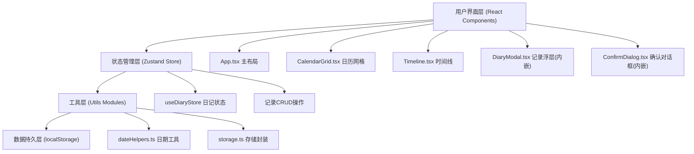

## 1. 架构设计



## 2. 技术选型说明
- **前端框架**：React@18 + TypeScript@5，组件化开发保证可维护性
- **构建工具**：Vite@5 + @vitejs/plugin-react，快速开发体验与HMR
- **状态管理**：Zustand@4，轻量无侵入，避免Redux繁琐模板
- **日期处理**：date-fns@3，函数式日期库，模块化按需引入
- **唯一标识**：uuid@9，生成记录唯一ID
- **样式方案**：纯CSS + CSS Modules（通过style标签或CSS文件），无需额外CSS框架保持轻量
- **持久化方案**：localStorage API封装，无需后端服务

## 3. 目录结构定义
```
auto312/
├── package.json
├── vite.config.ts  (用户要求js，但建议ts，按用户要求用js)
├── vite.config.js
├── tsconfig.json
├── index.html
└── src/
    ├── main.tsx              # React根挂载入口
    ├── App.tsx               # 主布局组件
    ├── components/
    │   ├── CalendarGrid.tsx  # 日历网格组件
    │   └── Timeline.tsx      # 时间线可视化组件
    ├── stores/
    │   └── useDiaryStore.ts  # Zustand状态管理
    └── utils/
        ├── dateHelpers.ts    # 日期计算工具
        └── storage.ts        # localStorage封装
```

## 4. 数据模型定义

### 4.1 核心类型定义
```typescript
// 天气类型
type WeatherType = 'sunny' | 'cloudy' | 'rainy' | 'snowy';

// 心情类型
type MoodType = 'happy' | 'calm' | 'sad' | 'angry';

// 心情元数据（颜色、高度映射）
interface MoodMeta {
  color: string;      // 心情颜色（HEX）
  height: number;     // 光柱高度百分比（0-100）
  label: string;      // 中文标签
}

// 单条日记记录
interface DiaryEntry {
  id: string;              // UUID唯一标识
  date: string;            // 日期字符串 YYYY-MM-DD（用于索引）
  weather: WeatherType;    // 天气
  mood: MoodType;          // 心情
  content: string;         // 文字内容（最多100字）
  createdAt: number;       // 创建时间戳
}

// Store状态
interface DiaryState {
  entries: DiaryEntry[];          // 所有记录列表
  selectedDate: string | null;    // 当前选中日期（YYYY-MM-DD）
  currentYear: number;            // 当前显示年份
  currentMonth: number;           // 当前显示月份（0-11）
  isModalOpen: boolean;           // 浮层开关
  isConfirmOpen: boolean;         // 确认对话框开关
  // 方法
  addEntry: (entry: Omit<DiaryEntry, 'id' | 'createdAt'>) => void;
  deleteEntry: (id: string) => void;
  clearAllEntries: () => void;
  setSelectedDate: (date: string | null) => void;
  setCurrentMonth: (year: number, month: number) => void;
  toggleModal: (open: boolean) => void;
  toggleConfirm: (open: boolean) => void;
}
```

### 4.2 常量映射表
```typescript
// 天气映射（存储值 → emoji + 中文）
const WEATHER_MAP: Record<WeatherType, { emoji: string; label: string }> = {
  sunny: { emoji: '☀️', label: '太阳' },
  cloudy: { emoji: '⛅', label: '多云' },
  rainy: { emoji: '🌨️', label: '雨天' },
  snowy: { emoji: '❄️', label: '雪天' },
};

// 心情映射（存储值 → 元数据）
const MOOD_MAP: Record<MoodType, MoodMeta> = {
  happy: { color: '#FFD700', height: 100, label: '开心' },
  calm: { color: '#90EE90', height: 75, label: '平静' },
  sad: { color: '#87CEEB', height: 50, label: '忧郁' },
  angry: { color: '#FF6347', height: 100, label: '愤怒' },
};
```

## 5. 状态管理设计（Zustand）

```typescript
// stores/useDiaryStore.ts
import { create } from 'zustand';
import { persist } from 'zustand/middleware'; // 可选，或手动结合storage工具

export const useDiaryStore = create<DiaryState>()(
  persist(
    (set, get) => ({
      entries: [],
      selectedDate: null,
      currentYear: new Date().getFullYear(),
      currentMonth: new Date().getMonth(),
      isModalOpen: false,
      isConfirmOpen: false,
      
      addEntry: (entryData) => {
        const newEntry: DiaryEntry = {
          ...entryData,
          id: uuidv4(),
          createdAt: Date.now(),
        };
        // 同一日期覆盖旧记录
        const filtered = get().entries.filter(e => e.date !== entryData.date);
        set({ entries: [...filtered, newEntry] });
      },
      
      deleteEntry: (id) => {
        set({ entries: get().entries.filter(e => e.id !== id) });
      },
      
      clearAllEntries: () => {
        set({ entries: [] });
      },
      
      setSelectedDate: (date) => set({ selectedDate: date }),
      setCurrentMonth: (year, month) => set({ currentYear: year, currentMonth: month }),
      toggleModal: (open) => set({ isModalOpen: open }),
      toggleConfirm: (open) => set({ isConfirmOpen: open }),
    }),
    {
      name: 'guangying-diary-storage', // localStorage key
      // 使用自定义storage工具封装
      storage: {
        getItem: (name) => storageUtils.get(name),
        setItem: (name, value) => storageUtils.set(name, value),
        removeItem: (name) => storageUtils.remove(name),
      },
    }
  )
);
```

## 6. 工具模块设计

### 6.1 dateHelpers.ts
```typescript
// 获取当月总天数
export function getDaysInMonth(year: number, month: number): number;

// 获取当月第一天是星期几（0=周日，6=周六）
export function getFirstDayOfMonth(year: number, month: number): number;

// 生成日历网格数据（包含上月/下月占位日期）
export function generateCalendarGrid(year: number, month: number): CalendarDay[];

// 格式化日期为 YYYY-MM-DD
export function formatDateKey(year: number, month: number, day: number): string;

// 解析日期key为年月日对象
export function parseDateKey(dateKey: string): { year: number; month: number; day: number };

// 格式化月份标题，如 "2026年6月"
export function formatMonthTitle(year: number, month: number): string;

// 获取上一月
export function getPrevMonth(year: number, month: number): { year: number; month: number };

// 获取下一月
export function getNextMonth(year: number, month: number): { year: number; month: number };
```

### 6.2 storage.ts
```typescript
// 安全读取localStorage（JSON parse + try/catch）
export function get<T>(key: string, defaultValue: T | null = null): T | null;

// 安全写入localStorage（JSON stringify + try/catch）
export function set<T>(key: string, value: T): boolean;

// 删除指定key
export function remove(key: string): boolean;

// 清空所有
export function clear(): boolean;
```

## 7. 性能优化策略
1. **CSS动画优化**：只对transform和opacity做动画，避免触发布局回流；使用will-change提示浏览器优化
2. **Zustand选择器**：组件中使用state selector按需订阅，避免不必要重渲染
3. **日期计算缓存**：同年同月的日历网格用useMemo缓存，切换月份时才重新计算
4. **记录查找优化**：用dateKey作为索引，O(1)查找某日是否有记录（通过new Map()构建映射）
5. **时间线渲染优化**：记录数不变时用useMemo缓存排序后的数组
6. **localStorage批量写入**：Zustand persist自动处理，避免频繁读写
7. **响应单位**：宽度断点600px使用CSS media query，无需JS监听resize
