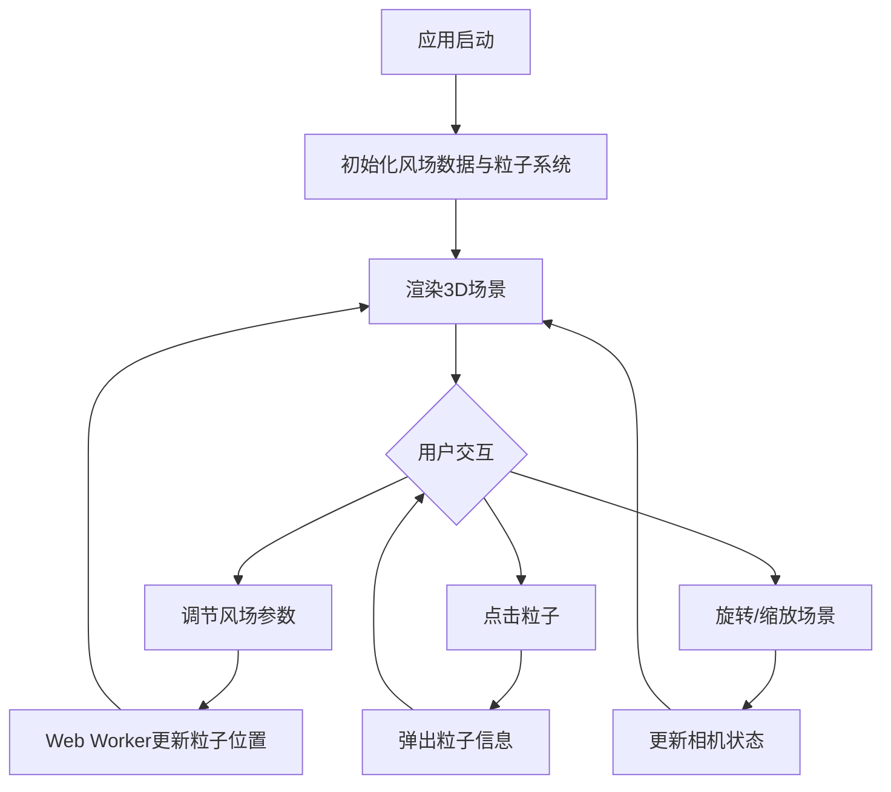

## 1. 产品概述

风纹城市是一款基于Three.js的3D交互式气象可视化应用，通过三维粒子系统模拟城市上空不同高度的风向和风速变化，帮助气象研究团队评估高层建筑对局部微气候的影响。目标用户为气象研究人员和城市规划师。

## 2. 核心功能

### 2.1 用户角色

| 角色 | 使用方式 | 核心权限 |
|------|----------|----------|
| 气象研究员 | 直接访问 | 调整风场参数、查看粒子数据 |
| 城市规划师 | 直接访问 | 浏览建筑绕流效果、交互探索 |

### 2.2 功能模块

1. **主场景页**：3D粒子风场可视化、建筑模型、交互控制面板、实时数据面板

### 2.3 页面详情

| 页面名称 | 模块名称 | 功能描述 |
|----------|----------|----------|
| 主场景页 | 3D粒子系统 | 3000个粒子在三维空间中模拟气流运动，颜色随高度渐变 |
| 主场景页 | 建筑模型 | 5-8个半透明灰色建筑长方体，粒子绕流效果 |
| 主场景页 | 风场控制面板 | 时间流速滑块、季节下拉菜单、风场强度滑块 |
| 主场景页 | 实时数据面板 | 粒子总数、平均风速、活跃粒子比例 |
| 主场景页 | 粒子信息弹窗 | 点击粒子显示坐标和风速 |

## 3. 核心流程

用户打开应用后进入3D城市场景，通过左侧控制面板调节时间流速、季节和风场强度，实时观察粒子流变化。可拖拽旋转场景、滚轮缩放、点击粒子查看详情。

## 4. 用户界面设计

### 4.1 设计风格

- 主色调：深色太空主题（背景色 #0A0E1A），粒子蓝色渐变（#0B3D91 → #48CAE4 → #FFFFFF）
- 控件风格：半透明毛玻璃面板，圆角12px，蓝色高亮（#4FC3F7）
- 字体：Orbitron（数据展示）+ Noto Sans SC（中文界面）
- 布局：全屏3D Canvas + 覆盖层UI面板
- 图标：lucide-react图标库

### 4.2 页面设计概览

| 页面名称 | 模块名称 | UI元素 |
|----------|----------|--------|
| 主场景页 | 3D场景 | 全屏Canvas，深色太空背景，粒子流线，半透明建筑 |
| 主场景页 | 控制面板 | 左上角半透明面板，滑块+下拉菜单，蓝色高亮 |
| 主场景页 | 数据面板 | 右下角半透明面板，实时数据文字 |
| 主场景页 | 信息弹窗 | 点击粒子弹出浮动卡片，显示坐标和风速 |

### 4.3 响应式设计

- 桌面端优先，全屏3D场景 + 固定位置面板
- 移动端（<768px）：控制面板折叠为汉堡菜单，数据面板缩小至底部条

### 4.4 3D场景指导

- 环境：深色太空氛围，无HDRI，纯色深蓝背景
- 光照：环境光 + 微弱方向光，不使用阴影
- 相机：透视相机，初始45度俯视，旋转范围0-360度，缩放0.5-3倍
- 焦点：城市建筑群 + 上空粒子流
- 交互：鼠标拖拽旋转、滚轮缩放、点击粒子查看信息
- 后处理：无后处理效果，保持性能
- 资源来源：程序化生成所有几何体，无外部模型资源
