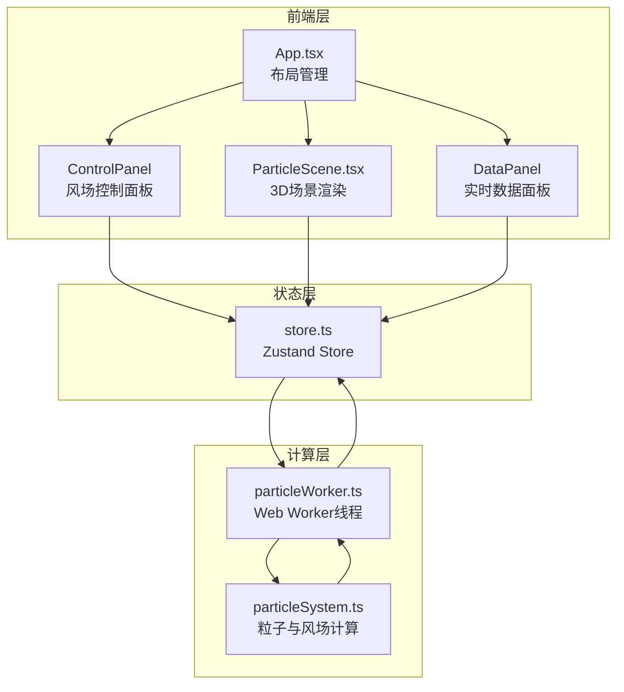

## 1. 架构设计



### 数据流向

1. 用户通过控制面板修改参数 → 写入Zustand Store
2. Store变更触发 → 将参数发送至Web Worker
3. Worker中执行particleSystem计算 → 返回更新后的粒子位置/颜色/大小
4. Store更新粒子数据 → ParticleScene从Store读取 → 更新BufferGeometry
5. 每帧渲染循环：Worker计算 → Store更新 → Canvas重绘

## 2. 技术说明

- 前端：React@18 + Three.js + @react-three/fiber + @react-three/drei + TypeScript
- 构建工具：Vite
- 状态管理：Zustand
- 噪声算法：simplex-noise
- 初始化工具：vite-init（react-ts模板）
- 后端：无
- 数据库：无

## 3. 路由定义

| 路由 | 用途 |
|------|------|
| / | 主场景页，包含3D粒子可视化和控制面板 |

## 4. 文件结构与调用关系

```
project/
├── index.html                    # 入口页面，挂载#root
├── package.json                  # 依赖管理
├── vite.config.js                # Vite配置，base='./'
├── tsconfig.json                 # TypeScript严格模式
├── src/
│   ├── main.tsx                  # React入口，初始化Store，渲染App
│   ├── App.tsx                   # 主组件，布局管理，resize监听
│   ├── ParticleScene.tsx         # 3D场景，Canvas渲染粒子+建筑
│   ├── particleSystem.ts         # 粒子生成、风场计算、位置更新
│   ├── store.ts                  # Zustand Store，状态与actions
│   ├── particleWorker.ts         # Web Worker，并行粒子计算
│   ├── components/
│   │   ├── ControlPanel.tsx      # 风场控制面板UI
│   │   ├── DataPanel.tsx         # 实时数据面板UI
│   │   └── ParticleInfoPopup.tsx # 粒子信息弹窗
│   └── styles/
│       └── global.css            # 全局样式
```

### 调用关系

- `main.tsx` → 初始化 `store.ts` → 渲染 `App.tsx`
- `App.tsx` → 调用 `ParticleScene.tsx` + `ControlPanel.tsx` + `DataPanel.tsx`
- `ParticleScene.tsx` → 从 `store.ts` 读取粒子数据 → 更新BufferGeometry
- `ParticleScene.tsx` → 创建 `particleWorker.ts` Worker实例
- `particleWorker.ts` → 导入 `particleSystem.ts` 计算函数
- `ControlPanel.tsx` → 写入 `store.ts` 的actions
- `DataPanel.tsx` → 从 `store.ts` 读取数据
- `ParticleInfoPopup.tsx` → 从 `store.ts` 读取选中粒子信息

## 5. 关键技术决策

### Web Worker架构

- 主线程负责React渲染和Three.js渲染循环
- Worker线程负责每帧粒子位置/颜色/大小计算
- 使用 `postMessage` 双向通信，传输 `Float32Array` 的 `Transferable` 对象
- Worker中使用simplex-noise计算风场，避免阻塞主线程

### 粒子系统实现

- 使用 `BufferGeometry` + `LineSegments` 渲染流线型粒子
- 3000个粒子，每个粒子为一条细长线段（长度0.5-1.5单位）
- 颜色通过 `Float32Array` 的color attribute实现高度渐变
- 建筑绕流：检测粒子与建筑AABB碰撞，施加偏转力

### 性能目标

- 60FPS稳定帧率
- 初始化加载 < 3秒
- Worker计算每帧 < 8ms
