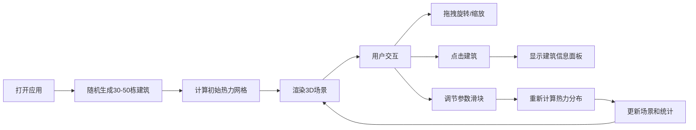

## 1. 产品概述

城市热岛效应3D交互可视化应用，帮助城市规划师直观评估绿地、水体和高层建筑对区域温度分布的影响。

- 核心价值：通过实时3D热力可视化，让规划者快速理解城市空间要素与微气候的关系
- 目标用户：城市规划师、建筑设计师、环境研究人员

## 2. 核心功能

### 2.1 用户角色

| 角色 | 注册方式 | 核心权限 |
|------|----------|----------|
| 规划师用户 | 无需注册，直接使用 | 场景浏览、参数调节、建筑信息查看 |

### 2.2 功能模块

1. **3D城市场景**：随机生成建筑群、热力网格叠加、交互旋转缩放
2. **参数控制面板**：绿地覆盖率、水体覆盖率、日照强度滑块
3. **建筑信息面板**：点击建筑显示占地、高度、朝向、受热等级
4. **实时统计面板**：平均温度、最高/最低温度、温度标准差

### 2.3 页面详情

| 页面名称 | 模块名称 | 功能描述 |
|-----------|-------------|---------------------|
| 主界面 | 3D场景区 | 占据80%宽度，展示10x10单位城市区域，支持鼠标拖拽旋转、滚轮缩放 |
| 主界面 | 左侧信息面板 | 20%宽度，显示选中建筑详情、参数滑块和统计数据 |
| 主界面 | 热力网格层 | 16x16格半透明热力图，脉冲动画，实时响应参数变化 |

## 3. 核心流程

用户打开应用 → 自动生成随机城市建筑和初始热力分布 → 拖拽/缩放浏览场景 → 点击建筑查看详情 → 拖动参数滑块 → 热力网格和建筑颜色实时更新 → 观察统计数据变化

## 4. 用户界面设计

### 4.1 设计风格

- 主色调：深蓝渐变背景（#0A0A23 到 #1A1A3E），面板深灰紫（#2D2D44）
- 强调色：紫色滑块手柄（#7C4DFF），热力蓝红渐变
- 字体：Inter，14px，浅灰文字（#E0E0E0）
- 交互：hover呼吸放大效果（scale 1.03，0.2s过渡）
- 整体风格：深色科技风，数据可视化感

### 4.2 页面设计概述

| 页面名称 | 模块名称 | UI元素 |
|-----------|-------------|-------------|
| 主界面 | 3D场景 | 等距视角建筑群、半透明热力网格、脉冲动画 |
| 主界面 | 左侧面板 | 建筑信息卡、三个参数滑块、统计数据面板 |
| 主界面 | 建筑着色 | 朝南暗红#A03030、朝北深蓝#1A3A5C、朝东西橙黄#D08020 |

### 4.3 响应式

- 桌面端：左侧20%面板 + 右侧80%场景
- 窗口宽度<1024px：面板折叠到底部，高度200px
- 触控优化：支持触屏旋转和缩放

### 4.4 3D场景指引

- 环境：深色渐变背景，柔和环境光 + 方向光模拟日照
- 光照：主光源模拟太阳角度，建筑立面根据朝向着色
- 相机：透视相机，初始45度俯角，OrbitControls控制
- 交互：点击建筑高亮，鼠标悬停提示
- 动画：热力网格脉冲动画（0.8-1.0强度，1.5秒周期）
- 后处理：轻微Bloom增强科技感
- 性能目标：60FPS，单帧<16ms
