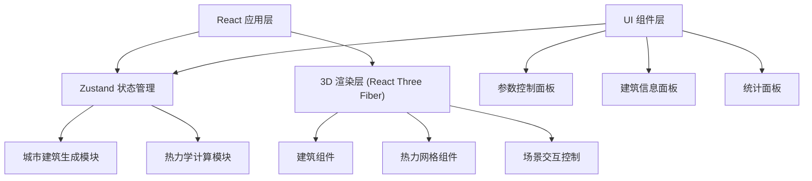

## 1. 架构设计



## 2. 技术说明

- 前端框架：React 18 + TypeScript
- 3D 渲染：Three.js + @react-three/fiber + @react-three/drei
- 状态管理：Zustand
- 构建工具：Vite
- 样式方案：原生 CSS (CSS Modules) + 内联样式
- 噪声库：simplex-noise（用于随机分布）

## 3. 模块职责划分

| 模块 | 文件 | 职责 |
|------|------|------|
| 类型定义 | src/types.ts | 定义 CityBuilding、HeatGridCell、SimulationParams 等接口 |
| 热力计算 | src/heatIsland.ts | 建筑生成算法、热力网格计算逻辑 |
| 状态管理 | src/store.ts | Zustand store，管理全局状态和更新函数 |
| 3D场景 | src/components/Scene.tsx | Three.js 场景、建筑渲染、热力网格、交互 |
| 控制面板 | src/components/ControlPanel.tsx | 参数滑块、统计面板、建筑信息展示 |
| 入口 | src/App.tsx + main.tsx | 应用入口，布局组装 |

## 4. 数据模型

### 4.1 核心类型定义

```typescript
// 建筑数据
interface CityBuilding {
  id: string;
  position: { x: number; z: number };
  width: number;
  depth: number;
  height: number;
  orientation: 'north' | 'south' | 'east' | 'west';
  heatLevel: 'low' | 'medium' | 'high';
}

// 热力网格单元
interface HeatGridCell {
  x: number;
  z: number;
  temperature: number;
  color: string;
}

// 模拟参数
interface SimulationParams {
  greenCoverage: number;      // 0-40 (%)
  waterCoverage: number;      // 0-20 (%)
  sunlightIntensity: number;  // 50-150 (%)
}

// 统计数据
interface HeatStatistics {
  avgTemp: number;
  maxTemp: number;
  minTemp: number;
  stdDev: number;
}
```

### 4.2 数据流

```
用户操作滑块 → Zustand store 更新 params 
  → 触发 updateHeatGrid 重新计算 
  → store 更新 heatGrid 和 statistics
  → Scene 组件响应式重新渲染热力网格
  → ControlPanel 响应式更新统计数值
```

## 5. 性能优化策略

1. **建筑 InstancedMesh**：使用实例化网格渲染多栋建筑，减少 draw call
2. **热力网格优化**：使用 PlaneGeometry + vertex colors 而非多个小平面
3. **计算节流**：参数变化时使用 requestAnimationFrame 批量更新
4. **对象复用**：建筑几何体和材质复用，避免重复创建
5. **像素比限制**：renderer.setPixelRatio(Math.min(window.devicePixelRatio, 2))

## 6. 文件结构

```
src/
├── types.ts              # 类型定义
├── heatIsland.ts         # 建筑生成 + 热力计算
├── store.ts              # Zustand 状态管理
├── App.tsx               # 主应用组件
├── main.tsx              # 入口文件
├── index.css             # 全局样式
└── components/
    ├── Scene.tsx         # 3D 场景组件
    └── ControlPanel.tsx  # 控制面板组件
```
