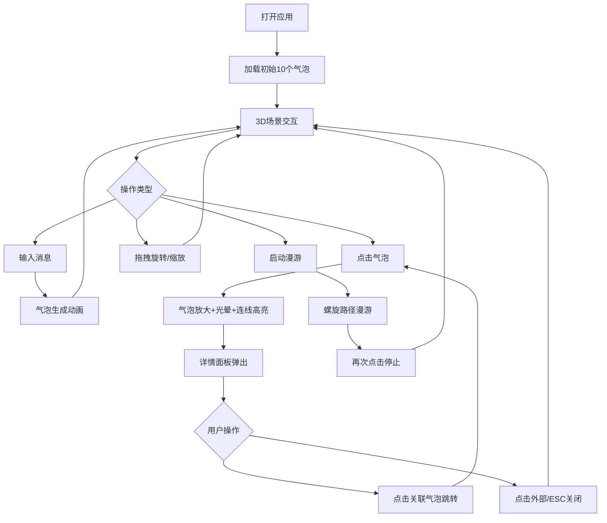

## 1. 产品概述

气泡密语是一个交互式3D数据叙事应用，让用户通过点击和拖拽探索悬浮在三维空间中的气泡。每个气泡代表一条短文本消息，大小反映字数，颜色由情感分析决定，气泡之间用动态贝塞尔曲线连接表示语义相似度。

- 目标用户：喜欢数据可视化和沉浸式交互体验的用户
- 核心价值：将文本消息转化为可探索的3D空间叙事，通过视觉和交互让文字"活"起来

## 2. 核心功能

### 2.1 功能模块

1. **3D气泡场景**：深邃太空背景、闪烁星星、悬浮气泡、语义连线与流动粒子
2. **消息输入**：底部输入栏和左下角添加按钮，支持快捷输入和模态框详细输入
3. **交互反馈**：点击气泡放大旋转+脉冲光晕，关联连线高亮，详情面板滑出
4. **场景漫游**：鼠标拖拽旋转、滚轮缩放、自动螺旋漫游模式

### 2.2 页面详情

| 页面名称 | 模块名称 | 功能描述 |
|----------|----------|----------|
| 主场景 | 太空背景 | 径向渐变#0F0E17→#1A1A2E，200颗闪烁星星 |
| 主场景 | 气泡展示 | 气泡按字数大小、情感着色，随机分布在6单位球壳内 |
| 主场景 | 语义连线 | 贝塞尔曲线连接相似气泡，流动粒子效果 |
| 主场景 | 底部输入栏 | 毛玻璃效果输入框+发射按钮 |
| 主场景 | 添加消息按钮 | 左下角悬浮按钮，弹出模态框 |
| 主场景 | 详情面板 | 右侧滑出面板，显示消息全文、情感标签、关联气泡 |
| 主场景 | 漫游控制 | 右下角漫游按钮，启动/停止自动漫游 |

## 3. 核心流程

1. 用户打开应用 → 看到10个初始气泡漂浮在太空背景中
2. 用户通过底部输入栏或添加按钮输入新消息 → 气泡在3D空间生成并飘入
3. 用户拖拽旋转视角、滚轮缩放探索场景
4. 用户点击气泡 → 气泡放大旋转、关联连线高亮、详情面板弹出
5. 用户在详情面板点击关联气泡 → 跳转到对应气泡
6. 用户启动漫游模式 → 摄像头沿螺旋路径自动移动

## 4. 用户界面设计

### 4.1 设计风格

- 主色调：深色太空主题，背景#0F0E17
- 强调色：#FF6B6B（珊瑚红/积极）、#4ECDC4（青绿/中性）、#1A535C（深青/消极）
- 按钮：圆角设计，悬浮交互带微光效果
- 字体：白色为主，轻字重，带#FF6B6B下划线装饰
- 布局：沉浸式全屏3D场景，UI控件浮动覆盖

### 4.2 页面设计概览

| 页面名称 | 模块名称 | UI元素 |
|----------|----------|--------|
| 主场景 | 标题 | 左上角"气泡密语"，白色24px字重300，2px #FF6B6B下划线 |
| 主场景 | 添加按钮 | 左下角56px圆形#FF6B6B，悬停放大1.1倍+微光 |
| 主场景 | 输入栏 | 底部居中80%宽毛玻璃栏，透明输入框+#FF6B6B发射按钮 |
| 主场景 | 模态框 | 居中480px，#0F0E17 80%背景，圆角24px |
| 主场景 | 详情面板 | 右侧300px宽，#1A1A2E背景，#FF6B6B边框，0.3s滑入 |
| 主场景 | 漫游按钮 | 右下角80x40px #4ECDC4，圆角8px |

### 4.3 响应式

- 桌面优先设计，3D场景占满全屏
- UI控件使用固定定位，适配不同分辨率
- 输入栏宽度80%自适应

### 4.4 3D场景指引

- 环境：深邃太空径向渐变背景，散布闪烁星星
- 灯光：环境光+点光源，营造深空氛围
- 相机：透视相机，初始距离适中，支持旋转缩放和螺旋漫游
- 构图：气泡在半径6单位球壳内分布，连线连接语义相关气泡
- 交互：点击气泡放大旋转+脉冲光晕，连线高亮+流动粒子
- 后处理：气泡半透明发光效果，星星闪烁动画
- 性能预算：45FPS+，气泡上限30，连线上限80
