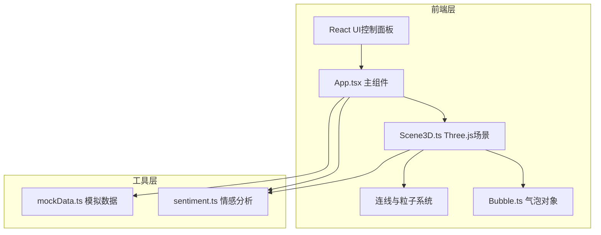

## 1. 架构设计



## 2. 技术说明

- 前端：React@18 + TypeScript + Three.js + Vite
- 初始化工具：vite-init (react-ts模板)
- 3D渲染：Three.js原生API（非R3F，因需求指定Scene3D.ts封装方式）
- 状态管理：React useState/useRef（轻量级，无需zustand）
- 后端：无
- 数据库：无，使用模拟数据

## 3. 路由定义

| 路由 | 用途 |
|------|------|
| / | 主场景页面（单页应用） |

## 4. 文件结构

```
├── package.json
├── index.html
├── vite.config.ts
├── tsconfig.json
├── src/
│   ├── main.tsx          # 应用入口
│   ├── App.tsx           # 主组件
│   ├── Scene3D.ts        # Three.js场景封装
│   ├── Bubble.ts         # 气泡对象类
│   ├── sentiment.ts      # 情感分析工具
│   └── mockData.ts       # 模拟数据
```

## 5. 核心模块设计

### 5.1 Scene3D.ts
- 创建WebGLRenderer、PerspectiveCamera、Scene
- 管理气泡对象生命周期（添加/删除/更新）
- 绘制贝塞尔曲线连线及流动粒子
- 处理Raycaster点击检测
- 实现相机控制（OrbitControls风格手动实现）
- 星空背景生成
- 动画循环

### 5.2 Bubble.ts
- SphereGeometry + MeshPhongMaterial / MeshStandardMaterial
- 情感颜色映射：积极#FF6B6B、中性#4ECDC4、消极#1A535C
- 半透明材质+发光效果
- 生成动画（0→目标大小，半透明→不透明）
- 点击后放大1.5倍+旋转+脉冲光晕
- 气泡半径由字数决定（每10字+0.1单位，范围0.5-1.5）

### 5.3 sentiment.ts
- 基于词典的简单情感分析
- 输入文本 → 输出情感标签（positive/neutral/negative）
- 关键词匹配+加权评分

### 5.4 mockData.ts
- 提供10条初始消息文本
- 预标注情感标签
- 消息内容涵盖不同情感倾向

## 6. 性能策略

- 气泡数量上限30，超出自动清理最远气泡
- 连线数量上限80，超出自动清理低相似度连线
- 使用InstancedMesh优化星星渲染
- 连线使用BufferGeometry减少内存
- requestAnimationFrame驱动动画循环
- 流动粒子使用Points几何体批量渲染
