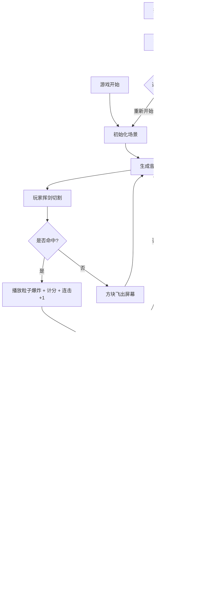

## 1. 产品概述

流光幻境是一款沉浸式节奏光剑游戏，玩家跟随随机生成的音符节拍挥动光剑切割彩色方块，累积连击分数并躲避障碍物。游戏融合了音乐节奏与动作元素，为玩家提供流畅、刺激的游戏体验。

- 核心玩法：鼠标拖动光剑切割飞向玩家的彩色音符方块，躲避红色障碍物
- 目标用户：休闲游戏爱好者、节奏游戏玩家
- 产品价值：提供低门槛、高沉浸感的节奏动作游戏体验

## 2. 核心功能

### 2.1 用户角色

| 角色 | 注册方式 | 核心权限 |
|------|----------|----------|
| 玩家 | 无需注册，直接进入游戏 | 完整游戏体验、分数记录 |

### 2.2 功能模块

1. **主游戏场景**：3D游戏世界，包含音符生成、光剑控制、碰撞检测、UI界面
2. **音符生成系统**：按随机节拍生成彩色方块，随节拍变化颜色
3. **光剑控制系统**：鼠标拖动实现180度弧形挥砍，记录切割位置
4. **分数与连击系统**：切割得分、连击奖励、最高连击记录
5. **生命值系统**：3点初始生命值，触碰障碍物扣除，归零游戏结束
6. **暂停功能**：ESC键暂停，包含继续和重新开始按钮
7. **结算界面**：最终得分、最高连击、评级展示

### 2.3 页面详情

| 页面名称 | 模块名称 | 功能描述 |
|----------|----------|----------|
| 游戏主界面 | 3D场景渲染 | 深空蓝黑色背景、动态光带、半透明网格地面 |
| 游戏主界面 | UI层 | 分数显示、连击数、生命值心形图标 |
| 暂停菜单 | 暂停遮罩 | 半透明黑色遮罩、圆角按钮（继续/重新开始） |
| 结算界面 | 结算面板 | 最终得分、最高连击、评级徽章、重新开始按钮 |

## 3. 核心流程

## 4. 用户界面设计

### 4.1 设计风格

- **主色调**：深空蓝黑色 #0A0A2E（背景）、发光蓝色 #00BFFF（光剑/光带）
- **强调色**：红色 #FF3333、蓝色 #3333FF、绿色 #33FF33、黄色 #FFFF33（音符方块）
- **评级颜色**：金色 #FFD700（S级）、银色 #C0C0C0（A级）、铜色 #CD7F32（B级）
- **按钮样式**：圆角矩形，20px圆角，背景白色，悬停变为金色
- **字体**：无衬线字体，白色文字带发光效果，黑色描边增强可读性

### 4.2 页面设计概述

| 页面名称 | 模块名称 | UI元素 |
|----------|----------|---------|
| 游戏主界面 | 3D场景 | 深空背景、半透明网格地面、两侧流动光带、彩色音符方块、发光蓝色光剑 |
| 游戏主界面 | HUD | 左侧分数（32px白色发光）、右侧连击数（24px金色）、左上角生命值（3颗发光心形） |
| 游戏主界面 | 特效 | +10浮动文字、连击横幅、粒子爆炸、光剑拖尾 |
| 暂停菜单 | 遮罩层 | 半透明黑色遮罩 #000000AA、居中菜单面板 |
| 暂停菜单 | 按钮 | 圆角矩形按钮，悬停金色高亮 |
| 结算界面 | 面板 | 居中显示最终得分、最高连击、彩色评级徽章、重新开始按钮 |

### 4.3 响应式

- 桌面端优先，全屏Canvas渲染
- 鼠标拖动控制光剑，ESC键暂停

### 4.4 3D场景指引

- **环境**：深空蓝黑色背景，营造科幻感
- **光照**：环境光 + 光剑发光效果，突出光剑和方块
- **相机**：固定第一人称视角，Z轴深度感
- **构图**：方块从远处Z轴飞来，光剑在屏幕下方弧形挥动
- **动画**：方块飞行、光剑挥砍拖尾、粒子爆炸、浮动文字、连击横幅
- **后处理**：发光效果、光晕，增强视觉冲击力
- **性能**：最多15个同时存在的方块，确保60FPS稳定帧率
