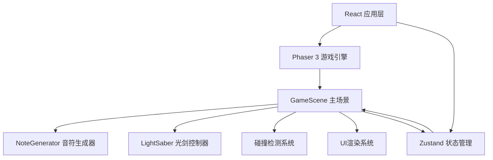

## 1. 架构设计



## 2. 技术描述

- **前端框架**：React@18 + ReactDOM@18
- **游戏引擎**：Phaser@3.60.0
- **构建工具**：Vite@5 + @vitejs/plugin-react
- **状态管理**：Zustand@4
- **开发语言**：TypeScript@5
- **渲染方式**：Phaser 3 Canvas/WebGL 渲染 + React DOM UI 叠加

## 3. 项目结构

```
auto321/
├── package.json
├── vite.config.js
├── tsconfig.json
├── index.html
└── src/
    ├── main.ts                    # Phaser 游戏初始化
    ├── App.tsx                    # React 根组件
    ├── scenes/
    │   └── GameScene.ts           # 主游戏场景
    ├── entities/
    │   ├── NoteGenerator.ts       # 音符生成器
    │   └── LightSaber.ts          # 光剑控制器
    └── store/
        └── gameStore.ts           # Zustand 状态管理
```

## 4. 文件定义

### 4.1 核心文件说明

| 文件路径 | 职责说明 |
|----------|----------|
| [package.json](file:///d:/Pro/tasks/auto321/package.json) | 依赖管理：phaser@3.60, react, react-dom, zustand, typescript, vite, @vitejs/plugin-react |
| [vite.config.js](file:///d:/Pro/tasks/auto321/vite.config.js) | Vite 配置，启用 React 插件 |
| [tsconfig.json](file:///d:/Pro/tasks/auto321/tsconfig.json) | TypeScript 配置，严格模式，ES2020 目标 |
| [index.html](file:///d:/Pro/tasks/auto321/index.html) | 入口文件，黑色背景 |
| [src/main.ts](file:///d:/Pro/tasks/auto321/src/main.ts) | Phaser.Game 实例创建，场景注册 |
| [src/App.tsx](file:///d:/Pro/tasks/auto321/src/App.tsx) | React 根组件，游戏容器 |
| [src/scenes/GameScene.ts](file:///d:/Pro/tasks/auto321/src/scenes/GameScene.ts) | 主游戏场景：音符管理、碰撞检测、UI更新、暂停、结算 |
| [src/entities/NoteGenerator.ts](file:///d:/Pro/tasks/auto321/src/entities/NoteGenerator.ts) | 音符方块生成：随机节拍、颜色变化、飞行控制 |
| [src/entities/LightSaber.ts](file:///d:/Pro/tasks/auto321/src/entities/LightSaber.ts) | 光剑控制：鼠标拖动、弧形挥砍、拖尾效果 |
| [src/store/gameStore.ts](file:///d:/Pro/tasks/auto321/src/store/gameStore.ts) | 状态管理：分数、连击数、最高连击、生命值、游戏状态 |

### 4.2 数据模型定义

```typescript
// Zustand Store 状态接口
interface GameState {
  score: number;
  combo: number;
  maxCombo: number;
  lives: number;
  isPaused: boolean;
  isGameOver: boolean;
  
  addScore: (points: number) => void;
  incrementCombo: () => void;
  resetCombo: () => void;
  loseLife: () => void;
  setPaused: (paused: boolean) => void;
  setGameOver: (over: boolean) => void;
  resetGame: () => void;
}

// 音符方块接口
interface Note {
  id: number;
  x: number;
  y: number;
  z: number;
  color: string;
  speed: number;
  size: number;
  isObstacle: boolean;
  active: boolean;
}

// 光剑接口
interface SaberState {
  x: number;
  y: number;
  angle: number;
  length: number;
  color: string;
  trail: Array<{ x: number; y: number; alpha: number }>;
}
```

## 5. 核心模块设计

### 5.1 NoteGenerator 模块

- **生成频率**：每1-2秒随机生成一个音符
- **方块属性**：0.8x0.8x0.8单位，四种颜色随机（#FF3333、#3333FF、#33FF33、#FFFF33）
- **飞行速度**：6单位/秒，沿Z轴向玩家移动
- **障碍物**：每10个方块后随机生成障碍物（红色半透明，1.0单位，不可切割）
- **数量限制**：最多同时存在15个活动方块

### 5.2 LightSaber 模块

- **光剑属性**：长度1.2单位，颜色#00BFFF，带光晕效果
- **控制方式**：鼠标拖动实现180度弧形挥砍
- **切割判定**：光剑位置与方块距离小于0.5单位判定为命中
- **拖尾效果**：0.1秒拖尾，残影逐渐缩小消失

### 5.3 GameScene 模块

- **碰撞检测**：每帧检测光剑与所有活动方块的距离
- **得分计算**：命中+10分，每5连击额外+20分
- **生命值**：触碰障碍物-1，初始3点，归零游戏结束
- **UI显示**：分数、连击、生命值、+10浮动文字、连击横幅
- **特效系统**：粒子爆炸（30个粒子，0.2秒）
- **暂停系统**：ESC键切换暂停，显示暂停菜单
- **结算系统**：游戏结束显示评级（S>1000, A>500, B其他）

## 6. 性能优化

- **对象池**：音符方块使用对象池复用，避免频繁创建销毁
- **数量限制**：最多15个同时存在的方块
- **帧率控制**：Phaser 3 自动帧率管理，目标60FPS
- **碰撞优化**：距离检测使用平方距离比较，避免开方运算
