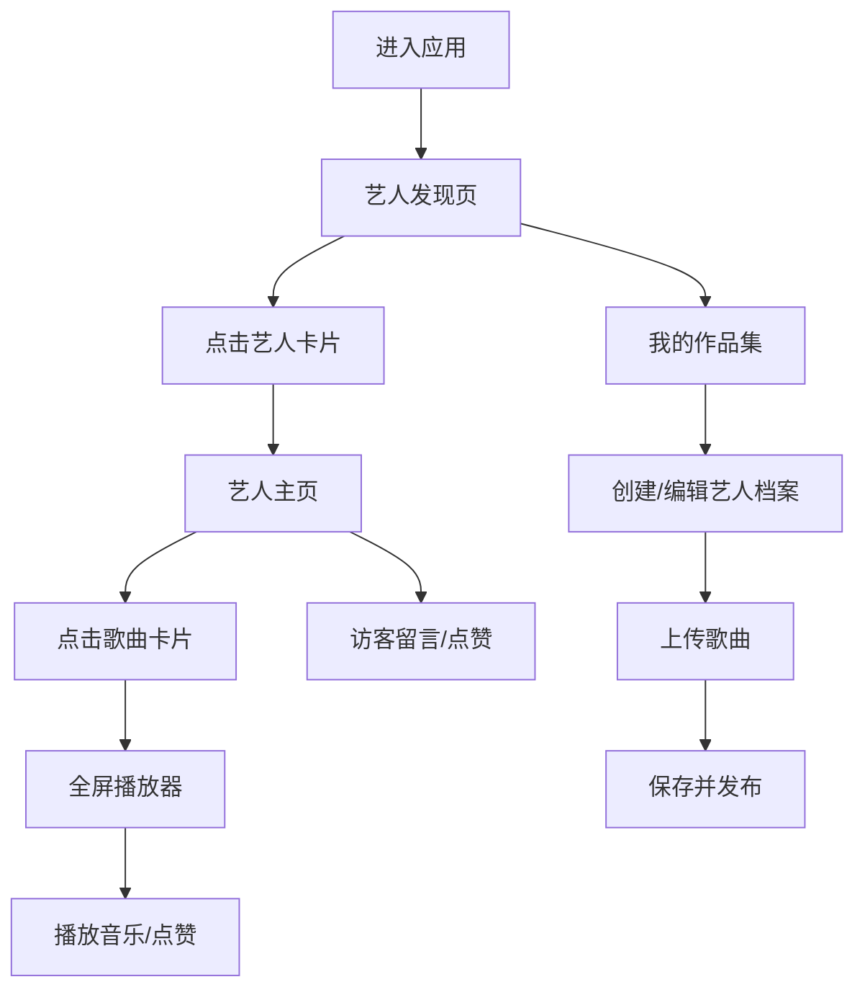

## 1. 产品概述

音乐人作品集是一款帮助独立音乐人快速生成和分享个人作品集页面的Web应用，解决传统建站工具操作复杂、无法专注展示音乐本身、缺乏试听与粉丝互动一体化体验的痛点。

- 目标用户：独立音乐人、乐队、音乐创作者
- 核心价值：零代码快速搭建作品集，音乐试听与粉丝互动一体化
- 市场价值：降低音乐人展示作品的技术门槛，专注音乐创作本身

## 2. 核心功能

### 2.1 用户角色

| 角色 | 注册方式 | 核心权限 |
|------|----------|----------|
| 音乐人 | 创建档案 | 编辑个人信息、上传歌曲、管理作品集 |
| 访客 | 无需注册 | 浏览艺人、试听歌曲、留言点赞 |

### 2.2 功能模块

1. **艺人发现页**：瀑布流展示所有艺人卡片，支持导航切换
2. **艺人主页**：个人信息展示、歌曲列表、留言区、粉丝榜
3. **作品集管理**：艺人档案编辑、歌曲上传管理
4. **音乐播放器**：全屏沉浸式播放器，波形动画，歌词展示
5. **互动系统**：留言、点赞、粉丝榜

### 2.3 页面详情

| 页面名称 | 模块名称 | 功能描述 |
|----------|----------|----------|
| 艺人发现页 | 导航栏 | 固定顶部，切换"发现艺人"和"我的作品集" |
| 艺人发现页 | 艺人卡片瀑布流 | 响应式网格布局，展示艺人头像、名字、风格标签 |
| 艺人主页 | 艺人信息区 | 圆形头像、艺人名、bio、风格标签 |
| 艺人主页 | 歌曲列表 | 瀑布流卡片展示，每首歌含封面、标题、时长、播放次数、点赞 |
| 艺人主页 | 留言区 | 访客留言展示，时间倒序，支持发表新留言 |
| 艺人主页 | 粉丝榜 | 点赞数最高的前5位粉丝，自动刷新 |
| 作品集管理 | 档案编辑 | 填写艺人名、bio、选择音乐风格标签 |
| 作品集管理 | 歌曲上传 | MP3上传，填写标题备注，自动提取时长 |
| 全屏播放器 | 播放控制 | 播放/暂停、进度条、波形动画、歌词占位、点赞 |

## 3. 核心流程

## 4. 用户界面设计

### 4.1 设计风格

- **主题色**：深色主题，主背景#0D0D0D，卡片背景#1E1E1E，强调色#FF6B6B，文字主色#EAEAEA
- **按钮风格**：胶囊形状，圆角8px，悬停过渡0.2秒
- **字体**：系统默认无衬线字体
- **布局风格**：单栏滚动，卡片式布局，固定顶部导航
- **动效**：卡片悬停上浮2px+阴影加深，点赞脉冲动画，粉丝榜淡入动画
- **图标**：音乐符号SVG，爱心图标

### 4.2 页面设计概览

| 页面名称 | 模块名称 | UI元素 |
|----------|----------|--------|
| 艺人发现页 | 导航栏 | 60px高度，#121212背景，底部1px分割线#2A2A2A，悬停文字变#FF6B6B |
| 艺人发现页 | 艺人卡片 | 8px圆角，柔和阴影，悬停上浮+阴影加深，圆形头像+首字母，风格标签胶囊 |
| 艺人主页 | 歌曲卡片 | 随机#333-#555背景+音乐符号SVG，瀑布流布局，播放按钮，点赞爱心 |
| 全屏播放器 | 播放器 | #1A1A1A背景80%不透明度，背景模糊20px，居中布局，Canvas波形动画，艺人主题色 |
| 互动区 | 留言/点赞 | 访客首字母头像（随机浅色背景），点赞实心#FF4757，0.3秒脉冲动画 |

### 4.3 响应式设计

- **大屏幕 (>1024px)**：每行3张卡片
- **中等屏幕 (768-1024px)**：每行2张卡片
- **小屏幕 (<768px)**：每行1张卡片
- 触控优化：增大点击区域，支持滑动操作

### 4.4 性能指标

- 首页加载时间 ≤ 1.5秒（模拟数据）
- 歌曲切换延迟 ≤ 0.5秒
- 点赞动画帧率保持 60fps
