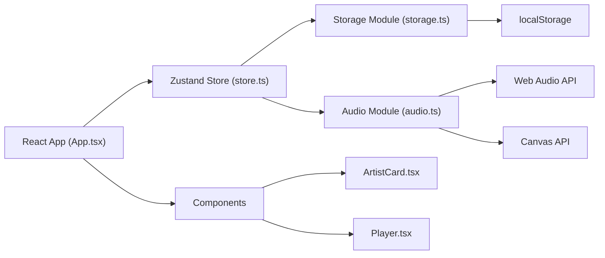

## 1. 架构设计



## 2. 技术选型

- **前端框架**：React@18 + TypeScript
- **构建工具**：Vite@5
- **状态管理**：Zustand@4
- **工具库**：uuid@9
- **数据存储**：localStorage（浏览器本地存储）
- **音频处理**：Web Audio API
- **图形绘制**：Canvas API

## 3. 目录结构

```
auto322/
├── index.html
├── package.json
├── vite.config.js
├── tsconfig.json
└── src/
    ├── App.tsx              # 主组件，路由和数据流控制
    ├── store.ts             # Zustand状态管理
    ├── utils/
    │   ├── storage.ts       # localStorage封装和数据导出
    │   └── audio.ts         # 音频解析和波形数据生成
    └── components/
        ├── ArtistCard.tsx   # 艺人卡片组件
        ├── SongCard.tsx     # 歌曲卡片组件
        ├── MessageList.tsx  # 留言列表组件
        ├── FanBoard.tsx     # 粉丝榜组件
        ├── Player.tsx       # 全屏播放器组件
        └── PortfolioForm.tsx # 作品集编辑表单
```

## 4. 路由定义

| 路由 | 页面 | 用途 |
|------|------|------|
| / | 艺人发现页 | 展示所有艺人卡片，瀑布流布局 |
| /artist/:id | 艺人主页 | 展示艺人信息、歌曲列表、留言区、粉丝榜 |
| /portfolio | 我的作品集 | 艺人档案编辑、歌曲上传管理 |

## 5. 数据模型

### 5.1 TypeScript 类型定义

```typescript
// 音乐风格
type MusicGenre = 'electronic' | 'folk' | 'rock' | 'pop' | 'jazz' | 'classical' | 'hiphop' | 'rnb';

// 艺人信息
interface Artist {
  id: string;
  name: string;
  bio: string;
  genres: MusicGenre[];
  avatarColor: string;
  createdAt: number;
}

// 歌曲
interface Song {
  id: string;
  artistId: string;
  title: string;
  note: string;
  duration: number;
  playCount: number;
  coverColor: string;
  audioData: string; // base64
  createdAt: number;
}

// 留言
interface Message {
  id: string;
  artistId: string;
  visitorName: string;
  content: string;
  avatarColor: string;
  createdAt: number;
}

// 点赞
interface Like {
  id: string;
  songId: string;
  visitorName: string;
  createdAt: number;
}

// 应用状态
interface AppState {
  artists: Artist[];
  songs: Song[];
  messages: Message[];
  likes: Like[];
  currentArtistId: string | null;
  currentSongId: string | null;
  isPlayerOpen: boolean;
}
```

### 5.2 状态管理设计

**Zustand Store 包含的 actions：**
- `createArtist(artist: Omit<Artist, 'id' | 'avatarColor' | 'createdAt'>): Artist`
- `updateArtist(id: string, updates: Partial<Artist>): void`
- `addSong(song: Omit<Song, 'id' | 'playCount' | 'coverColor' | 'createdAt'>): Song`
- `deleteSong(id: string): void`
- `incrementPlayCount(songId: string): void`
- `addMessage(message: Omit<Message, 'id' | 'avatarColor' | 'createdAt'>): Message`
- `addLike(like: Omit<Like, 'id' | 'createdAt'>): Like`
- `getLikesForSong(songId: string): Like[]`
- `getTopFans(artistId: string, limit: number): { name: string; count: number }[]`
- `openPlayer(songId: string): void`
- `closePlayer(): void`
- `exportData(): string`
- `importData(json: string): void`

## 6. 核心模块设计

### 6.1 Storage Module (storage.ts)

```typescript
// 存储键名常量
const STORAGE_KEY = 'music_portfolio_data';

// 保存整个应用状态到localStorage
export function saveToStorage(state: AppState): void;

// 从localStorage加载应用状态
export function loadFromStorage(): AppState | null;

// 导出数据为JSON文件
export function exportToJson(state: AppState): void;

// 生成基于名字的哈希颜色
export function hashColor(name: string): string;

// 生成随机浅色
export function randomLightColor(): string;

// 生成随机深色（#333-#555）
export function randomDarkColor(): string;
```

### 6.2 Audio Module (audio.ts)

```typescript
// 解析音频文件，提取时长
export async function parseAudio(file: File): Promise<{
  duration: number;
  audioData: string; // base64
}>;

// 从AudioBuffer生成波形频率数据
export function generateWaveformData(audioBuffer: AudioBuffer, samples: number): number[];

// 获取实时频率数据（用于Canvas动画）
export function getRealTimeFrequencies(analyser: AnalyserNode): Uint8Array;
```

## 7. 性能优化策略

1. **首屏加载**：使用Vite的代码分割，按需加载组件
2. **音频处理**：使用Web Worker处理音频解码，避免阻塞UI
3. **动画性能**：使用CSS transform和opacity属性实现动画，保证60fps
4. **Canvas优化**：使用requestAnimationFrame，限制绘制频率
5. **列表虚拟化**：歌曲列表使用虚拟滚动（如超过20首）
6. **数据缓存**：localStorage读写使用防抖，避免频繁IO
