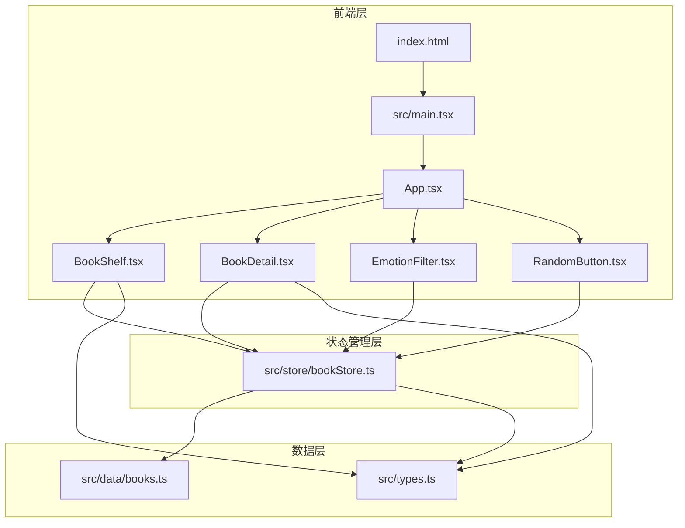
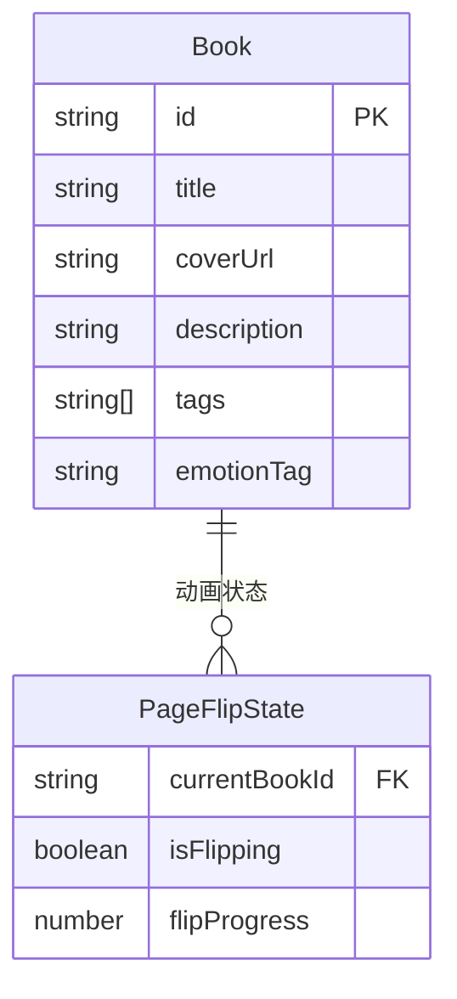

## 1. 架构设计

## 2. 技术说明
- 前端：React@18 + TypeScript + Vite
- 初始化工具：vite-init（react-ts模板）
- 状态管理：Zustand
- 后端：无（纯前端，数据为预设Mock数据）
- 数据库：无（内存数据）

## 3. 路由定义
| 路由 | 用途 |
|------|------|
| / | 书架展示页（唯一页面） |

## 4. 数据模型

### 4.1 数据模型定义

### 4.2 数据定义
- Book接口：id（uuid）、title（书名）、coverUrl（Unsplash封面链接）、description（简介）、tags（标签数组）、emotionTag（情感标签）
- PageFlipState接口：currentBookId、isFlipping、flipProgress（0-1）
- Zustand Store状态：selectedBook、animationProgress、activeEmotions（选中情感标签集合）、books（书籍数组）
- Zustand Store动作：selectBook、closeBook、toggleEmotion、randomSelect
