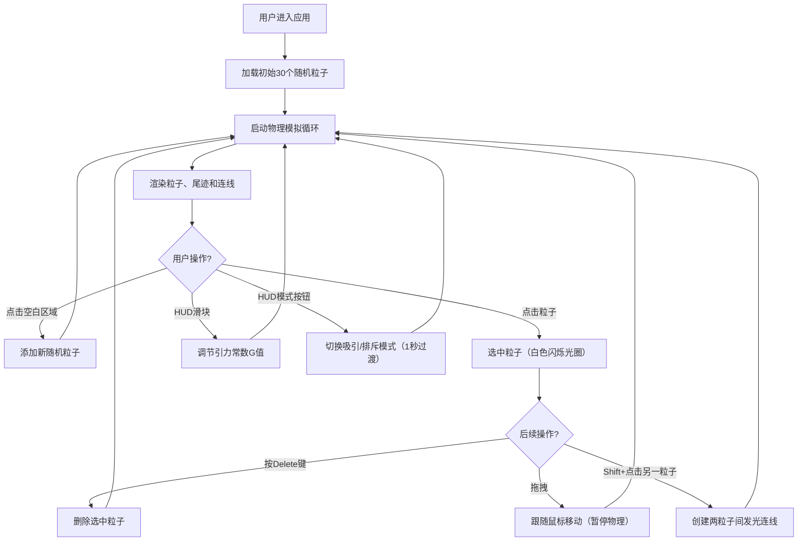

## 1. 产品概述
星尘编年史是一款沉浸式3D交互粒子宇宙沙盒应用，用户可以在三维空间中自由创造、操控和观察发光粒子（星尘）的动态演化，体验引力物理学与美学的完美融合。
- 面向创意爱好者、物理爱好者和普通用户，提供直观的粒子宇宙探索体验
- 通过简单的交互创造出独特的星云艺术作品，兼具教育性与娱乐性

## 2. 核心功能

### 2.1 用户角色
无角色区分，所有用户拥有完整功能权限。

### 2.2 功能模块
1. **3D宇宙场景**：深空渐变背景、粒子渲染、轨道控制、手势交互
2. **粒子物理引擎**：引力/斥力模拟、速度加速度计算、模式平滑过渡
3. **交互管理系统**：粒子增删改、选中拖拽、连线创建、模式切换
4. **HUD控制面板**：粒子计数、模式显示、引力常数调节滑块
5. **粒子尾迹与连线系统**：动态尾迹效果、粒子间发光连线

### 2.3 页面详情
| 页面名称 | 模块名称 | 功能描述 |
|----------|----------|----------|
| 主场景 | 3D宇宙渲染 | 全屏Three.js场景，深空渐变背景，支持鼠标拖拽旋转、滚轮缩放 |
| 主场景 | 粒子系统 | 默认30个随机分布粒子，支持颜色、大小、运动参数自定义 |
| 主场景 | 物理模拟 | 吸引/排斥双模式，牛顿引力公式，G值0.1-10可调，模式切换1秒平滑过渡 |
| 主场景 | 粒子交互 | 点击空白添加粒子、点击选中粒子（白色闪烁光圈）、Delete删除、拖拽移动 |
| 主场景 | 连线系统 | Shift+点击两粒子创建发光连线，最多20条，颜色混合，动态伸缩 |
| HUD面板 | 状态显示 | 粒子总数、当前模式、G值滑块（渐变填充），毛玻璃效果 |
| 操作提示 | 提示条 | 底部居中显示操作指南，3秒静止自动淡出，移动重新显现 |

## 3. 核心流程
用户进入应用后，默认场景加载30个随机粒子并开始物理模拟。用户可以点击添加新粒子、选中并拖拽粒子、通过Shift+点击创建粒子连线、通过HUD面板切换引力模式和调节G值，观察粒子在引力规则下形成动态星云结构。

## 4. 用户界面设计

### 4.1 设计风格
- **主色调**：#6C63FF（紫蓝主色）、#FF6584（粉红辅色）
- **星尘色板**：#FFB7C5（粉）、#B5EAD7（绿）、#C7CEEA（蓝）、#FFDAC1（橙）、#E2F0CB（黄）
- **按钮风格**：扁平化设计，圆角，0.2秒悬停颜色过渡
- **字体**：现代无衬线字体，白色文字配合半透明深色背景
- **布局风格**：全屏沉浸式3D场景，左上角HUD浮动面板，底部居中提示条
- **视觉效果**：毛玻璃（backdrop-filter: blur）、深空渐变背景、粒子发光效果、连线发光

### 4.2 页面设计概述
| 页面名称 | 模块名称 | UI元素 |
|----------|----------|--------|
| 主场景 | 3D宇宙 | 深空渐变#0A0A1A→#1A1A3A，粒子发光材质，尾迹虚线渐变透明 |
| 主场景 | 粒子选中效果 | 2px白色光圈，1Hz频率闪烁 |
| HUD面板 | 控制面板 | 背景rgba(255,255,255,0.1)，blur(10px)毛玻璃，10px圆角，白色文字 |
| HUD面板 | G值滑块 | 0.1-10范围，步长0.1，渐变填充，扁平化风格 |
| HUD面板 | 模式切换 | 吸引/排斥双按钮，#6C63FF高亮当前模式 |
| 操作提示 | 底部提示条 | 背景rgba(0,0,0,0.5)，10px圆角，#FFFFFF文字，3秒静止淡出（0.5秒动画） |
| 连线效果 | 粒子连线 | 线宽0.5单位，透明度0.6，颜色为两粒子混合色，模式切换时蓝→红平滑过渡 |

### 4.3 响应式设计
- 桌面端：鼠标拖拽旋转场景、滚轮缩放、点击/Shift+点击交互
- 移动端：双指捏合缩放、单指旋转、双指平移、触摸交互
- 全屏自适应，Canvas元素随窗口大小自动调整

### 4.4 3D场景指引
- **环境**：深空渐变背景，无外部HDRI，营造宇宙深邃感
- **光照**：粒子自发光（ emissive 材质），无场景光源，粒子本身作为光源
- **相机**：PerspectiveCamera，初始距离20单位，fov 60°，支持OrbitControls轨道控制
- **构图**：粒子分布在半径10单位的球体内，中心为场景原点
- **交互**：OrbitControls（enableDamping=true，dampingFactor=0.05），自定义Raycaster进行粒子拾取
- **后处理**：粒子使用AdditiveBlending实现发光叠加效果
- **性能**：100粒子@60FPS，物理计算<5ms/帧，draw calls<150，尾迹总粒子<500
