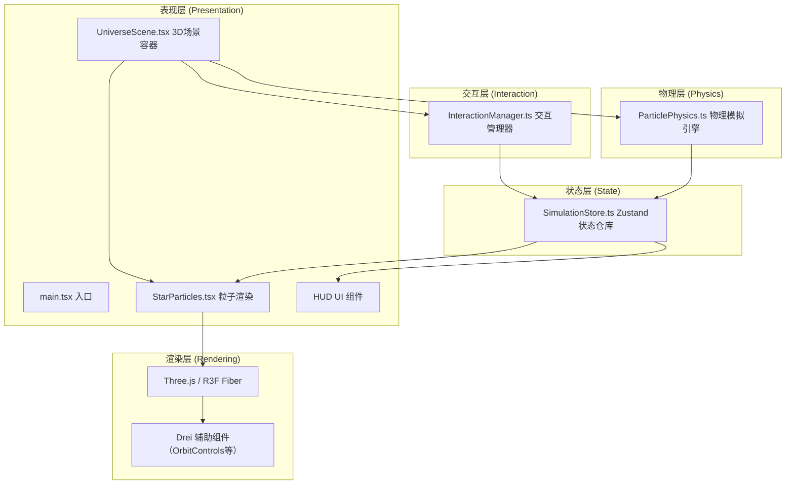

## 1. 架构设计



## 2. 技术描述
- **前端框架**：React@18 + TypeScript@5
- **3D渲染**：three@0.160 + @react-three/fiber@8 + @react-three/drei@9
- **状态管理**：zustand@4
- **构建工具**：Vite@5 + @vitejs/plugin-react@4
- **后端**：无（纯前端应用）
- **数据库**：无（内存状态存储）

## 3. 项目结构

```
d:\Pro\tasks\auto324/
├── package.json
├── vite.config.js
├── tsconfig.json
├── index.html
└── src/
    ├── main.tsx              # React入口
    ├── scene/
    │   ├── UniverseScene.tsx # 3D场景容器
    │   └── StarParticles.tsx # 粒子渲染组件
    ├── physics/
    │   └── ParticlePhysics.ts # 物理模拟引擎
    ├── interaction/
    │   └── InteractionManager.ts # 交互管理器
    └── data/
        └── SimulationStore.ts # Zustand状态仓库
```

## 4. 数据模型

### 4.1 粒子数据结构

```typescript
interface Particle {
  id: string;           // 唯一标识符
  x: number;            // 位置X
  y: number;            // 位置Y
  z: number;            // 位置Z
  vx: number;           // 速度X
  vy: number;           // 速度Y
  vz: number;           // 速度Z
  color: string;        // 颜色HEX
  size: number;         // 大小（0.3-0.8）
  prevPositions?: {     // 尾迹历史位置
    x: number; y: number; z: number; time: number;
  }[];
}

interface ParticleConnection {
  id: string;
  particleIdA: string;
  particleIdB: string;
}

interface SimulationState {
  particles: Particle[];
  connections: ParticleConnection[];
  gravityConstant: number;  // G值，0.1-10
  simulationMode: 'attract' | 'repel';  // 吸引/排斥模式
  isRunning: boolean;
  selectedParticleId: string | null;
  secondSelectedId: string | null;  // 用于连线的第二个选中
  isDragging: boolean;
  draggedParticleId: string | null;
  modeTransitionProgress: number;  // 模式切换过渡 0-1
  previousMode: 'attract' | 'repel';
}
```

### 4.2 Store方法定义

```typescript
interface SimulationActions {
  addParticle: (partial?: Partial<Particle>) => void;
  removeParticle: (id: string) => void;
  updateParticle: (id: string, updates: Partial<Particle>) => void;
  setSelectedParticle: (id: string | null) => void;
  setSecondSelected: (id: string | null) => void;
  addConnection: (idA: string, idB: string) => void;
  removeConnection: (id: string) => void;
  setGravityConstant: (g: number) => void;
  setSimulationMode: (mode: 'attract' | 'repel') => void;
  setDragging: (isDragging: boolean, particleId?: string) => void;
  tickPhysics: (deltaTime: number) => void;
  updateModeTransition: (progress: number) => void;
}
```

## 5. 核心算法

### 5.1 引力/斥力计算
```
对每个粒子 i:
  合力 F = (0, 0, 0)
  对每个其他粒子 j:
    距离向量 d = pos[j] - pos[i]
    距离平方 r² = |d|² + ε (防止除零，ε=0.1)
    力的大小 F_mag = G * mass[i] * mass[j] / r²
    力的方向 = normalize(d)
    若吸引模式: F += F_mag * 方向
    若排斥模式: F -= F_mag * 方向
  加速度 a = F / mass (mass=1，简化)
  速度 v += a * dt
  位置 pos += v * dt
  速度阻尼: v *= 0.999 (防止能量无限累积)
```

### 5.2 模式切换平滑过渡
```
切换模式时:
  保存当前速度数组 prevVelocities
  计算新模式下目标速度 targetVelocities（翻转引力方向重新计算一帧）
  在1000ms内:
    t = 已过时间 / 1000
    当前速度 = lerp(prevVelocities, targetVelocities, t)
    当 t >= 1 时，过渡结束
```

## 6. 性能优化策略
- **粒子渲染**：使用BufferGeometry + Points，单次draw call渲染所有粒子
- **尾迹渲染**：使用单独的BufferGeometry，限制历史位置数量（每粒子最多5段）
- **连线渲染**：使用LineSegments，BufferGeometry存储所有线段
- **物理计算**：O(n²)算法但n≤100，使用原生数组避免GC
- **Zustand优化**：使用selectors避免不必要的重渲染
- **Raycaster拾取**：每帧仅在鼠标移动时更新，使用LOD=0.1提高精度
