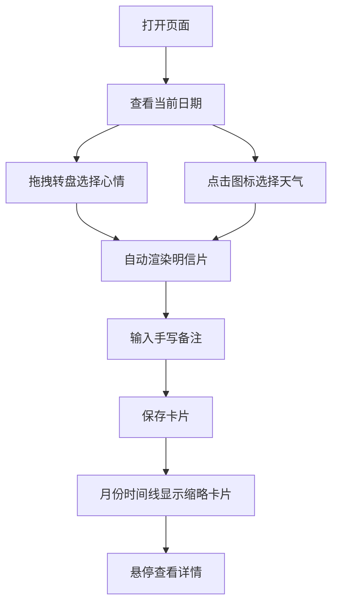

## 1. 产品概述

情绪气象站是一款让用户通过选择当日心情和天气来生成独特插画风格气象明信片的交互式Web应用。每张明信片上的云朵形状、雨滴密度、阳光角度等视觉元素会根据情绪参数自动变化，所有卡片以月份时间线的方式排列展示，形成个人的情绪气象日记。

- 目标用户：希望以创意方式记录每日情绪的年轻人、日记爱好者、心理健康关注者
- 核心价值：将抽象情绪转化为可视化插画，创造持续的情绪记录习惯

## 2. 核心功能

### 2.1 用户角色

| 角色 | 注册方式 | 核心权限 |
|------|----------|----------|
| 普通用户 | 无需注册 | 浏览、创建、查看情绪明信片 |

### 2.2 功能模块

1. **首页**：渐变横幅、心情转盘、天气选择器、明信片生成器
2. **月份时间线**：日历网格、缩略卡片、悬停交互

### 2.3 页面详情

| 页面名称 | 模块名称 | 功能描述 |
|----------|----------|----------|
| 首页 | 渐变横幅区域 | 左侧显示当前日期（中文格式），中间显示心情转盘，右侧显示天气图标 |
| 首页 | 心情转盘 | 六段色环（开心/平静/忧伤/愤怒/焦虑/惊喜），支持左右拖拽旋转选择 |
| 首页 | 天气选择器 | 六种天气SVG图标（晴天/多云/小雨/大雨/雪天/雷阵雨），点击弹出选择面板，选中图标放大并脉冲光效 |
| 首页 | 明信片生成器 | 根据心情和天气动态渲染插画明信片，包含云朵漂移、雨滴下落、阳光闪烁动画，底部手写风格文本框 |
| 首页 | 月份时间线 | 月历网格展示缩略卡片，鼠标悬停上浮放大并显示备注 |

## 3. 核心流程

用户打开页面 → 查看当前日期 → 拖拽心情转盘选择心情 → 点击天气图标选择天气 → 自动生成插画明信片 → 输入手写备注 → 保存卡片 → 月份时间线中出现缩略卡片 → 悬停查看详情

## 4. 用户界面设计

### 4.1 设计风格

- 主色调：根据心情动态变化（开心#FFD93D、平静#6BCB77、忧伤#4F8FD3、愤怒#FF6B6B、焦虑#9B59B6、惊喜#FF9FF3）
- 辅助色：天空渐变色（晴天#87CEEB到#FFFACD，雨天#6A9FB5到#A9C0D2）
- 按钮风格：圆角8px，柔和阴影，hover时轻微上浮
- 字体：Caveat手写字体（备注文本24px，颜色#2C3E50），UI字体使用无衬线体
- 布局风格：顶部渐变横幅 + 主体插画区 + 底部月历时间线
- 图标风格：SVG手绘风格天气图标，带微动画

### 4.2 页面设计概览

| 页面名称 | 模块名称 | UI元素 |
|----------|----------|--------|
| 首页 | 渐变横幅 | 横向渐变背景，左侧日期文字，中间六段色环转盘，右侧天气SVG图标 |
| 首页 | 明信片区域 | 天空渐变背景，CSS动画云朵/雨滴/阳光，底部Caveat字体文本框 |
| 首页 | 月份时间线 | 网格布局，80x60px缩略卡片，8px圆角阴影，hover放大120x90px |

### 4.3 响应式设计

- 桌面优先设计，适配1920px/1440px/1024px宽度
- 心情转盘在窄屏下缩小但保持可操作性
- 月份时间线网格列数自适应
- 触屏设备支持触摸拖拽转盘

### 4.4 动效设计

- 云朵：缓慢水平漂移（translateX动画，10s循环）
- 雨滴：从上到下下落（translateY动画，1.5s循环，不同延迟错开）
- 阳光：射线闪烁（opacity动画，2s循环）
- 转盘：拖拽旋转（transform rotate，0.3s过渡）
- 天气图标选中：放大1.2倍 + 脉冲光效（scale + box-shadow动画）
- 缩略卡片悬停：上浮8px + 放大到120x90px + 背景模糊（0.5s过渡）
