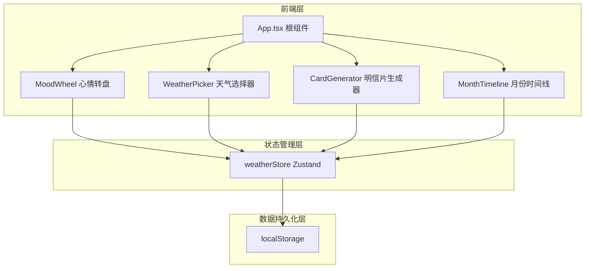
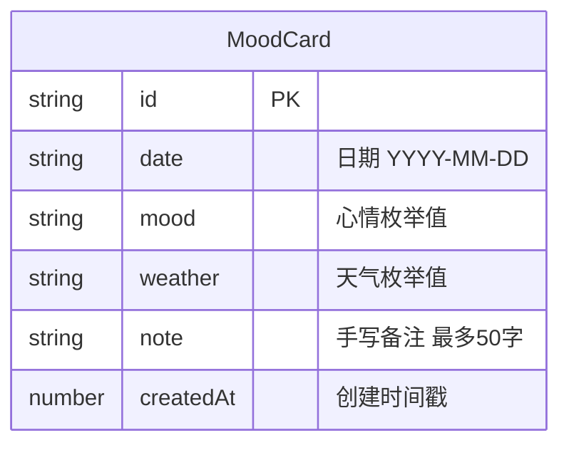

## 1. 架构设计



## 2. 技术说明

- 前端：React@18 + TypeScript + Vite
- 状态管理：Zustand
- 样式方案：CSS Modules + Tailwind CSS
- 初始化工具：vite-init（react-ts模板）
- 后端：无
- 数据库：localStorage（浏览器本地持久化）
- 日期处理：date-fns
- 唯一标识：uuid

## 3. 路由定义

| 路由 | 用途 |
|------|------|
| / | 首页，包含心情转盘、天气选择、明信片生成和月份时间线 |

## 4. 数据模型

### 4.1 数据模型定义



### 4.2 数据定义

- **Mood枚举**：happy（开心#FFD93D）、calm（平静#6BCB77）、sad（忧伤#4F8FD3）、angry（愤怒#FF6B6B）、anxious（焦虑#9B59B6）、surprised（惊喜#FF9FF3）
- **Weather枚举**：sunny（晴天）、cloudy（多云）、lightRain（小雨）、heavyRain（大雨）、snow（雪天）、thunderstorm（雷阵雨）
- **localStorage键**：`emotion-weather-cards`，存储MoodCard数组的JSON序列化

### 4.3 状态管理接口

```typescript
interface WeatherState {
  currentMood: Mood | null
  currentWeather: Weather | null
  cards: MoodCard[]
  setMood: (mood: Mood) => void
  setWeather: (weather: Weather) => void
  saveCard: (note: string) => void
  getMonthCards: (year: number, month: number) => MoodCard[]
}
```

## 5. 文件结构

```
├── package.json
├── vite.config.js
├── tsconfig.json
├── index.html
├── src/
│   ├── App.tsx
│   ├── main.tsx
│   ├── store/
│   │   └── weatherStore.ts
│   ├── components/
│   │   ├── MoodWheel.tsx
│   │   ├── WeatherPicker.tsx
│   │   ├── CardGenerator.tsx
│   │   └── MonthTimeline.tsx
│   └── utils/
│       └── illustrationEngine.ts
```

## 6. 性能目标

- 所有动画帧率不低于55fps（使用CSS动画优先，避免JS动画重排）
- 页面首次加载时间在1.5秒内（Vite代码分割 + 轻量依赖）
- CSS动画使用transform和opacity属性，确保GPU加速
- 明信片插画元素使用CSS实现，不依赖Canvas或WebGL
