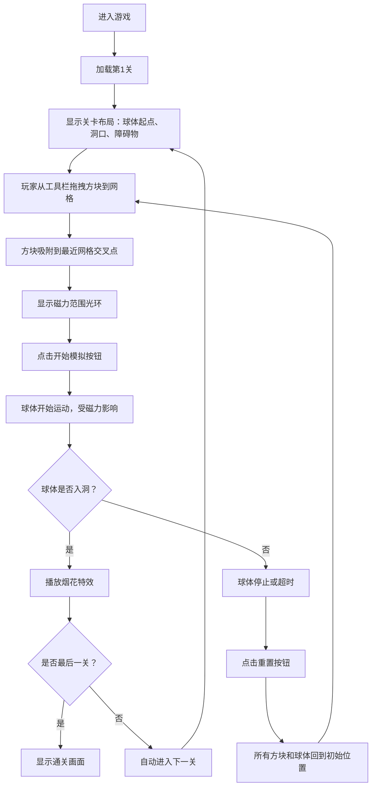

## 1. 产品概述

磁力谜题是一款基于 2D 物理碰撞的解谜游戏，玩家通过拖拽放置不同极性的磁力方块，利用"同性相斥、异性相吸"的物理原理，将目标球体推入指定洞口。游戏通过精心设计的关卡布局，考验玩家的空间思维和物理直觉。

- **核心玩法**：拖拽放置 N 极（红色）、S 极（蓝色）、中性（灰色）三种磁力方块，操纵球体运动轨迹
- **目标用户**：喜欢物理解谜类游戏的休闲玩家，年龄覆盖 12 岁以上
- **产品价值**：将抽象的磁场物理概念具象化，提供兼具教育性和娱乐性的游戏体验

## 2. 核心功能

### 2.1 用户角色

| 角色 | 注册方式 | 核心权限 |
|------|----------|----------|
| 玩家 | 无需注册 | 体验全部 5 个关卡，放置方块，控制游戏流程 |

### 2.2 功能模块

1. **游戏主界面**：8x8 网格游戏区域、工具栏、控制按钮、进度显示
2. **方块拖拽系统**：从工具栏拖拽方块到网格，吸附到交叉点，显示磁力范围
3. **物理模拟引擎**：球体受磁力影响的运动、碰撞反弹、轨迹残影
4. **关卡系统**：5 个预设关卡，不同洞口位置、障碍物布局、可用方块数量
5. **游戏状态管理**：开始模拟、重置关卡、通关判定、进度记录

### 2.3 页面详情

| 页面名称 | 模块名称 | 功能描述 |
|----------|----------|----------|
| 游戏主界面 | 网格游戏区 | 8x8 网格（64px/格），渲染球体、方块、障碍物、洞口 |
| 游戏主界面 | 右侧工具栏 | 垂直排列三种方块槽位，显示可用数量，支持拖拽 |
| 游戏主界面 | 中央控制区 | "开始模拟"和"重置"按钮，控制游戏流程 |
| 游戏主界面 | 顶部状态栏 | 计时器、移动步数、关卡进度条 |
| 游戏主界面 | 通关特效 | 烟花粒子效果，自动进入下一关 |

## 3. 核心流程



玩家进入游戏后，系统加载第一关的初始布局。玩家从右侧工具栏拖拽磁力方块到左侧 8x8 网格上，方块会自动吸附到最近的网格交叉点，并显示 1.5 格范围的磁力光环。玩家调整好方块布局后，点击"开始模拟"按钮，球体从起点出发，在磁力作用下运动。如果球体成功进入洞口，则播放烟花特效并自动进入下一关。如果失败，玩家可以点击"重置"按钮，回到布局阶段重新尝试。

## 4. 界面设计

### 4.1 设计风格

- **整体主题**：深色科技感，营造未来物理实验室的氛围
- **主背景色**：#1A1A2E（深蓝紫色）
- **网格线条**：#2D2D44，线宽 1px
- **游戏区边框**：#4A4A9A 到透明的内发光渐变
- **工具栏背景**：#16213E（深蓝绿色）

**配色方案**：
| 用途 | 颜色值 | 说明 |
|------|--------|------|
| N 极方块 | #FF4757 | 红色，排斥同名磁极 |
| S 极方块 | #3742FA | 蓝色，吸引 N 极 |
| 中性方块 | #747D8C | 灰色，无磁力，仅作障碍 |
| 球体 | 银白渐变 | #E8E8E8 到 #A0A0A0 金属质感 |
| 主要按钮 | #6C63FF 到 #4834D4 | 紫色渐变 |
| 重置按钮 | #555555 | 深灰色，悬停变 #7F8C8D |
| 已完成关卡 | #2ECC71 | 绿色圆点 |
| 当前关卡 | #F1C40F | 黄色圆点 |
| 未完成关卡 | #7F8C8D | 灰色圆点 |

**按钮样式**：
- "开始模拟"：圆角 12px，渐变 #6C63FF → #4834D4，悬停亮度 +20%，点击缩放 0.95
- "重置"：圆角 12px，背景 #555，点击变 #7F8C8D
- 所有按钮动画过渡 ≤ 0.2 秒

**字体**：
- 使用 JetBrains Mono 或 Fira Code 等代码风格字体，增强科技感
- 数字：18px 白色，用于方块数量显示
- 标题：14px 半透明白色，用于标签
- 计时器和步数：20px 粗体白色

### 4.2 页面设计总览

| 页面名称 | 模块名称 | UI 元素 |
|----------|----------|---------|
| 游戏主界面 | 网格游戏区 | 8x8 网格线（#2D2D44）、内发光边框、居中放置、占屏幕 65% 宽度 |
| 游戏主界面 | 右侧工具栏 | 宽 250px、圆角 16px、背景 #16213E、三个垂直排列的方块槽位、Font Awesome cube 图标（32px）、数量数字（白色 18px） |
| 游戏主界面 | 控制按钮 | "开始模拟"和"重置"按钮水平居中排列、间距 16px、过渡动画 0.2s |
| 游戏主界面 | 顶部状态栏 | 左上角进度条（5 个圆点）、右上角计时器 + 步数统计 |
| 游戏主界面 | 磁力范围显示 | 方块周围 1.5 格半径的半透明圆环、N 极红色微光、S 极蓝色微光 |
| 游戏主界面 | 球体效果 | 直径 24px、贝塞尔曲线轨迹、5 帧半透明残影、拖拽时磁场感应颤动 |
| 游戏主界面 | 通关特效 | 烟花粒子（彩色圆点 3-8px、从洞口扩散、持续 2 秒） |

### 4.3 布局结构

```
┌─────────────────────────────────────────────────────────────┐
│ 进度条 ● ● ● ● ●                      计时器 00:00  步数: 0 │
├───────────────────────────────────┬─────────────────────────┤
│                                   │                         │
│                                   │  ┌───────────────────┐  │
│                                   │  │     工具栏        │  │
│                                   │  │ ┌───────────────┐ │  │
│            8x8 网格游戏区          │  │ │ 🔴 N 极  剩余 3 │ │  │
│        (占宽度 65%，居中)          │  │ └───────────────┘ │  │
│                                   │  │ ┌───────────────┐ │  │
│                                   │  │ │ 🔵 S 极  剩余 2 │ │  │
│                                   │  │ └───────────────┘ │  │
│                                   │  │ ┌───────────────┐ │  │
│                                   │  │ │ ⬜ 中性  剩余 1 │ │  │
│                                   │  │ └───────────────┘ │  │
│                                   │  └───────────────────┘  │
├───────────────────────────────────┤                         │
│     [开始模拟]    [重置]          │                         │
└───────────────────────────────────┴─────────────────────────┘
```

### 4.4 响应式设计

- **桌面优先**：针对 1280px 及以上宽度优化，游戏画布固定 800x600 像素
- **平板适配**：工具栏自适应宽度，最小保持 200px
- **触控优化**：拖拽区域扩大 20px，按钮最小触控区域 44x44px
- **性能优化**：使用 CSS transform 和 will-change 提升渲染性能，所有动画 60fps 运行

### 4.5 交互动画规范

| 交互 | 动画效果 | 时长 |
|------|----------|------|
| 按钮悬停 | 亮度 +20%，阴影增强 | 0.2s |
| 按钮点击 | 缩放 0.95 倍 | 0.1s |
| 方块拖拽 | 半透明跟随鼠标，释放时吸附到网格 | 0.15s |
| 球体运动 | 贝塞尔曲线平滑移动，尾部 5 帧残影 | 每帧更新 |
| 碰撞反弹 | 弹性系数 0.6，速度衰减 | 瞬时 |
| 通关烟花 | 彩色粒子从洞口向外扩散 | 2s |
| 磁场感应 | 拖拽方块靠近时球体颤动（±2px 偏移） | 0.5s 周期 |

### 4.6 性能指标

- **帧率**：Chrome/Firefox/Safari 稳定 60fps
- **物理模拟**：单帧计算时间 ≤ 16ms
- **拖拽响应**：从鼠标按下到视觉反馈 ≤ 50ms
- **内存占用**：稳定运行 ≤ 200MB
