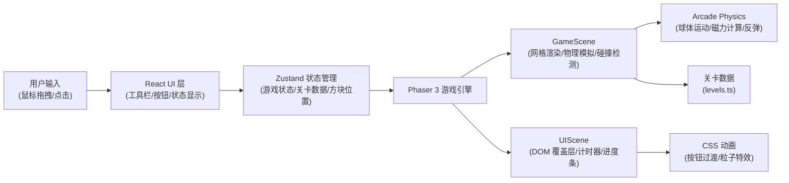

## 1. 架构设计



本项目采用 **React + Phaser 3** 混合架构，React 负责 UI 组件和状态管理，Phaser 3 负责游戏渲染和物理模拟。两层通过 Zustand 状态管理和 Phaser 事件系统进行通信，实现数据单向流动。

## 2. 技术选型

### 2.1 核心技术栈

| 技术 | 版本 | 用途 |
|------|------|------|
| React | ^18.2.0 | UI 组件框架，管理工具栏、按钮、状态显示 |
| TypeScript | ^5.0.0 | 类型安全，提升代码可维护性 |
| Vite | ^4.3.0 | 构建工具，提供快速的开发体验 |
| Phaser | 3.60.0 | 2D 游戏引擎，负责网格渲染、物理模拟、碰撞检测 |
| Zustand | ^4.3.0 | 轻量级状态管理，连接 React UI 和 Phaser 游戏场景 |
| @vitejs/plugin-react | ^4.0.0 | Vite React 插件 |
| uuid | ^9.0.0 | 生成唯一 ID 标识游戏对象 |
| Font Awesome | ^6.4.0 | 提供方块图标 (cube) |

### 2.2 初始化方式

使用 Vite React TypeScript 模板初始化项目：
```bash
npm init vite-init@latest -y . -- --template react-ts --force
```

然后修改 `package.json` 添加 Phaser 3、zustand、uuid 等依赖。

## 3. 目录结构

```
auto326/
├── index.html                          # 入口页面，含 div#game 容器
├── package.json                        # 依赖配置
├── vite.config.js                      # Vite 配置
├── tsconfig.json                       # TypeScript 配置
├── public/
│   └── favicon.ico
└── src/
    ├── main.tsx                        # 游戏主入口
    ├── App.tsx                         # React 根组件
    ├── index.css                       # 全局样式
    ├── scenes/
    │   ├── GameScene.ts                # 游戏场景：网格、物理、碰撞
    │   └── UIScene.ts                  # UI 场景：覆盖层、计时器
    ├── config/
    │   └── levels.ts                   # 关卡配置数据
    ├── store/
    │   └── useGameStore.ts             # Zustand 状态管理
    ├── types/
    │   └── game.ts                     # TypeScript 类型定义
    ├── utils/
    │   └── physics.ts                  # 物理计算工具函数
    └── components/
        ├── Toolbar.tsx                 # 右侧工具栏
        ├── ControlButtons.tsx          # 开始/重置按钮
        ├── StatusBar.tsx               # 计时器/步数/进度条
        └── Fireworks.tsx               # 通关烟花特效
```

## 4. 核心数据模型

### 4.1 TypeScript 类型定义

```typescript
// src/types/game.ts

export type BlockType = 'n-pole' | 's-pole' | 'neutral';

export interface Position {
  x: number;
  y: number;
}

export interface Block {
  id: string;
  type: BlockType;
  gridX: number;
  gridY: number;
}

export interface Obstacle {
  gridX: number;
  gridY: number;
}

export interface Level {
  id: number;
  name: string;
  ballStart: Position;
  hole: Position;
  obstacles: Obstacle[];
  availableBlocks: {
    'n-pole': number;
    's-pole': number;
    'neutral': number;
  };
}

export interface BallState {
  x: number;
  y: number;
  vx: number;
  vy: number;
  trail: Position[];
}

export type GamePhase = 'editing' | 'simulating' | 'won' | 'lost';

export interface GameState {
  currentLevel: number;
  completedLevels: number[];
  phase: GamePhase;
  placedBlocks: Block[];
  availableBlocks: {
    'n-pole': number;
    's-pole': number;
    'neutral': number;
  };
  ball: BallState;
  timer: number;
  moveCount: number;
  isDragging: boolean;
  draggingBlockType: BlockType | null;
}
```

### 4.2 关卡数据示例

```typescript
// src/config/levels.ts

export const LEVELS: Level[] = [
  {
    id: 1,
    name: '初识磁力',
    ballStart: { x: 1, y: 4 },
    hole: { x: 6, y: 4 },
    obstacles: [],
    availableBlocks: { 'n-pole': 2, 's-pole': 1, 'neutral': 0 },
  },
  // ... 更多关卡
];
```

## 5. 状态管理设计

### 5.1 Zustand Store

```typescript
// src/store/useGameStore.ts

import { create } from 'zustand';
import { GameState, BlockType, Position, Block } from '../types/game';
import { LEVELS } from '../config/levels';
import { v4 as uuidv4 } from 'uuid';

interface GameActions {
  startSimulation: () => void;
  resetLevel: () => void;
  placeBlock: (type: BlockType, gridX: number, gridY: number) => void;
  removeBlock: (blockId: string) => void;
  updateBall: (x: number, y: number, vx: number, vy: number) => void;
  addTrailPoint: (x: number, y: number) => void;
  incrementTimer: () => void;
  incrementMoveCount: () => void;
  setDragging: (isDragging: boolean, type: BlockType | null) => void;
  completeLevel: () => void;
  nextLevel: () => void;
  loadLevel: (levelId: number) => void;
}

export const useGameStore = create<GameState & GameActions>((set, get) => ({
  // ... 初始状态和 action 实现
}));
```

## 6. 游戏场景设计

### 6.1 GameScene (Phaser 场景)

**核心职责**：
- 渲染 8x8 网格（格子 64x64 像素）
- 管理磁力方块的放置和显示
- 球体物理模拟（使用 Phaser Arcade Physics）
- 磁力计算（同性相斥、异性相吸）
- 碰撞检测（墙壁、方块、洞口）
- 球体轨迹残影效果
- 磁场感应颤动效果
- 通关判定

**关键方法**：
```typescript
// 网格坐标转换
gridToWorld(gridX: number, gridY: number): { x: number; y: number }
worldToGrid(worldX: number, worldY: number): { gridX: number; gridY: number }

// 磁力计算
calculateMagneticForce(ballPos: Position, blocks: Block[]): { fx: number; fy: number }

// 碰撞处理
handleWallCollision(ball: Phaser.Physics.Arcade.Sprite): void
handleBlockCollision(ball: Phaser.Physics.Arcade.Sprite, block: Block): void
checkHoleCollision(ballPos: Position, holePos: Position): boolean

// 渲染
drawGrid(): void
drawBlocks(): void
drawBall(): void
drawMagneticRange(block: Block): void
drawTrail(trail: Position[]): void
```

### 6.2 UIScene (Phaser UI 场景)

**核心职责**：
- 叠加在 GameScene 上方
- 显示计时器（格式 MM:SS）
- 显示移动步数
- 与 React UI 组件通信

## 7. React UI 组件

### 7.1 Toolbar (工具栏)

- 垂直排列三个方块槽位
- 显示每种方块的可用数量
- 支持 HTML5 Drag and Drop API
- 拖拽时显示半透明预览
- Font Awesome cube 图标 32px

### 7.2 ControlButtons (控制按钮)

- "开始模拟"按钮：渐变 #6C63FF → #4834D4，圆角 12px
- "重置"按钮：背景 #555，点击变 #7F8C8D
- CSS 过渡动画 0.2s
- 点击缩放 0.95 效果

### 7.3 StatusBar (状态栏)

- 左上角：5 个圆点进度条（绿色=已完成，黄色=当前，灰色=未完成）
- 右上角：计时器 + 步数统计

### 7.4 Fireworks (烟花特效)

- 通关时从洞口向外扩散的彩色粒子
- 粒子半径 3-8px，随机颜色
- 持续 2 秒
- 使用 CSS animation 或 Canvas 实现

## 8. 物理模拟引擎

### 8.1 磁力计算公式

```
对于每个方块对球体的作用力：
距离 d = sqrt((bx - sx)^2 + (by - sy)^2)
如果 d ≤ 1.5 格（磁力范围）：
  力的大小 F = k * (1 / d^2)  * 磁力强度
  力的方向：
    - N 极 → N 极：排斥（远离方块）
    - S 极 → S 极：排斥（远离方块）
    - N 极 → S 极：吸引（朝向方块）
    - 中性：无磁力

总和所有方块的作用力得到净力
加速度 a = F / m（质量 m 简化为 1）
```

### 8.2 运动参数

| 参数 | 值 | 说明 |
|------|----|------|
| 磁力加速度 | 0.3 单位/帧² | 磁力作用下的最大加速度 |
| 最大速度 | 3 单位/帧 | 球体最大移动速度 |
| 弹性系数 | 0.6 | 碰撞反弹时速度衰减 |
| 摩擦力 | 0.98 | 每帧速度衰减（可选） |
| 磁力范围 | 1.5 格 | 96 像素 |

### 8.3 碰撞处理

使用 Phaser Arcade Physics 的碰撞系统：
- 球体与墙壁碰撞：弹性反弹
- 球体与方块碰撞：弹性反弹
- 球体与洞口碰撞：判定通关（距离 < 16px 时触发）

## 9. 性能优化策略

### 9.1 渲染优化

- 使用 CSS `transform` 和 `will-change` 提升动画性能
- Phaser 游戏画布使用 WebGL 渲染
- 球体残影使用对象池复用
- 磁力范围光环使用静态纹理，避免每帧重绘

### 9.2 计算优化

- 磁力计算使用空间分区，仅计算范围内的方块
- 物理计算限制在 60fps，使用 `requestAnimationFrame`
- 碰撞检测使用 Phaser 内置的空间哈希优化

### 9.3 内存优化

- 关卡切换时清理 Phaser 场景资源
- 粒子特效使用对象池
- 避免频繁创建新对象，复用 Position 等数据结构

## 10. 事件流设计

```
玩家拖拽方块
  ↓
React Toolbar 触发 dragstart
  ↓
Zustand 更新 isDragging 和 draggingBlockType
  ↓
GameScene 监听状态变化，显示方块预览
  ↓
玩家释放鼠标
  ↓
GameScene 计算最近网格交叉点
  ↓
Zustand 更新 placedBlocks 和 availableBlocks
  ↓
GameScene 重新渲染方块
  ↓
玩家点击开始模拟
  ↓
Zustand 更新 phase 为 'simulating'
  ↓
GameScene 启动物理模拟循环
  ↓
每帧：计算磁力 → 更新速度 → 检测碰撞 → 更新位置
  ↓
球体入洞
  ↓
Zustand 更新 phase 为 'won'，添加到 completedLevels
  ↓
React Fireworks 组件播放特效
  ↓
2 秒后自动加载下一关
```

## 11. 构建配置

### 11.1 vite.config.js

```javascript
import { defineConfig } from 'vite';
import react from '@vitejs/plugin-react';

export default defineConfig({
  plugins: [react()],
  server: {
    port: 5173,
    open: true,
  },
  build: {
    target: 'es2020',
    sourcemap: true,
  },
  optimizeDeps: {
    include: ['phaser'],
  },
});
```

### 11.2 tsconfig.json

```json
{
  "compilerOptions": {
    "target": "ES2020",
    "useDefineForClassFields": true,
    "lib": ["ES2020", "DOM", "DOM.Iterable"],
    "module": "ESNext",
    "skipLibCheck": true,
    "moduleResolution": "bundler",
    "allowImportingTsExtensions": true,
    "resolveJsonModule": true,
    "isolatedModules": true,
    "noEmit": true,
    "jsx": "react-jsx",
    "strict": true,
    "noUnusedLocals": true,
    "noUnusedParameters": true,
    "noFallthroughCasesInSwitch": true
  },
  "include": ["src"],
  "references": [{ "path": "./tsconfig.node.json" }]
}
```

## 12. 运行脚本

| 命令 | 说明 |
|------|------|
| `npm install` | 安装所有依赖 |
| `npm run dev` | 启动开发服务器（端口 5173） |
| `npm run build` | 构建生产版本 |
| `npm run preview` | 预览生产构建 |
| `npm run check` | TypeScript 类型检查 |
