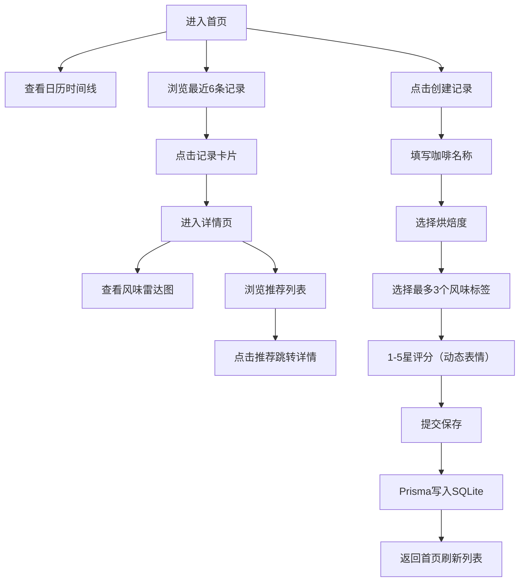

## 1. 产品概述

咖啡味觉档案馆是一款为小型独立咖啡店常客设计的在线咖啡日记平台。顾客可记录每次品尝的咖啡种类、风味笔记和心情，系统根据历史记录生成个人风味雷达图并智能推荐相似口味的咖啡。

- 核心价值：帮助咖啡爱好者系统化记录品鉴体验，发现个性化风味偏好，拓展咖啡探索边界
- 目标用户：独立咖啡店的常客、咖啡品鉴爱好者

## 2. 核心功能

### 2.1 用户角色

| 角色 | 注册方式 | 核心权限 |
|------|----------|----------|
| 品鉴用户 | 默认单用户模式 | 记录咖啡、查看雷达图、浏览推荐 |

### 2.2 功能模块

1. **首页时间线**：日历视图展示月度记录、最近6条记录卡片
2. **记录创建**：咖啡信息录入、烘焙度选择、风味标签选择、星级评分
3. **记录详情**：完整记录展示、风味雷达图、个性化推荐列表
4. **风味分析**：基于历史数据生成五边形雷达图、风味强度计算
5. **智能推荐**：基于余弦相似度的记录推荐、用户匹配算法
6. **侧边栏**：用户头像、风味标签云展示

### 2.3 页面详情

| 页面名称 | 模块名称 | 功能描述 |
|----------|----------|----------|
| 首页 `/` | 日历时间线 | 当月日历视图，有记录日期显示风味彩色圆点，点击跳转当日记录 |
| 首页 `/` | 最近记录卡片 | 展示最近6条记录，径向渐变背景，倒序排列，点击进入详情 |
| 详情页 `/records/[id]` | 记录详情 | 咖啡名、烘焙度、日期、风味标签胶囊、星级评分展示 |
| 详情页 `/records/[id]` | 风味雷达图 | ECharts五边形雷达图，渐变填充，悬停显示趋势线 |
| 详情页 `/records/[id]` | 推荐列表 | 横向滚动3条推荐卡片，带缩略雷达图，点击跳转 |
| 侧边栏 | 用户面板 | 头像展示、风味标签云（频率决定大小） |
| 全局 | 导航栏 | 顶部导航，Logo和页面切换 |
| 记录表单 | 创建记录 | 弹窗表单，咖啡名输入、烘焙度选择、标签多选（最多3个）、星级评分带动态表情 |

## 3. 核心流程

### 主要用户流程

用户打开首页 → 查看日历时间线或最近记录 → 点击创建新记录 → 填写咖啡名/选择烘焙度/选择风味标签/星级评分 → 提交保存 → 返回首页查看新记录 → 点击记录查看详情 → 查看风味雷达图和推荐列表 → 点击推荐探索其他咖啡

## 4. 用户界面设计

### 4.1 设计风格

- **主色调**：深色主题，背景 `#1A1A2E`，卡片背景 `#16213E`，文字 `#E0E0E0`
- **强调色**：金色渐变 `#FFD700 → #FF6347`（雷达图填充），8种风味标签专属色
- **卡片样式**：磨砂玻璃效果 `backdrop-filter: blur(10px)`，边框 `1px rgba(255,255,255,0.1)`，圆角12px，3px内阴影
- **交互动效**：悬停卡片上移3px+阴影增强，页面切换fade in 300ms，雷达图从中心扩散动画，所有过渡0.5s ease-out
- **字体**：展示字体用 Playfair Display（咖啡文化优雅感），正文字体用 Noto Sans SC（中文可读性）
- **布局**：左右两栏，左侧固定300px侧边栏，右侧主内容区；768px以下侧边栏转为底部导航栏

### 4.2 页面设计概览

| 页面名称 | 模块名称 | UI元素 |
|----------|----------|--------|
| 首页 `/` | 日历时间线 | 7列网格，日期单元格，半填充风味色圆点，选中态高亮 |
| 首页 `/` | 记录卡片 | 径向渐变背景（风味标签平均色），咖啡名字体加粗，烘焙度标签，星级显示，悬停上浮 |
| 详情页 `/records/[id]` | 头部信息 | 大字体咖啡名，烘焙度徽章，日期文字，风味胶囊标签（彩色背景+白字） |
| 详情页 `/records/[id]` | 雷达图 | ECharts五边形，半透明渐变填充，悬停显示该风味评分趋势小图 |
| 详情页 `/records/[id]` | 推荐区 | 横向滚动容器，3张卡片带迷你雷达图（50%缩放），咖啡名+风味色条 |
| 侧边栏 | 用户区 | 圆形头像+用户名，下方风味标签云（大小按出现频率） |
| 创建弹窗 | 表单区 | 输入框、烘焙度按钮组、标签多选胶囊、星级评分条（鼠标悬停表情变化） |

### 4.3 响应式设计

- **桌面端（>768px）**：左侧300px固定侧边栏 + 右侧主内容区，最大内容宽度1200px居中
- **移动端（≤768px）**：侧边栏折叠为底部4项导航（首页/创建/雷达/我的），主内容全宽，卡片单列堆叠
- **触摸优化**：按钮最小44px触摸区，横向滑动支持推荐列表滚

### 4.4 风味标签配色

| 标签 | 颜色HEX |
|------|---------|
| 花香 | #E91E63 |
| 果酸 | #FF9800 |
| 巧克力 | #795548 |
| 坚果 | #A1887F |
| 焦糖 | #FFB74D |
| 烟熏 | #455A64 |
| 草本 | #66BB6A |
| 酒香 | #7E57C2 |
