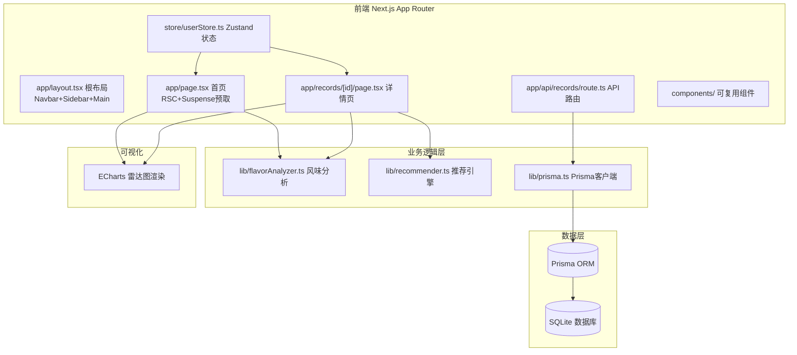
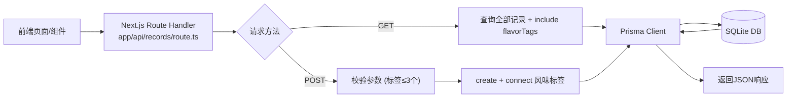
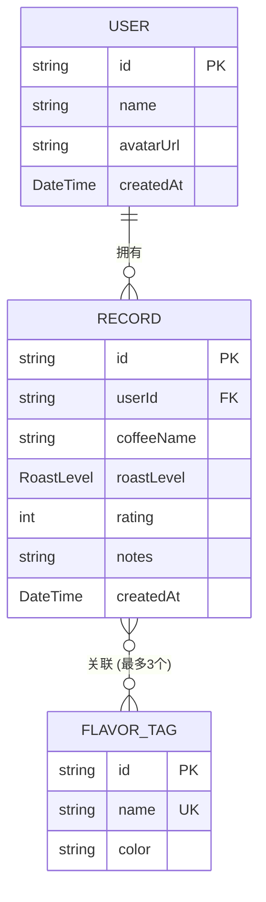

## 1. 架构设计



## 2. 技术描述

- **前端框架**：Next.js 14（App Router + React Server Components）
- **开发语言**：TypeScript 5（严格模式 strict: true）
- **样式方案**：Tailwind CSS 3 + PostCSS + Autoprefixer
- **状态管理**：Zustand 4（用户状态、记录缓存）
- **后端API**：Next.js API Routes（Route Handlers）
- **ORM层**：Prisma 5 + @prisma/client
- **数据库**：SQLite（零配置、文件型、适合小型应用）
- **图表库**：ECharts 5（五边形雷达图、渐变填充、动画）
- **图标库**：Lucide React
- **初始化方式**：手动搭建 Next.js 项目结构（非 Vite）
- **包管理**：npm

## 3. 路由定义

| 路由路径 | 页面类型 | 用途 |
|----------|----------|------|
| `/` | React Server Component | 首页：日历时间线 + 最近6条记录卡片 |
| `/records/[id]` | React Server Component | 详情页：记录信息 + 雷达图 + 推荐列表 |
| `/api/records` | Route Handler (GET) | 获取当前用户所有记录（含风味标签关联） |
| `/api/records` | Route Handler (POST) | 创建新记录（校验最多3个标签，关联FlavorTag） |

## 4. API 定义

### 4.1 TypeScript 类型定义

```typescript
// 烘焙度枚举
enum RoastLevel {
  LIGHT = 'LIGHT',       // 浅焙
  MEDIUM = 'MEDIUM',     // 中焙
  DARK = 'DARK',         // 深焙
  EXTRA_DARK = 'EXTRA_DARK' // 极深焙
}

// 风味标签
interface FlavorTag {
  id: string;
  name: string;       // 花香/果酸/巧克力/坚果/焦糖/烟熏/草本/酒香
  color: string;      // HEX颜色
}

// 咖啡记录
interface CoffeeRecord {
  id: string;
  userId: string;
  coffeeName: string;
  roastLevel: RoastLevel;
  rating: number;     // 1-5
  notes?: string;
  createdAt: Date;
  flavorTags: FlavorTag[];
}

// 雷达图数据点
interface RadarPoint {
  flavor: string;
  intensity: number;  // 0-100
}

// 推荐记录
interface RecommendedRecord extends CoffeeRecord {
  similarityScore: number;
}

// 创建记录请求体
interface CreateRecordRequest {
  coffeeName: string;
  roastLevel: RoastLevel;
  rating: number;
  notes?: string;
  flavorTagIds: string[];  // 最多3个
}
```

### 4.2 API 请求/响应格式

**GET /api/records**
- 响应：`{ success: true; data: CoffeeRecord[] }`
- 说明：返回所有记录，按 createdAt 倒序，包含关联的 flavorTags

**POST /api/records**
- 请求体：`CreateRecordRequest`
- 校验：flavorTagIds.length ≤ 3，rating ∈ [1,5]
- 成功响应：`{ success: true; data: CoffeeRecord }` (201)
- 失败响应：`{ success: false; error: string }` (400)

## 5. 服务端架构



**处理流程要点：**
- GET：`prisma.record.findMany({ include: { flavorTags: true }, orderBy: { createdAt: 'desc' } })`
- POST：`prisma.record.create({ data: { ..., flavorTags: { connect: flavorTagIds.map(id => ({id})) } }, include: { flavorTags: true } })`
- 参数校验失败返回 400，数据库异常返回 500

## 6. 数据模型

### 6.1 ER 图



### 6.2 Prisma Schema DDL

```prisma
generator client {
  provider = "prisma-client-js"
}

datasource db {
  provider = "sqlite"
  url      = "file:./dev.db"
}

enum RoastLevel {
  LIGHT
  MEDIUM
  DARK
  EXTRA_DARK
}

model User {
  id        String   @id @default(cuid())
  name      String   @default("咖啡品鉴师")
  avatarUrl String   @default("/default-avatar.png")
  createdAt DateTime @default(now())
  records   Record[]
}

model Record {
  id         String      @id @default(cuid())
  userId     String
  coffeeName String
  roastLevel RoastLevel  @default(MEDIUM)
  rating     Int         @db.SmallInt
  notes      String?
  createdAt  DateTime    @default(now())
  user       User        @relation(fields: [userId], references: [id])
  flavorTags FlavorTag[]
}

model FlavorTag {
  id      String   @id @default(cuid())
  name    String   @unique
  color   String
  records Record[]
}
```

### 6.3 初始种子数据

- **FlavorTag 预置8条**：花香(#E91E63)、果酸(#FF9800)、巧克力(#795548)、坚果(#A1887F)、焦糖(#FFB74D)、烟熏(#455A64)、草本(#66BB6A)、酒香(#7E57C2)
- **User 预置1条**：默认用户"咖啡品鉴师"
- **Record 预置10条示例数据**：覆盖各烘焙度，用于演示雷达图和推荐功能

## 7. 核心算法模块

### 7.1 风味分析 (flavorAnalyzer.ts)

```
输入：CoffeeRecord[]（用户所有历史记录）
处理：
  1. 统计每种风味标签出现次数 → frequency
  2. 计算每种风味标签平均评分 → avgRating
  3. 强度值 = normalize( frequency * avgRating ) → 0-100 区间
  4. 按强度排序取前5种风味生成五边形雷达图数据
输出：RadarPoint[]（5个顶点的强度值）
```

### 7.2 推荐引擎 (recommender.ts)

```
输入：currentRecord, allRecords
处理：
  1. 构建每条记录的风味标签向量（8维0/1向量，对应8种预设标签）
  2. 计算当前记录与其他所有记录的余弦相似度
  3. 过滤掉当前记录自身，按相似度降序
  4. 取Top 3条作为推荐结果
输出：RecommendedRecord[]（3条带相似度评分的推荐记录）
```

余弦相似度公式：`cos(A,B) = (A·B) / (||A|| × ||B||)`

## 8. 性能约束实现方案

| 约束项 | 目标 | 实现策略 |
|--------|------|----------|
| 首页时间线加载 | ≤400ms | React Server Components 服务器端预取数据；Prisma 查询使用 include 一次联表；避免 N+1 查询 |
| 雷达图渲染帧率 | ≥30fps | ECharts 使用 Canvas 渲染器；数据量控制在5个顶点；动画采用内置动画避免JS逐帧计算 |
| 推荐响应时间 | ≤200ms | 向量维度固定8维预计算；余弦相似度用原生数组操作（O(n)，n为记录数）；小型数据集(<1000条)无性能瓶颈 |
| 首屏加载 | 优化 | 关键CSS内联；使用 next/font 优化字体加载；图片懒加载 |

## 9. 文件结构与调用关系

```
auto327/
├── package.json                      # 依赖配置
├── next.config.js                    # Next.js构建配置
├── tsconfig.json                     # TypeScript严格模式配置
├── tailwind.config.ts                # Tailwind主题配置（自定义色板）
├── postcss.config.js                 # PostCSS配置
├── prisma/
│   ├── schema.prisma                 # 数据模型定义
│   └── seed.ts                       # 种子数据脚本
├── app/
│   ├── layout.tsx                    # 根布局：Navbar+Sidebar+main容器，引入Tailwind，背景#1A1A2E
│   │   └── 调用：components/Navbar.tsx, components/Sidebar.tsx
│   ├── page.tsx                      # 首页：RSC获取数据，Suspense包裹，渲染日历+最近记录
│   │   └── 调用：lib/flavorAnalyzer.ts, components/Calendar.tsx, components/RecordCard.tsx
│   ├── globals.css                   # 全局样式，Tailwind指令，磨砂玻璃类，动画定义
│   ├── records/
│   │   └── [id]/
│   │       └── page.tsx              # 详情页：RSC按ID获取，雷达图+推荐
│   │           └── 调用：lib/flavorAnalyzer.ts, lib/recommender.ts, components/RadarChart.tsx, components/RecommendList.tsx
│   └── api/
│       └── records/
│           └── route.ts              # CRUD API：GET查全部，POST创建（校验≤3标签）
│               └── 调用：lib/prisma.ts → Prisma写入/读取SQLite
├── lib/
│   ├── prisma.ts                     # Prisma单例客户端封装
│   ├── flavorAnalyzer.ts             # 风味分析：统计频率×平均评分 → 雷达图数据
│   │   └── 被调用：app/page.tsx, app/records/[id]/page.tsx
│   └── recommender.ts                # 推荐：余弦相似度匹配 → Top3推荐
│       └── 被调用：app/records/[id]/page.tsx
├── components/
│   ├── Navbar.tsx                    # 顶部导航栏
│   ├── Sidebar.tsx                   # 左侧侧边栏（用户+标签云）
│   ├── Calendar.tsx                  # 日历时间线组件
│   ├── RecordCard.tsx                # 记录卡片（径向渐变背景）
│   ├── RadarChart.tsx                # ECharts雷达图封装
│   ├── RecommendList.tsx             # 横向推荐列表
│   ├── CreateRecordModal.tsx         # 创建记录弹窗
│   ├── RatingStars.tsx               # 星级评分组件（带动态表情）
│   └── FlavorTagPill.tsx             # 风味标签胶囊
└── store/
    └── userStore.ts                  # Zustand：当前用户、记录缓存、UI状态
```

**数据流向总览：**
1. `app/page.tsx (RSC)` → Prisma 直接查询 → 传数据给 `RecordCard` / `Calendar` 渲染
2. `CreateRecordModal` → `POST /api/records` → `route.ts` 参数校验 → Prisma `create` → SQLite → 返回新记录 → Zustand 更新缓存 → UI 刷新
3. `app/records/[id]/page.tsx` → 传入所有记录给 `flavorAnalyzer` → 生成雷达数据 → `RadarChart` (ECharts) 渲染
4. `app/records/[id]/page.tsx` → 传入当前记录+所有记录给 `recommender` → 生成3条推荐 → `RecommendList` 渲染
