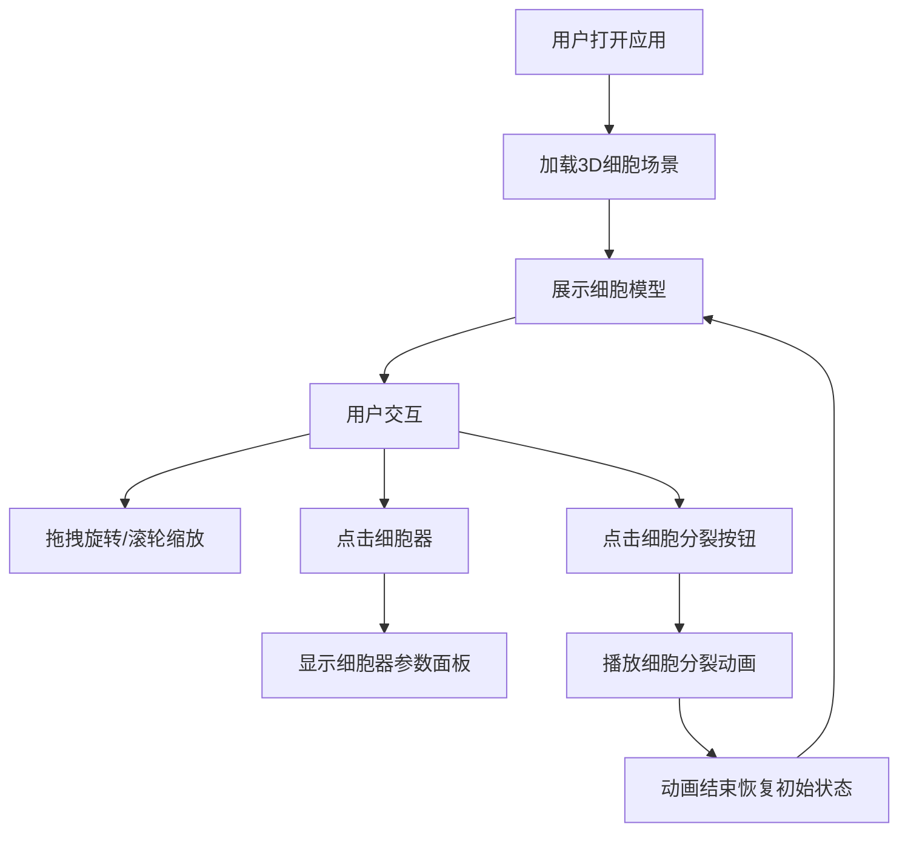

## 1. 产品概述

"细胞之城"是一个沉浸式3D交互可视化应用，让用户通过旋转和缩放操作探索动态细胞内部结构模型。应用以半透明发光几何体呈现细胞膜、细胞核、线粒体、高尔基体和内质网等细胞器，并支持播放细胞分裂动画。

- 主要用途：生物教学辅助、科学可视化展示、3D交互体验
- 目标用户：学生、教师、生物爱好者、科普工作者
- 产品价值：将微观细胞结构转化为直观可交互的3D可视化体验，提升学习和展示效果

## 2. 核心功能

### 2.1 功能模块

1. **主场景页面**：3D细胞模型展示、交互控制、信息面板、动画控制

### 2.2 页面详情

| 页面名称 | 模块名称 | 功能描述 |
|-----------|-------------|---------------------|
| 主场景 | 3D细胞渲染 | 展示直径10单位的细胞模型，包含细胞膜、细胞核、线粒体、高尔基体、内质网、液泡等半透明发光细胞器 |
| 主场景 | 交互控制 | 鼠标拖拽旋转场景，滚轮缩放（5-20单位范围），平滑阻尼效果 |
| 主场景 | 信息面板 | 左上角半透明面板，显示选中细胞器名称和关键参数（半径、颜色代码） |
| 主场景 | 细胞分裂动画 | 点击右下角按钮触发，细胞膜拉伸变形→分裂为两个子细胞→恢复初始状态，总时长4秒 |
| 主场景 | 动效系统 | 细胞器自转、细胞核脉动呼吸、按钮光晕脉动、阴影渲染 |

## 3. 核心流程

用户打开应用后看到完整的3D细胞模型，可以通过鼠标拖拽旋转、滚轮缩放来从不同角度观察细胞结构。点击细胞器可查看详细参数，点击"细胞分裂"按钮触发细胞分裂动画，动画结束后自动恢复初始状态。

## 4. 用户界面设计

### 4.1 设计风格

- **主色调**：深空蓝#0A0A2E（背景），搭配细胞器色彩：#88CCFF（细胞膜）、#FF6B6B（细胞核）、#FFD93D（线粒体）、#6BCB77（高尔基体）、#4F8FD3（内质网）、#9B59B6（液泡）
- **按钮风格**：渐变背景#FF6B6B到#C0392B，10px圆角，白色文字，悬停亮度提升10%并缩放1.05倍，点击缩小至0.95倍
- **字体**：'Segoe UI', sans-serif，14px白色字体
- **布局风格**：全屏沉浸式布局，左上角信息面板（玻璃态模糊效果），右下角控制按钮
- **视觉效果**：半透明发光材质、柔和阴影、光晕动画、呼吸脉动效果

### 4.2 页面设计概述

| 页面名称 | 模块名称 | UI元素 |
|-----------|-------------|-------------|
| 主场景 | 3D场景 | 全屏Canvas，深空蓝渐变背景，半透明发光细胞模型，方向光+环境光照明，1024x1024阴影贴图 |
| 主场景 | 信息面板 | 背景rgba(255,255,255,0.05)，模糊效果，16px圆角，16px内边距，显示细胞器名称、半径、颜色代码 |
| 主场景 | 控制按钮 | 渐变背景，白色光晕脉动动画（1.5秒周期），悬停缩放动效 |

### 4.3 响应性

- 桌面端优先设计，全屏Canvas自适应窗口大小
- 支持鼠标拖拽、滚轮缩放等桌面交互
- 窗口大小变化时自动调整Canvas尺寸

### 4.4 3D场景指引

- **环境**：深空蓝#0A0A2E渐变背景，营造微观世界沉浸感
- **光照**：右上角方向光（强度1.0）+ 环境光（强度0.3），细胞器投射柔和阴影
- **相机**：PerspectiveCamera，初始距离15单位，OrbitControls控制，缩放范围5-20，平滑阻尼
- **构图**：细胞模型位于场景中心，信息面板左上角，控制按钮右下角，避免遮挡主视觉
- **交互**：鼠标拖拽旋转、滚轮缩放、点击选择细胞器、按钮触发动画
- **后期效果**：半透明发光材质（emissive属性）、柔和阴影、抗锯齿
- **性能**：细胞器数量控制在10个以下，保持60fps渲染帧率，动画期间不低于50fps

## 5. 非功能需求

### 5.1 性能要求

- 正常交互时帧率 ≥ 60fps
- 细胞分裂动画期间帧率 ≥ 50fps
- 渲染延迟 ≤ 16ms（细胞器数量<10时）

### 5.2 技术约束

- 使用TypeScript、React、Three.js技术栈
- Vite作为构建工具
- Zustand进行状态管理
- 模块分离：CellData（数据模块）、CellAnimation（动画模块）、共享接口模块
