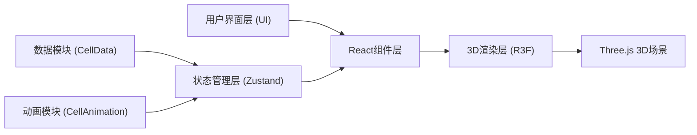
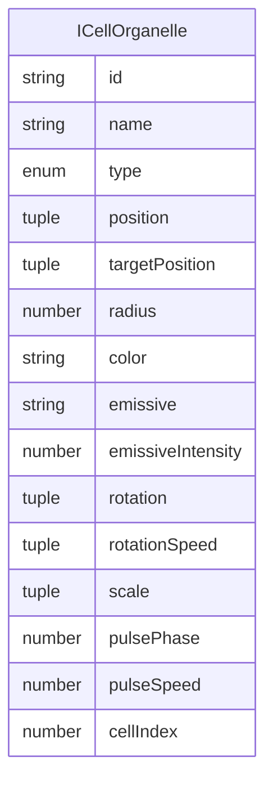

## 1. 架构设计



## 2. 技术描述

- **前端框架**: React@18 + TypeScript
- **3D渲染**: Three.js + @react-three/fiber + @react-three/drei
- **状态管理**: Zustand
- **构建工具**: Vite@5 + @vitejs/plugin-react
- **样式方案**: 原生CSS

### 依赖包说明

| 包名 | 版本 | 用途 |
|------|------|------|
| react | ^18.2.0 | UI框架核心 |
| react-dom | ^18.2.0 | React DOM渲染 |
| three | ^0.160.0 | 3D渲染引擎 |
| @react-three/fiber | ^8.15.0 | React渲染器Three.js绑定 |
| @react-three/drei | ^9.92.0 | R3F实用组件库 |
| zustand | ^4.4.0 | 轻量级状态管理 |
| typescript | ^5.3.0 | 类型系统 |
| vite | ^5.0.0 | 构建工具 |
| @vitejs/plugin-react | ^4.2.0 | Vite React插件 |

## 3. 文件结构

```
auto328/
├── package.json
├── vite.config.js
├── tsconfig.json
├── index.html
├── src/
│   ├── main.tsx
│   ├── App.tsx
│   ├── CellScene.tsx          (主场景组件)
│   ├── CellData.ts            (模块一：数据模块)
│   ├── CellAnimation.ts       (模块二：动画模块)
│   ├── CellTypes.ts           (共享接口模块)
│   ├── useCellStore.ts        (Zustand状态管理)
│   └── styles.css
└── .trae/documents/
    ├── PRD-细胞之城3D可视化应用.md
    └── 技术架构-细胞之城3D可视化应用.md
```

### 模块职责说明

| 文件名 | 职责 | 对外接口 |
|--------|------|----------|
| `CellTypes.ts` | 定义共享接口和类型 | `ICellOrganelle` 接口 |
| `CellData.ts` | 细胞器数据生成与管理 | `initOrganelles()`, `updatePositions()` |
| `CellAnimation.ts` | 细胞分裂动画控制 | `triggerMitosis()`, `getAnimationProgress()` |
| `useCellStore.ts` | Zustand状态管理 | 细胞器数据、动画状态、选中状态 |
| `CellScene.tsx` | 3D场景渲染与交互 | Three.js Canvas、光照、控制器、细胞器渲染 |

## 4. 接口定义

### 4.1 共享接口 (CellTypes.ts)

```typescript
export interface ICellOrganelle {
  id: string;
  name: string;
  type: 'nucleus' | 'mitochondria' | 'golgi' | 'er' | 'vacuole';
  position: [number, number, number];
  targetPosition?: [number, number, number];
  radius: number;
  color: string;
  emissive: string;
  emissiveIntensity: number;
  rotation: [number, number, number];
  rotationSpeed: [number, number, number];
  scale?: [number, number, number];
  pulsePhase?: number;
  pulseSpeed?: number;
  cellIndex?: number;
}

export interface IAnimationState {
  isAnimating: boolean;
  progress: number;
  phase: 'idle' | 'stretching' | 'splitting' | 'separating' | 'resetting';
}
```

### 4.2 模块接口

**CellData.ts**:
```typescript
export function initOrganelles(): ICellOrganelle[]
export function updatePositions(
  organelles: ICellOrganelle[], 
  animationProgress: number
): ICellOrganelle[]
```

**CellAnimation.ts**:
```typescript
export function triggerMitosis(): void
export function getAnimationProgress(): number
export function isAnimating(): boolean
```

## 5. 数据模型

### 5.1 细胞器数据模型



### 5.2 状态管理模型

```typescript
interface CellState {
  organelles: ICellOrganelle[];
  animationState: IAnimationState;
  selectedOrganelle: ICellOrganelle | null;
  actions: {
    setOrganelles: (orgs: ICellOrganelle[]) => void;
    selectOrganelle: (org: ICellOrganelle | null) => void;
    triggerMitosis: () => void;
    updateAnimation: () => void;
  };
}
```

## 6. 核心算法

### 6.1 细胞分裂动画算法

```
动画总时长: 4秒
阶段划分:
  1. 拉伸阶段 (0-2s): 细胞膜沿X轴拉伸为椭圆，scale.x从1→1.8，scale.z从1→0.7
  2. 分裂阶段 (2-3s): 两个子细胞核分离，细胞器随机分配到两个子细胞
  3. 分离阶段 (3-3.5s): 两个子细胞向两侧移动，间距逐渐增大
  4. 恢复阶段 (3.5-4s): 场景重置为初始状态

细胞器分配: 随机分配原有细胞器到两个子细胞，每个子细胞约获得2.5个
```

### 6.2 呼吸脉动动画

```
细胞核呼吸脉动:
  scale = baseScale * (1 + 0.08 * sin(time * pulseSpeed + pulsePhase))
  emissiveIntensity = baseIntensity * (1 + 0.15 * sin(time * pulseSpeed + pulsePhase))
```

## 7. 性能优化策略

1. **几何复用**: 同类细胞器共享BufferGeometry实例
2. **材质优化**: 使用MeshStandardMaterial，合理设置emissive属性
3. **阴影优化**: 阴影贴图尺寸1024x1024，仅关键几何体投射/接收阴影
4. **渲染优化**: 启用抗锯齿，合理设置像素比(devicePixelRatio)
5. **状态更新**: Zustand按需订阅，避免不必要的重渲染
6. **帧率监控**: 使用React Three Fiber的useFrame钩子进行帧更新
