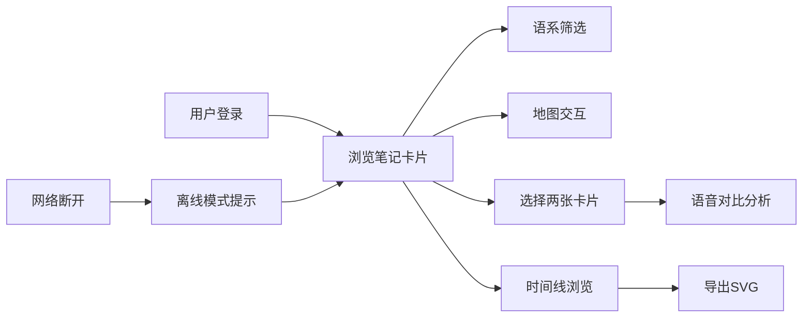

## 1. 产品概述
语音地图是一款面向语言学爱好者的全栈应用，帮助用户整理和可视化多语言发音数据，解决发音规则难以对比、口音演变路径不直观的问题。
- 核心功能：语音笔记管理、世界语言地图可视化、语音对比分析、演化时间线、离线缓存
- 目标用户：语言学爱好者、语言学习者、语音研究者
- 产品价值：将抽象的语音学知识转化为直观的可视化界面，提升语言学习和研究效率

## 2. 核心功能

### 2.1 用户角色
| 角色 | 注册方式 | 核心权限 |
|------|----------|----------|
| 普通用户 | 用户名登录 | 创建/编辑/删除语音笔记、查看地图、对比分析、导出时间线 |

### 2.2 功能模块
1. **语音笔记管理**：创建笔记卡片，包含单词、IPA音标、录音上传、描述
2. **世界语言地图**：2D地图展示语系分布，标记点大小表示单词数量，支持拖拽缩放
3. **语音对比分析**：选中两张卡片，波形图并排对比，音频同步播放
4. **演化时间线**：按创建时间展示笔记，支持SVG导出
5. **离线缓存**：IndexedDB存储，断网时自动使用缓存数据

### 2.3 页面详情
| 页面名称 | 模块名称 | 功能描述 |
|----------|----------|----------|
| 主页面 | 侧边栏 | 用户头像、语系筛选标签 |
| 主页面 | 卡片列表 | 语音笔记卡片展示，支持滚动、淡入动画 |
| 主页面 | 地图视图 | 2D世界地图，语系标记点，拖拽缩放 |
| 主页面 | 对比面板 | 双语音波形对比，播放控制 |
| 主页面 | 时间线 | 横向滚动时间线，SVG导出 |

## 3. 核心流程
用户登录后进入主界面，可浏览语音笔记卡片。通过侧边栏筛选语系，点击地图标记点查看相关笔记。选中两张卡片进行语音对比分析。滚动时间线浏览历史笔记，支持导出SVG快照。离线时自动使用缓存数据。

## 4. 用户界面设计

### 4.1 设计风格
- **主色调**：深色主题，主背景#121212，卡片背景#1E1E2E，文字#E0E0E0
- **强调色**：#7C4DFF（紫色）、#00BFFF（蓝色）、#FF6347（红色）
- **卡片样式**：圆角、淡入动画、悬停上移效果、点击波纹扩散
- **字体**：现代无衬线字体，清晰易读
- **布局**：三栏布局（卡片列表+地图+对比面板），底部时间线，左侧侧边栏

### 4.2 页面设计概述
| 页面名称 | 模块名称 | UI元素 |
|----------|----------|--------|
| 主页面 | 侧边栏 | 用户头像（首字母圆形）、语系筛选胶囊标签、滚动区域 |
| 主页面 | 卡片列表 | 语音卡片（单词、音标、波形图、录音时长）、滚动容器、淡入动画 |
| 主页面 | 地图视图 | 深蓝渐变背景、圆形标记点、柔和连接线、拖拽阻尼效果 |
| 主页面 | 对比面板 | 毛玻璃效果、双波形Canvas、播放按钮、进度高亮 |
| 主页面 | 时间线 | 深灰渐变背景、发光圆点、年月刻度、导出按钮 |

### 4.3 响应式
- 桌面端（≥768px）：三栏布局+侧边栏+底部时间线
- 移动端（<768px）：单栏纵向堆叠，侧边栏收起为汉堡菜单

### 4.4 动效设计
- 卡片淡入：0.3s 淡入动画，逐个延迟触发
- 悬停效果：卡片上移5px，阴影加深
- 点击波纹：点击卡片产生扩散波纹
- 地图拖拽：平滑阻尼效果
- 时间线滚动：流畅滚动，卡片加载延迟≤200ms
