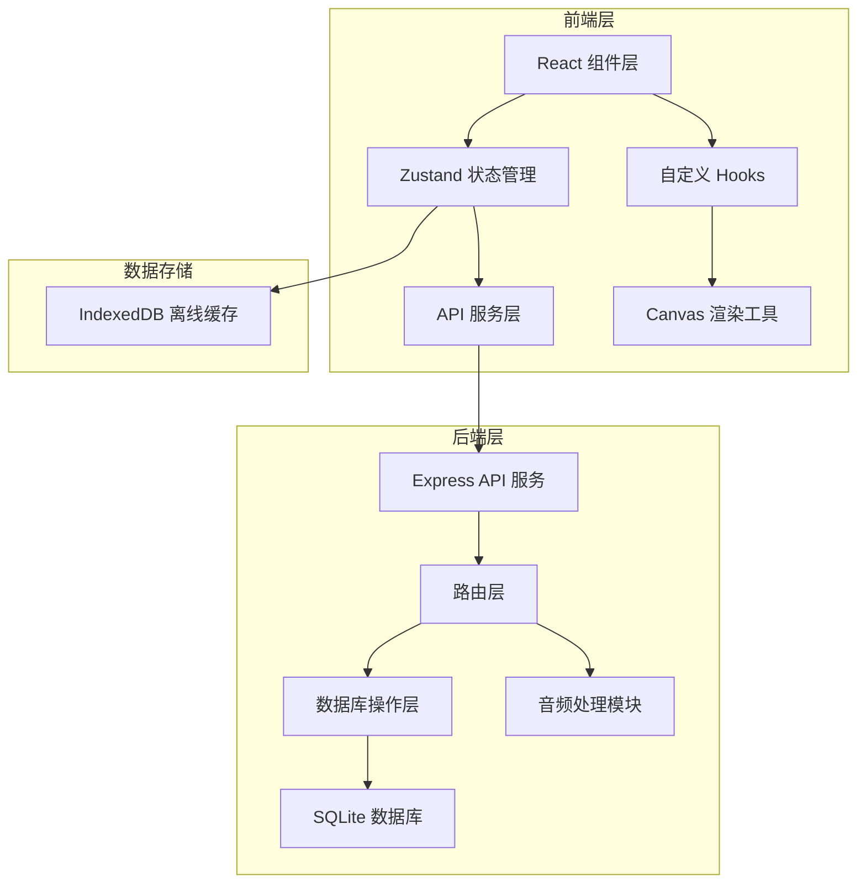

## 1. 架构设计



## 2. 技术描述
- **前端**：React@18 + TypeScript + Vite + Zustand
- **构建工具**：Vite
- **后端**：Express@4 + TypeScript
- **数据库**：SQLite (better-sqlite3)
- **音频处理**：ffmpeg + Web Audio API
- **状态管理**：Zustand
- **缓存**：IndexedDB

## 3. 目录结构
```
/
├── package.json          # 根依赖，concurrently 启动脚本
├── frontend/
│   ├── package.json      # 前端依赖
│   ├── vite.config.ts    # Vite配置，代理/api到3001端口
│   ├── tsconfig.json     # TypeScript配置
│   ├── index.html        # 入口HTML
│   └── src/
│       ├── App.tsx       # 主组件
│       ├── components/   # 组件目录
│       ├── hooks/        # 自定义Hooks
│       ├── utils/        # 工具函数
│       └── store/        # Zustand状态管理
└── backend/
    ├── package.json      # 后端依赖
    └── src/
        ├── server.ts     # Express服务入口
        ├── database.ts   # 数据库操作
        └── audioProcessor.ts  # 音频处理模块
```

## 4. 路由定义
| 路由路径 | 方法 | 用途 |
|----------|------|------|
| /api/auth/login | POST | 用户登录 |
| /api/auth/register | POST | 用户注册 |
| /api/notes | GET | 获取所有笔记 |
| /api/notes | POST | 创建笔记 |
| /api/notes/:id | PUT | 更新笔记 |
| /api/notes/:id | DELETE | 删除笔记 |
| /api/audio/upload | POST | 上传音频文件 |
| /api/audio/:id | GET | 获取音频文件 |

## 5. 数据模型

### 5.1 数据库表结构

**users表**
| 字段 | 类型 | 说明 |
|------|------|------|
| id | INTEGER PRIMARY KEY | 用户ID |
| username | TEXT UNIQUE | 用户名 |
| password | TEXT | 密码（哈希） |
| created_at | DATETIME | 创建时间 |

**notes表**
| 字段 | 类型 | 说明 |
|------|------|------|
| id | INTEGER PRIMARY KEY | 笔记ID |
| user_id | INTEGER | 关联用户ID |
| word | TEXT | 单词 |
| ipa | TEXT | IPA音标 |
| description | TEXT | 描述（最多200字） |
| audio_path | TEXT | 音频文件路径 |
| audio_duration | INTEGER | 音频时长（毫秒） |
| waveform_data | TEXT | 波形数据JSON |
| language_family | TEXT | 语系 |
| created_at | DATETIME | 创建时间 |

### 5.2 前端状态模型
```typescript
interface Note {
  id: number;
  word: string;
  ipa: string;
  description: string;
  audioUrl: string;
  audioDuration: number;
  waveformData: number[];
  languageFamily: string;
  createdAt: string;
}

interface User {
  id: number;
  username: string;
}

interface AppState {
  user: User | null;
  notes: Note[];
  selectedNotes: number[];
  filterFamily: string | null;
  isOnline: boolean;
  mapZoom: number;
  mapOffset: { x: number; y: number };
}
```

## 6. 核心API定义

### GET /api/notes
**响应**：
```typescript
{
  notes: Array<{
    id: number;
    word: string;
    ipa: string;
    description: string;
    audio_path: string;
    audio_duration: number;
    waveform_data: string;
    language_family: string;
    created_at: string;
  }>
}
```

### POST /api/notes
**请求体**（multipart/form-data）：
```
word: string
ipa: string
description: string
language_family: string
audio: File (wav, ≤5MB)
```

## 7. 性能指标
- 地图50个标记点：拖拽/缩放帧率 ≥ 55fps
- 时间线滚动：卡片加载延迟 ≤ 200ms
- 音频播放响应延迟 ≤ 100ms
