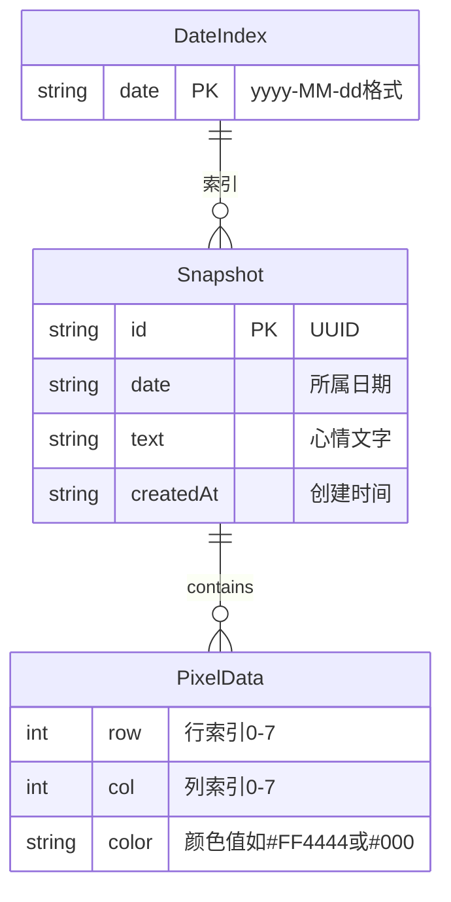

## 1. 架构设计

```mermaid
graph TB
    "前端 React应用" --> "像素网格模块 pixelGrid.ts"
    "前端 React应用" --> "日历管理模块 calendar.ts"
    "前端 React应用" --> "数据持久化模块 storage.ts"
    "数据持久化模块 storage.ts" --> "localStorage"
```

纯前端架构，无后端服务。三个核心模块各自独立，通过Zustand状态管理连接。

## 2. 技术说明

- 前端：React 18 + TypeScript + Vite
- 初始化工具：vite-init（react-ts模板）
- 状态管理：Zustand
- 日期处理：date-fns
- 唯一标识：uuid
- 数据存储：localStorage（JSON序列化）
- 后端：无
- 数据库：无（localStorage替代）

## 3. 路由定义

| 路由 | 用途 |
|------|------|
| / | 单页应用，所有功能集成在一个页面 |

单页应用，无需路由。

## 4. API定义

无后端API。所有数据通过localStorage本地读写。

## 5. 服务器架构图

无服务器架构。

## 6. 数据模型

### 6.1 数据模型定义



### 6.2 数据结构定义

```typescript
type PixelGrid = string[][];

interface MoodSnapshot {
  id: string;
  date: string;
  grid: PixelGrid;
  text: string;
  createdAt: string;
}

interface CalendarStore {
  [date: string]: MoodSnapshot[];
}
```

localStorage存储结构：键名`pixel-mood-log`，值为CalendarStore的JSON字符串。

## 7. 文件结构

```
├── package.json
├── vite.config.js
├── tsconfig.json
├── index.html
└── src/
    ├── main.tsx
    ├── App.tsx
    ├── App.css
    └── modules/
        ├── pixelGrid.ts
        ├── calendar.ts
        └── storage.ts
```
