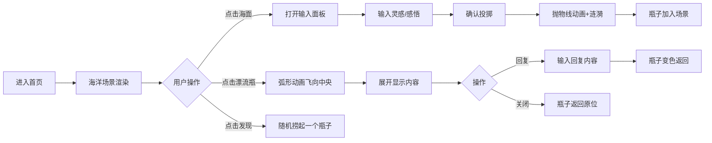

## 1. 产品概述

灵感漂流瓶是一款匿名情感分享应用，用户可将灵感或感悟封装成虚拟漂流瓶投入海洋，其他用户可捞起查看并回复。瓶子在海上缓慢漂流，一周后沉入海底消失。

- **核心价值**：营造浪漫匿名的情感交流空间，让陌生人之间传递温暖与灵感
- **目标用户**：希望匿名分享心情、寻找灵感或随机社交的年轻用户

## 2. 核心功能

### 2.1 功能模块
1. **海洋主场景**：全屏渐变蓝色海洋背景 + CSS波浪动画 + 漂流瓶随机分布渲染
2. **投掷漂流瓶**：点击海面 → 毛玻璃输入面板 → 抛物线动画投放 → 涟漪效果
3. **捞起漂流瓶**：点击漂流瓶 → 弧形飞向屏幕中央 → 展开内容 → 回复输入
4. **顶部工具栏**：Logo、我的瓶子（计数）、我的回信（计数）、发现（随机捞瓶）

### 2.2 页面详情
| 页面名称 | 模块名称 | 功能描述 |
|----------|----------|----------|
| 首页 | 海洋场景 | 渐变天空到深海(#87CEEB→#0B3D91)，正弦波CSS动画(幅度5px, 周期3s) |
| 首页 | 漂流瓶渲染 | SVG半透明胶囊瓶，随机朝向，随波浪浮动，悬停放大+发光 |
| 首页 | 投掷交互 | 点击海面打开毛玻璃输入面板(模糊10px)，抛物线入水+涟漪 |
| 首页 | 捞起交互 | 点击瓶子弧形飞入中央，展开内容，回复后变色返回原位 |
| 首页 | 顶部工具栏 | 固定定位z-index10，磨砂背景(8px毛玻璃)，悬停上移2px |

## 3. 核心流程

### 3.1 主要用户流程
用户进入首页 → 观察海洋场景中漂浮的瓶子 → 点击海面投掷灵感 → 输入内容确认 → 瓶子落入海中 | 点击已有瓶子 → 瓶子飞到中央展开 → 查看内容 → 回复或关闭 → 瓶子返回

## 4. 用户界面设计

### 4.1 设计风格
- **主色调**：蓝色系 #1E90FF（主色）、#87CEEB（天空）、#0B3D91（深海）
- **辅色调**：#F0F8FF（爱丽丝蓝）、#FFD700（金色强调）
- **字体**：系统无衬线体（system-ui, -apple-system, sans-serif）
- **动效节奏**：所有过渡 0.3-0.5秒，流畅平滑
- **视觉质感**：毛玻璃/磨砂效果（backdrop-filter: blur），半透明叠加层次

### 4.2 页面设计概览
| 模块 | UI元素 | 设计细节 |
|------|--------|----------|
| 海洋背景 | 垂直渐变色带 | 天空蓝→深海蓝，占满全屏，无重复 |
| 波浪动画 | ::before/::after伪元素 | 正弦波形，两层叠加错相，translateY±5px，3s周期 |
| 漂流瓶(SVG) | 圆角矩形+瓶盖+纸条 | fill半透明，stroke白色描边，rotate随机±30deg |
| 悬停效果 | transform+box-shadow | scale(1.2)，0.3s过渡，box-shadow金色光晕 |
| 输入面板 | 毛玻璃卡片 | background: rgba(255,255,255,0.15)，blur(10px)，圆角16px |
| 工具栏 | 4个按钮横向排列 | 间距12px，padding 8px 16px，圆角20px，hover上移2px |
| 涟漪效果 | 绝对定位圆形 | border: 2px solid rgba(255,255,255,0.6)，scale+opacity动画 |

### 4.3 响应式适配
- **最小宽度**：320px（手机竖屏）
- **最大宽度**：1200px（桌面宽屏，超出居中显示）
- **适配策略**：CSS媒体查询，rem单位，flex布局自动换行
- **移动端优化**：工具栏图标尺寸缩小，瓶子密度降低，触控点击区域≥44px

### 4.4 性能要求
- **首屏渲染**：≤ 1.5秒（LCP指标）
- **动画帧率**：瓶子数量≤200时保持60FPS
- **优化策略**：transform/opacity硬件加速，requestAnimationFrame批量更新，will-change提示
