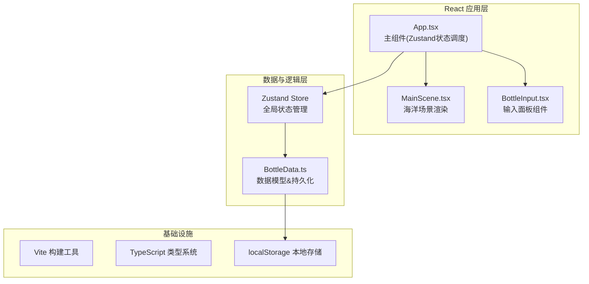
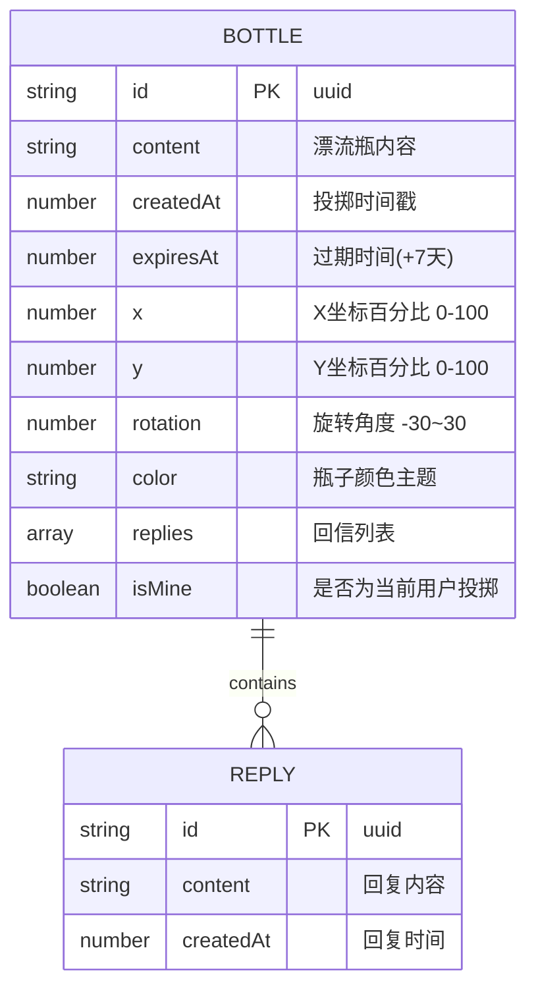

## 1. 架构设计



## 2. 技术栈说明
- **前端框架**：React 18 + TypeScript
- **构建工具**：Vite 5.x（@vitejs/plugin-react）
- **状态管理**：Zustand 4.x
- **ID生成**：uuid 9.x
- **数据持久化**：浏览器 localStorage
- **目标**：ES2020，严格模式

## 3. 模块划分（按用户要求）

| 文件 | 职责 | 输入 | 输出/对外 |
|------|------|------|-----------|
| `src/BottleData.ts` | 漂流瓶数据模型，类型定义，JSON校验，localStorage读写 | JSON数据 / 原始对象 | Bottle对象 / Bottle数组 |
| `src/MainScene.tsx` | 海洋场景渲染：背景渐变、波浪CSS动画、漂流瓶坐标渲染、点击事件分发 | Bottle数组，onBottleClick，onSeaClick | （React渲染DOM，触发回调） |
| `src/BottleInput.tsx` | 投掷/回复输入面板：毛玻璃UI，文本输入，提交回调 | onSubmit(text), onClose, mode='throw'/'reply' | （用户输入文本回调） |
| `src/App.tsx` | 整合组件，Zustand状态管理，交互逻辑编排，工具栏，动画调度 | （无，顶层组件） | （应用完整UI） |

## 4. 数据模型

### 4.1 类型定义


### 4.2 BottleData 模块接口
```typescript
export interface Reply { id: string; content: string; createdAt: number; }
export interface Bottle {
  id: string; content: string; createdAt: number; expiresAt: number;
  x: number; y: number; rotation: number; color: string;
  replies: Reply[]; isMine: boolean;
}
export function validateBottle(json: unknown): Bottle | null;   // 校验并转换
export function createBottle(content: string, x: number, y: number): Bottle;
export function loadBottles(): Bottle[];                         // 从localStorage读取
export function saveBottles(bottles: Bottle[]): void;            // 写入localStorage
export function addReply(bottle: Bottle, content: string): Bottle;
export function isExpired(bottle: Bottle): boolean;
```

## 5. Zustand Store 设计

```typescript
interface BottleStore {
  bottles: Bottle[];                              // 全部活跃瓶子
  selectedBottleId: string | null;                // 当前选中(捞起)的瓶子
  isInputOpen: boolean;                           // 输入面板是否打开
  inputMode: 'throw' | 'reply';                   // 面板模式
  throwPosition: { x: number; y: number } | null; // 投掷落点坐标
  myBottlesCount: number;                         // 我的瓶子计数
  myRepliesCount: number;                         // 我的回信计数
  // actions
  init: () => void;                                            // 初始化+清理过期
  openThrowInput: (x: number, y: number) => void;              // 打开发射面板
  openReplyInput: (bottleId: string) => void;                  // 打开回复面板
  closeInput: () => void;                                      // 关闭面板
  throwBottle: (content: string) => void;                      // 投掷瓶子
  selectBottle: (bottleId: string | null) => void;             // 选中/取消瓶子
  submitReply: (bottleId: string, content: string) => void;    // 提交回复
  discoverRandom: () => void;                                  // 随机捞瓶
  cleanupExpired: () => void;                                  // 清理过期瓶子
}
```

## 6. 性能优化点
1. **波浪动画**：纯CSS `@keyframes` + transform/opacity，不触发重排
2. **瓶子浮动**：CSS变量 + `animation-delay` 错相，避免JS逐帧更新
3. **涟漪效果**：有限次数动画后自动移除DOM节点
4. **重渲染隔离**：MainScene内的单个瓶子用 `React.memo` 包裹
5. **Zustand选择器**：组件只订阅所需字段，避免全量重渲染
