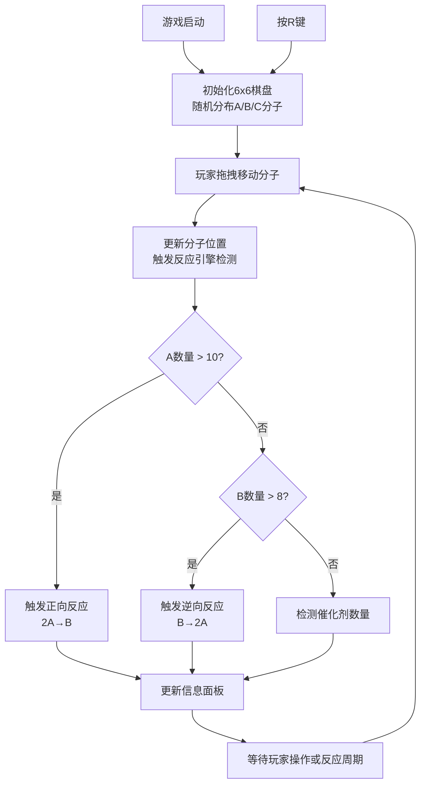

## 1. 产品概述

化学平衡模拟器是一款交互式益智游戏，通过可视化的分子反应动画帮助学生直观理解可逆反应动态平衡原理。解决传统化学教学中抽象概念难以理解的问题，让学习者在互动操作中掌握化学反应平衡的核心机制。

- 核心价值：将抽象的化学平衡原理转化为可视化、可交互的游戏体验
- 目标用户：中学化学学习者、化学教师、对化学感兴趣的普通用户
- 市场价值：填补化学教育类互动工具的空白，提升学习效率和兴趣

## 2. 核心功能

### 2.1 用户角色
| 角色 | 注册方式 | 核心权限 |
|------|----------|----------|
| 普通用户 | 无需注册，直接使用 | 完整游戏体验、重置棋盘、查看反应数据 |

### 2.2 功能模块
1. **棋盘交互模块**：6x6网格棋盘，分子拖拽移动，分子合成与分解动画
2. **反应引擎模块**：正向/逆向反应触发判定，反应速率控制，催化剂效果模拟
3. **信息面板模块**：实时分子计数、反应速率状态显示、平衡常数计算
4. **状态提示模块**：底部状态条显示反应历史，催化剂中毒提示

### 2.3 页面详情
| 页面名称 | 模块名称 | 功能描述 |
|----------|----------|------------|
| 主游戏页面 | 棋盘交互区 | 6x6网格，分子拖拽移动，反应动画效果展示 |
| 主游戏页面 | 信息面板区 | 显示A/B/C分子数量、反应速率状态、平衡常数K |
| 主游戏页面 | 状态提示区 | 底部状态条显示最近反应类型及时间戳 |

## 3. 核心流程

## 4. 用户界面设计

### 4.1 设计风格
- **主色调**：深蓝渐变背景（#1A1A2E → #16213E），营造科技感与沉浸感
- **分子颜色**：红色（A，反应物）、蓝色（B，生成物）、灰色（C，催化剂）
- **交互反馈色**：白色闪烁（正反应）、黄色闪烁（逆反应#FFFACD）
- **字体**：等宽字体（数值显示）、现代无衬线字体（说明文字）
- **布局风格**：左右分栏，左侧游戏棋盘，右侧信息面板，底部状态条
- **动画风格**：流畅的CSS过渡动画，拖拽放大效果，反应融合粒子效果

### 4.2 页面设计概述
| 页面名称 | 模块名称 | UI元素 |
|----------|----------|--------|
| 主游戏页面 | 棋盘交互区 | 64x64像素格子，浅灰底色#E0E0E0，深灰网格线#4A4A4A，内阴影凹陷效果，分子棋子带发光效果 |
| 主游戏页面 | 信息面板区 | 毛玻璃半透明背景（rgba(255,255,255,0.08)，模糊10px），白色文字#F0F0F0，数值等宽字体带text-shadow发光，数值变化时scale动画 |
| 主游戏页面 | 状态提示区 | 窄条背景，显示最近反应类型（正反应/逆反应/催化剂中毒）及时间戳 |

### 4.3 响应式设计
- 桌面端优先设计，最小宽度800px，页面整体居中对齐
- 棋盘尺寸固定6x6格，每格64x64像素，整体棋盘尺寸384x384像素
- 信息面板宽度固定，与棋盘保持合理间距
- 键盘快捷键支持（R键重置）

### 4.4 性能保障
- 棋盘初始化时间 ≤ 100ms
- 拖拽操作响应延迟 < 50ms
- 动画帧率稳定 ≥ 30fps
- 使用CSS transform和opacity属性实现高性能动画
