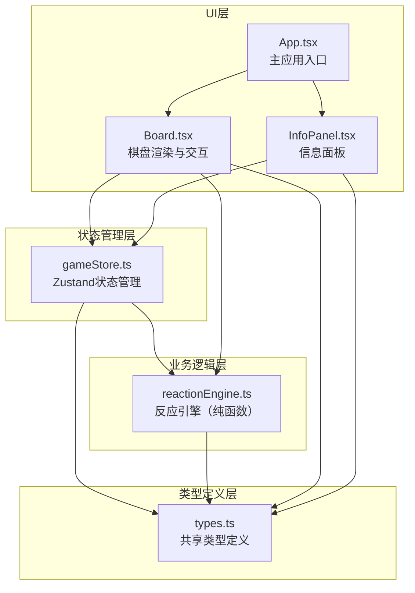

## 1. 架构设计



## 2. 技术描述

- **前端框架**：React@18 + TypeScript@5
- **构建工具**：Vite@5 + @vitejs/plugin-react@4
- **状态管理**：Zustand@4
- **样式方案**：CSS Modules / 内联样式 + CSS动画
- **初始化方式**：手动配置项目结构，npm安装依赖

## 3. 项目结构定义

| 文件路径 | 用途说明 |
|----------|----------|
| `package.json` | 项目依赖配置，启动脚本：npm run dev |
| `vite.config.js` | Vite配置，React插件 |
| `tsconfig.json` | TypeScript配置，严格模式，target ES2020 |
| `index.html` | 入口页面，标题"化学平衡模拟器" |
| `src/types.ts` | 类型定义：棋子颜色、网格状态、反应结果 |
| `src/gameStore.ts` | Zustand状态管理：网格、计数、速率、K值、操作函数 |
| `src/reactionEngine.ts` | 纯函数反应引擎：判定反应、计算新状态 |
| `src/Board.tsx` | 棋盘组件：渲染网格、拖拽处理、反应动画 |
| `src/InfoPanel.tsx` | 信息面板：实时数据显示、动画效果 |
| `src/App.tsx` | 主应用组件：整合棋盘与信息面板 |
| `src/main.tsx` | React入口文件 |
| `src/index.css` | 全局样式 |

## 4. 数据模型

### 4.1 核心类型定义

```typescript
// types.ts
export type MoleculeColor = 'A' | 'B' | 'C';

export interface Molecule {
  id: string;
  color: MoleculeColor;
  x: number;
  y: number;
  isAnimating?: boolean;
  animationType?: 'forward' | 'reverse' | 'idle';
}

export interface GridState {
  molecules: Molecule[];
  gridSize: number; // 6
}

export type ReactionType = 'forward' | 'reverse' | 'catalyst-poisoning' | 'none';
export type RateStatus = 'normal' | 'accelerated' | 'stopped';

export interface ReactionResult {
  newGrid: GridState;
  reactionType: ReactionType;
  message?: string;
}

export interface GameState {
  grid: GridState;
  counts: { A: number; B: number; C: number };
  rateStatus: RateStatus;
  equilibriumConstant: number; // K = [B]^2 / [A]
  lastReaction: { type: ReactionType; timestamp: Date | null };
  reactionInterval: number; // 反应间隔（毫秒）
}
```

### 4.2 状态管理接口

```typescript
// gameStore.ts 暴露的操作函数
interface GameStoreActions {
  moveAtom: (id: string, newX: number, newY: number) => void;
  triggerForwardReaction: () => void;
  triggerReverseReaction: () => void;
  updateCounts: () => void;
  updateEquilibriumConstant: () => void;
  checkReactionConditions: () => void;
  resetBoard: () => void;
}
```

## 5. 核心算法

### 5.1 正向反应判定算法
```
1. 统计A分子数量，若 > 10 则继续
2. 查找所有相邻的A分子对（上下左右相邻）
3. 找到第一对相邻的A分子
4. 标记这两个分子为闪烁动画状态
5. 动画完成后，移除两个A，在其中一个位置创建一个B
6. 更新计数和平衡常数
```

### 5.2 逆向反应判定算法
```
1. 统计B分子数量，若 > 8 则继续
2. 查找所有B分子
3. 找到一个B分子
4. 标记该分子为闪烁动画状态
5. 动画完成后，移除该B，在相邻位置创建两个A
6. 更新计数和平衡常数
```

### 5.3 催化剂效果算法
```
1. 统计C分子数量
2. 若 2 ≤ C ≤ 4：反应间隔 = 800ms（加速）
3. 若 C > 5：反应间隔 = Infinity（停摆），显示催化剂中毒提示
4. 否则：反应间隔 = 1500ms（正常）
```

### 5.4 平衡常数计算
```
K = [B]^2 / [A]
其中[A]为A分子数量，[B]为B分子数量
保留两位小数显示
```

## 6. 性能优化策略

1. **状态更新优化**：使用Zustand的选择器（selectors）避免不必要的重渲染
2. **动画优化**：使用CSS transform和opacity属性，避免触发重排
3. **拖拽性能**：使用requestAnimationFrame处理拖拽位置更新
4. **分子ID管理**：使用稳定的唯一标识，避免React列表重渲染
5. **反应周期控制**：使用useRef存储定时器ID，避免重复创建
6. **批量更新**：反应操作使用批量状态更新，减少渲染次数
