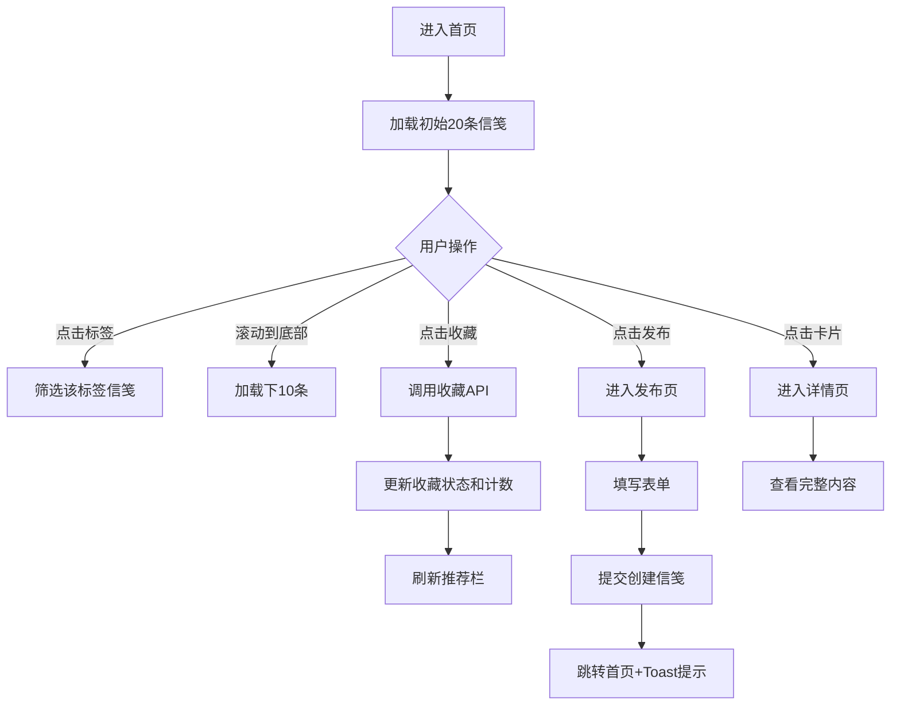

## 1. 产品概述

诗笺寄语是一个匿名书信交换平台，用户可以发布手写风格的诗句或短篇故事为虚拟信笺，其他用户可在瀑布流中浏览、收藏，并根据收藏记录获得相似风格的作品推荐。

- 主要目的：提供一个文艺、温暖的匿名创作与分享空间
- 目标用户：喜爱文学创作、诗歌、短篇故事的文艺爱好者
- 市场价值：填补细分领域匿名文艺创作社区的空白，以优雅的手写风格和纸质质感营造独特的用户体验

## 2. 核心功能

### 2.1 用户角色

| 角色 | 注册方式 | 核心权限 |
|------|---------|---------|
| 匿名用户 | 无需注册 | 浏览信笺、收藏信笺、发布信笺、查看推荐 |

### 2.2 功能模块

1. **首页**：标签筛选栏、瀑布流信笺展示、无限滚动加载、侧边推荐栏
2. **发布页面**：信笺创建表单（标题、内容、字体、公开状态、标签选择）
3. **信笺详情页**：完整内容展示、标签、发布时间、收藏数
4. **收藏系统**：心形收藏按钮、收藏状态同步、收藏数实时更新
5. **推荐系统**：基于标签的协同过滤推荐、热门信笺兜底推荐

### 2.3 页面详情

| 页面名称 | 模块名称 | 功能描述 |
|---------|---------|---------|
| 首页 | 标签筛选栏 | 12个预设标签，点击筛选/取消筛选，带滑动切换动画 |
| 首页 | 瀑布流卡片 | CSS columns布局，4列（<768px为2列，<480px为1列），初始20条，滚动加载10条，淡入动画 |
| 首页 | 侧边推荐栏 | sticky定位，宽280px，展示5条推荐/热门信笺，<768px隐藏 |
| 发布页 | 表单 | 标题（必填≤30字）、内容（必填≤500字）、字体下拉（楷体/宋体/仿宋）、公开/私密切换、标签选择（最多3个） |
| 详情页 | 内容展示 | 居中白色卡片，标题使用选择字体，正文行高1.8首行缩进，底部标签、时间、收藏数 |

## 3. 核心流程

用户浏览首页瀑布流 → 点击标签筛选或滚动加载更多 → 点击心形收藏按钮收藏信笺 → 侧边栏根据收藏记录推荐相似风格信笺 → 用户可点击发布按钮创建新信笺 → 填写表单提交后跳转首页并显示Toast → 点击卡片进入详情页查看完整内容

## 4. 用户界面设计

### 4.1 设计风格

- **主色调**：米白 #F9F6F0、浅米色 #FDF9F0
- **文字色**：深褐 #2C1810、次文字 #4A3B32
- **辅色**：陶土色 #A67C52、高亮红 #E84C3D、深绿 #4A6B5D
- **按钮风格**：圆角，悬停scale 1.05，过渡0.2s
- **字体**：标题楷体手写风格，正文字体可选（楷体/宋体/仿宋）
- **布局风格**：卡片式瀑布流，顶部固定标签栏，右侧sticky推荐栏
- **图标风格**：SVG线性图标（书本、心形），圆润线条
- **背景纹理**：微妙的纸质噪声纹理（data URI base64）

### 4.2 页面设计概览

| 页面名称 | 模块名称 | UI元素 |
|---------|---------|--------|
| 首页 | 标签筛选栏 | 高60px，白底，底部1px边框，12个标签横向排列，<480px可横向滚动 |
| 首页 | 瀑布流卡片 | 圆角12px，#FDF9F0背景，0 2px 8px rgba(0,0,0,0.04)阴影，hover上移4px+浅阴影，宽高比1:1至3:2随机，column-gap 16px |
| 首页 | 侧边推荐栏 | 标题楷体1.1rem，每条高80px圆角8px#FDF9F0背景，hover左侧5px#4A6B5D边框 |
| 发布页 | 表单 | 优雅输入框，标签选择圆角#E8E0D6背景，选中#A67C52背景白字 |
| 详情页 | 内容卡片 | max-width 640px，圆角16px，padding 24px，白色背景 |

### 4.3 响应式设计

- **桌面端（≥768px）**：瀑布流4列，右侧280px推荐栏sticky显示
- **平板端（<768px）**：瀑布流2列，推荐栏隐藏
- **移动端（<480px）**：瀑布流1列，标签栏横向滚动

### 4.4 动效设计

- 卡片悬停：translateY(-4px) + box-shadow，0.2s ease-out
- 收藏按钮：scale 0.8→1.2→1.0，0.2s弹性动画
- 标签切换：旧列表左移出，新列表右滑入，0.3s
- 新加载卡片：opacity淡入，0.5s
- 按钮悬停：scale 1.05，0.2s
