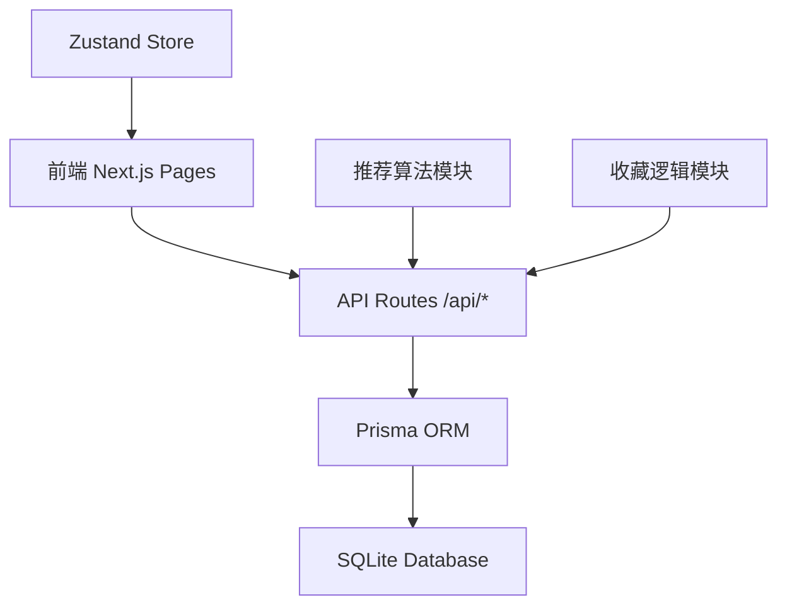
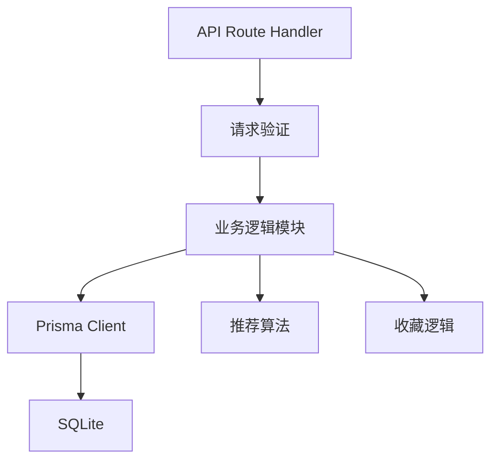
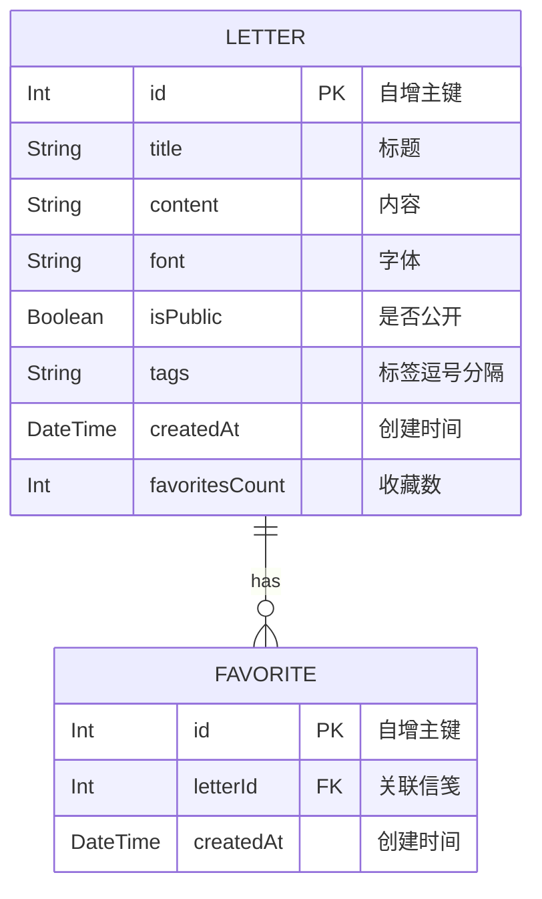

## 1. 架构设计



## 2. 技术说明

- **前端框架**：Next.js 14 (Pages Router) + React 18 + TypeScript
- **构建工具**：Vite 5 + @vitejs/plugin-react
- **状态管理**：Zustand 4
- **后端**：Next.js API Routes
- **ORM**：Prisma 5 + @prisma/client
- **数据库**：SQLite
- **唯一ID**：uuid

## 3. 路由定义

| 路由 | 用途 |
|------|------|
| / | 首页：瀑布流信笺展示、标签筛选、推荐栏 |
| /create | 发布信笺页面 |
| /letter/[id] | 信笺详情页 |
| /api/letters (GET) | 分页查询信笺列表（cursor分页） |
| /api/letters (POST) | 创建新信笺 |
| /api/favorites (POST) | 收藏/取消收藏信笺 |
| /api/recommend (GET) | 获取推荐信笺列表 |

## 4. API定义

### 类型定义

```typescript
interface Letter {
  id: number;
  title: string;
  content: string;
  font: string;
  isPublic: boolean;
  tags: string;
  createdAt: Date;
  favoritesCount: number;
}

interface Favorite {
  id: number;
  letterId: number;
  createdAt: Date;
}

interface LettersResponse {
  letters: Letter[];
  nextCursor: number | null;
  hasMore: boolean;
}
```

### GET /api/letters
- Query参数：cursor（number，可选）、tag（string，可选）、limit（number，默认20/10）
- 响应：`LettersResponse`

### POST /api/letters
- Request Body：`{ title, content, font, isPublic, tags }`
- 响应：创建的 `Letter` 对象（含id）

### POST /api/favorites
- Request Body：`{ letterId: number }`
- 响应：`{ favorited: boolean, favoritesCount: number }`

### GET /api/recommend
- Query参数：userId（string，可选，预留）
- 响应：`{ letters: Letter[] }`（5条）

## 5. 服务端架构



## 6. 数据模型

### 6.1 ER图



### 6.2 Prisma Schema

```prisma
model Letter {
  id             Int        @id @default(autoincrement())
  title          String
  content        String
  font           String     @default("楷体")
  isPublic       Boolean    @default(true)
  tags           String
  createdAt      DateTime   @default(now())
  favoritesCount Int        @default(0)
  favorites      Favorite[]
}

model Favorite {
  id        Int      @id @default(autoincrement())
  letterId  Int
  letter    Letter   @relation(fields: [letterId], references: [id])
  createdAt DateTime @default(now())
}
```

## 7. 项目目录结构

```
.
├── package.json
├── vite.config.js
├── tsconfig.json
├── index.html
├── prisma/
│   └── schema.prisma
└── src/
    ├── pages/
    │   ├── index.tsx
    │   ├── create.tsx
    │   └── letter/
    │       └── [id].tsx
    ├── api/
    │   ├── letters.ts
    │   ├── favorites.ts
    │   └── recommendations.ts
    ├── store/
    │   └── index.ts
    └── lib/
        └── prisma.ts
```

## 8. 核心模块说明

### 8.1 推荐算法模块 (src/api/recommendations.ts)
- 基于用户收藏信笺的标签进行协同过滤
- 计算标签相似度：统计收藏信笺中各标签出现频率
- 按标签匹配度排序，取前5条
- 无收藏记录时，按favoritesCount降序取前5条热门

### 8.2 收藏逻辑模块 (src/api/favorites.ts)
- 切换收藏状态（收藏/取消收藏）
- 原子更新favoritesCount计数
- 返回最新状态和计数

### 8.3 状态管理 (src/store/index.ts)
- letters：信笺列表数组
- tag：当前筛选标签
- favorites：已收藏letterId的Set
- loading：加载状态
- Actions：setLetters、addLetters、toggleFavorite、setTag

## 9. 性能优化

- 首页初始加载≤1s（3G网络）：精简首屏数据，使用cursor分页
- 无限滚动加载≤500ms：每次10条数据，SQLite索引优化
- 推荐接口≤300ms：热门数据可考虑缓存策略
- CSS columns实现瀑布流，避免JS重排
