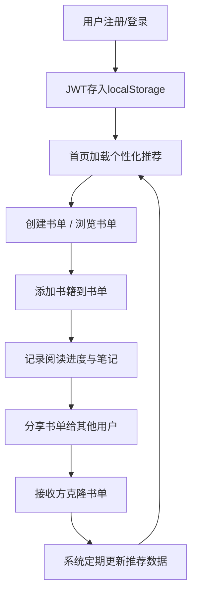

## 1. 产品概述

书旅驿站是一个面向线上读书会会员的互动书单平台，提供主题书单创建、阅读进度记录、书籍推荐交换及个性化书单推荐等功能，构建沉浸式阅读社交体验。

- 核心价值：帮助读者发现好书、记录阅读旅程、与同好分享交流
- 目标用户：线上读书会会员及热爱阅读的社交型读者

## 2. 核心功能

### 2.1 用户角色

| 角色 | 注册方式 | 核心权限 |
|------|----------|----------|
| 普通会员 | 用户名+邮箱+密码注册 | 创建书单、添加书籍、分享书单、查看推荐 |

### 2.2 功能模块

1. **首页**：欢迎信息、个性化推荐书单横向滚动、热门书单展示
2. **书单详情页**：书单信息展示、书籍卡片列表、阅读进度条、笔记功能
3. **搜索页面**：按书名、作者、标签搜索书籍
4. **用户认证**：注册、登录、JWT持久化（24小时）
5. **书单管理**：创建/编辑书单、封面颜色选择、公开/私密切换
6. **书籍管理**：添加书籍、自动补全、阅读进度滑块、Markdown笔记
7. **分享与克隆**：复制链接分享、一键克隆书单、进度独立更新
8. **推荐引擎**：基于Jaccard相似度的个性化书单推荐

### 2.3 页面详情

| 页面名称 | 模块名称 | 功能描述 |
|----------|----------|----------|
| 首页 | 欢迎区 | 显示登录用户昵称、个性化问候语 |
| 首页 | 推荐书单横向滚动 | 250x350px卡片，圆角12px，悬停上移4px，推荐5位用户各3个公开书单 |
| 首页 | 热门书单列表 | 展示平台热门公开书单 |
| 书单详情页 | 书单头部 | 名称、简介、封面颜色、创建者、公开状态 |
| 书单详情页 | 书籍卡片列表 | 书名、作者、封面、进度条、笔记入口 |
| 书单详情页 | 进度条 | 渐变填充（#A8E6CF→#3BB78F），宽度动画0.5秒 |
| 书单详情页 | 添加书籍表单 | 书名自动补全（最多5建议）、作者、封面URL、进度滑块（步长5%） |
| 书单详情页 | 分享功能 | 复制链接、一键克隆书单 |
| 搜索页面 | 搜索框 | 按书名、作者、标签模糊搜索 |
| 搜索页面 | 结果列表 | 书籍卡片展示搜索结果 |
| 注册/登录页 | 表单 | 用户名、邮箱、密码输入 |

## 3. 核心流程

用户注册登录后，可创建主题书单，添加书籍并记录阅读进度，将书单分享给其他用户，其他用户可克隆书单。系统根据用户近30天的阅读标签和进度，通过Jaccard相似度算法推荐相似用户的公开书单。

## 4. 用户界面设计

### 4.1 设计风格

- **主色调**：柔和暖色调为主，冷色调为辅
- **背景色**：浅灰色 #F5F0E1
- **导航栏**：深棕色 #3E2723，文字 #F5F0E1
- **主区块背景**：白色 #FFFFFF，柔和阴影 box-shadow: 0 2px 8px rgba(0,0,0,0.08)
- **主题色**：#4ECDC4（输入框聚焦边框色）
- **进度条渐变**：#A8E6CF → #3BB78F
- **卡片圆角**：border-radius: 12px
- **封面色板**：#FF6B6B, #4ECDC4, #45B7D1, #96CEB4, #FFEAA7, #DDA0DD, #98D8C8, #F7DC6F, #BB8FCE, #85C1E9, #F1948A, #82E0AA
- **按钮反馈**：点击时 scale: 0.95，持续0.1秒
- **卡片悬停**：上移4px，阴影增强至12px，过渡0.3秒
- **字体**：优雅衬线体显示标题 + 简洁无衬线体正文

### 4.2 页面设计概述

| 页面名称 | 模块名称 | UI元素 |
|----------|----------|--------|
| 首页 | 推荐书单横向滚动 | 250x350px卡片，圆角12px，悬停动画，横向滚动容器 |
| 首页 | 用户信息侧栏 | 280px宽，头像、昵称、统计数据 |
| 首页 | 推荐侧栏 | 300px宽，热门书单、推荐用户 |
| 书单详情页 | 书籍卡片 | 封面缩略图、进度条、操作按钮 |
| 书单详情页 | 进度条 | 渐变填充，0.5秒宽度动画 |
| 全站 | 导航栏 | 深棕色背景，浅色文字，logo + 导航链接 + 用户菜单 |

### 4.3 响应式设计

- **桌面端（>1024px）**：三栏布局 - 左栏用户信息280px / 中间主内容自适应 / 右栏推荐300px
- **平板端（768px-1024px）**：两栏布局 - 左侧栏隐藏，中间与右栏并排
- **移动端（<768px）**：单列堆叠布局 - 所有栏位垂直排列

### 4.4 性能约束

- 首页首次内容渲染（FCP）≤ 3秒
- 推荐引擎计算时间 ≤ 500毫秒
