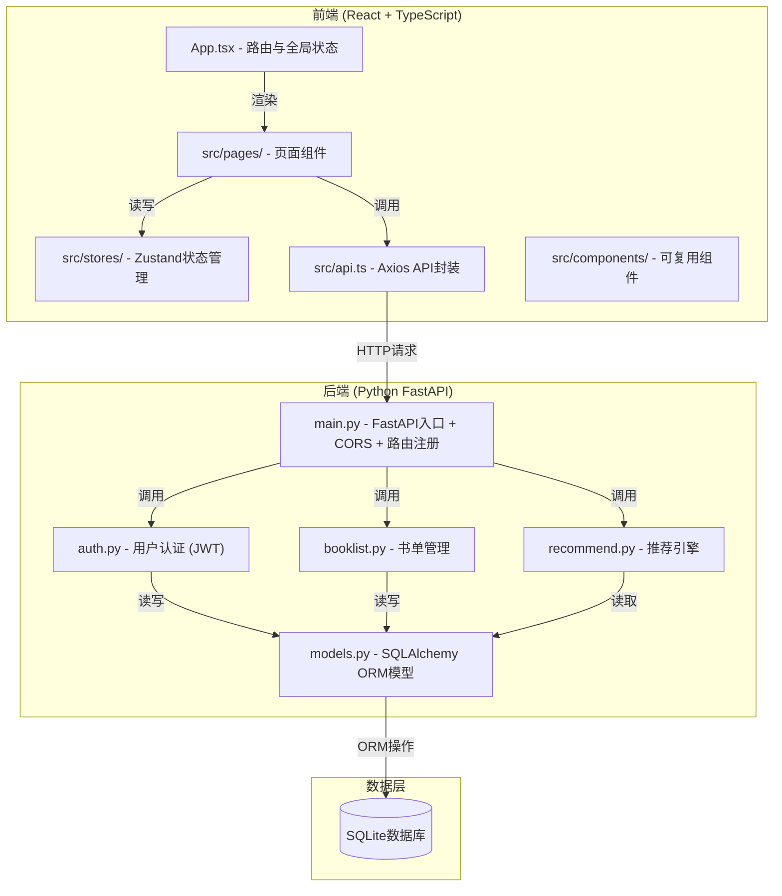
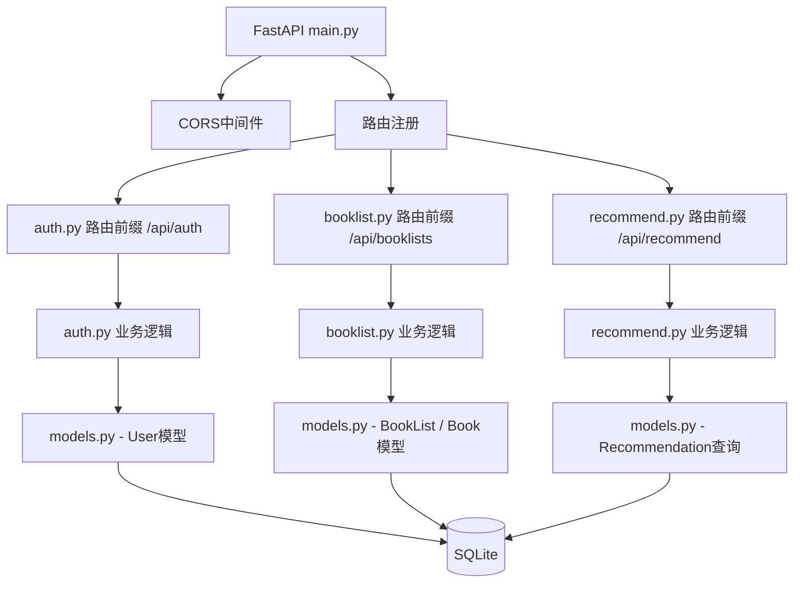
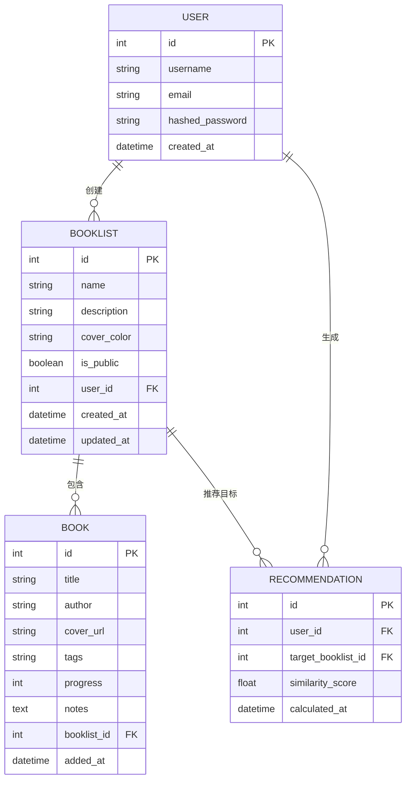

## 1. 架构设计



## 2. 技术描述

- **前端框架**：React 18 + TypeScript + Vite
- **状态管理**：Zustand
- **HTTP客户端**：Axios
- **路由**：react-router-dom
- **后端框架**：Python FastAPI
- **ORM**：SQLAlchemy
- **数据库**：SQLite
- **认证**：JWT（PyJWT），有效期24小时
- **构建工具**：Vite（前端），uvicorn（后端ASGI）

## 3. 路由定义

| 路由 | 用途 |
|------|------|
| / | 首页 - 推荐书单与热门书单展示 |
| /booklist/:id | 书单详情页 - 书籍列表、进度、笔记 |
| /search | 搜索页面 - 书籍搜索 |
| /login | 登录页面 |
| /register | 注册页面 |

### 后端API路由

| 方法 | 路径 | 用途 |
|------|------|------|
| POST | /api/auth/register | 用户注册 |
| POST | /api/auth/login | 用户登录，返回JWT |
| GET | /api/auth/me | 获取当前用户信息 |
| POST | /api/booklists | 创建书单 |
| GET | /api/booklists | 获取当前用户书单列表 |
| GET | /api/booklists/public | 获取公开书单列表 |
| GET | /api/booklists/{id} | 获取书单详情 |
| PUT | /api/booklists/{id} | 更新书单 |
| POST | /api/booklists/{id}/books | 添加书籍到书单 |
| PUT | /api/booklists/{id}/books/{book_id} | 更新书籍信息/进度 |
| DELETE | /api/booklists/{id}/books/{book_id} | 删除书籍 |
| POST | /api/booklists/{id}/clone | 克隆书单 |
| GET | /api/recommend | 获取个性化推荐书单 |
| GET | /api/books/search | 搜索书籍（自动补全） |

## 4. API定义

### TypeScript 类型定义

```typescript
interface User {
  id: number;
  username: string;
  email: string;
  created_at: string;
}

interface Book {
  id: number;
  title: string;
  author: string;
  cover_url?: string;
  tags?: string[];
  progress: number;
  notes?: string;
  added_at: string;
}

interface BookList {
  id: number;
  name: string;
  description: string;
  cover_color: string;
  is_public: boolean;
  user_id: number;
  user?: User;
  books: Book[];
  created_at: string;
  updated_at: string;
}

interface AuthResponse {
  access_token: string;
  token_type: string;
  user: User;
}

interface LoginRequest {
  username: string;
  password: string;
}

interface RegisterRequest {
  username: string;
  email: string;
  password: string;
}

interface CreateBookListRequest {
  name: string;
  description: string;
  cover_color: string;
  is_public: boolean;
}

interface AddBookRequest {
  title: string;
  author: string;
  cover_url?: string;
  tags?: string[];
  progress?: number;
  notes?: string;
}

interface UpdateBookRequest {
  progress?: number;
  notes?: string;
  cover_url?: string;
}
```

## 5. 后端架构图



## 6. 数据模型

### 6.1 ER图



### 6.2 数据定义语言（SQLAlchemy模型）

```python
# User表
class User(Base):
    __tablename__ = "users"
    id = Column(Integer, primary_key=True, index=True)
    username = Column(String(50), unique=True, index=True, nullable=False)
    email = Column(String(100), unique=True, index=True, nullable=False)
    hashed_password = Column(String(255), nullable=False)
    created_at = Column(DateTime, default=datetime.utcnow)

# BookList表
class BookList(Base):
    __tablename__ = "booklists"
    id = Column(Integer, primary_key=True, index=True)
    name = Column(String(30), nullable=False)
    description = Column(String(200), default="")
    cover_color = Column(String(7), default="#4ECDC4")
    is_public = Column(Boolean, default=False)
    user_id = Column(Integer, ForeignKey("users.id"))
    created_at = Column(DateTime, default=datetime.utcnow)
    updated_at = Column(DateTime, default=datetime.utcnow, onupdate=datetime.utcnow)
    user = relationship("User", backref="booklists")
    books = relationship("Book", backref="booklist", cascade="all, delete-orphan")

# Book表
class Book(Base):
    __tablename__ = "books"
    id = Column(Integer, primary_key=True, index=True)
    title = Column(String(200), nullable=False)
    author = Column(String(100), nullable=False)
    cover_url = Column(String(500), nullable=True)
    tags = Column(String(500), default="")  # 逗号分隔存储
    progress = Column(Integer, default=0)  # 0-100
    notes = Column(Text, default="")  # Markdown
    booklist_id = Column(Integer, ForeignKey("booklists.id"))
    added_at = Column(DateTime, default=datetime.utcnow)

# Recommendation表
class Recommendation(Base):
    __tablename__ = "recommendations"
    id = Column(Integer, primary_key=True, index=True)
    user_id = Column(Integer, ForeignKey("users.id"))
    target_booklist_id = Column(Integer, ForeignKey("booklists.id"))
    similarity_score = Column(Float, default=0.0)
    calculated_at = Column(DateTime, default=datetime.utcnow)
```

## 7. 文件结构与调用关系

```
auto339/
├── package.json          # 前端依赖与脚本
├── vite.config.js        # Vite配置
├── tsconfig.json         # TypeScript配置
├── index.html            # 入口HTML
├── backend/
│   ├── main.py           # FastAPI入口：接收前端请求 → 调用auth/booklist/recommend模块 → 返回JSON
│   ├── models.py         # SQLAlchemy模型：被main.py和各模块调用
│   ├── auth.py           # 用户认证：接收main.py传递凭证 → 验证 → 返回token
│   ├── booklist.py       # 书单管理：接收请求参数 → 调用models.py → 返回结果
│   ├── recommend.py      # 推荐引擎：接收用户ID → 查询models.py → 计算 → 返回推荐列表
│   └── requirements.txt  # Python依赖
└── src/
    ├── App.tsx           # 前端入口：渲染页面 → 调用api.ts
    ├── api.ts            # API封装：被组件调用 → 发送HTTP到main.py → 返回数据
    ├── pages/
    │   ├── HomePage.tsx      # 首页：调用api.ts → 渲染卡片
    │   ├── BookListPage.tsx  # 书单详情：调用api.ts → 渲染书籍和进度
    │   └── SearchPage.tsx    # 搜索页：调用api.ts搜索 → 渲染结果
    └── stores/
        ├── authStore.ts  # 用户状态：被组件调用 → 存储token到localStorage
        └── bookStore.ts  # 书单状态：被组件调用 → 缓存书单数据
```

### 数据流说明

1. **用户登录**：Login组件 → authStore.login() → api.ts POST /api/auth/login → backend/main.py → auth.py → models.py查询用户 → JWT生成 → 返回token → authStore存localStorage
2. **书单创建**：HomePage → api.ts POST /api/booklists → main.py → booklist.py → models.py插入 → 返回书单对象 → bookStore缓存
3. **书籍添加**：BookListPage → api.ts POST /api/booklists/{id}/books → main.py → booklist.py → models.py插入Book → 返回 → 组件刷新
4. **推荐计算**：HomePage加载 → api.ts GET /api/recommend → main.py → recommend.py → models.py查询近30天数据 → Jaccard相似度计算 → 返回书单ID列表 → 渲染横向滚动卡片
