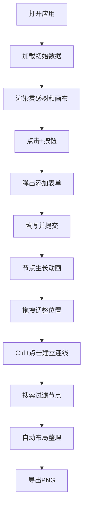

## 1. 产品概述

灵感图谱是一款面向创意工作者（设计师、作家、策划）的可视化灵感管理工具，帮助用户将零散的灵感点子以思维导图的形式组织和存储，提升创意工作效率。

- 核心功能：灵感节点的可视化管理、思维导图式布局、标签分类、优先级设置
- 目标用户：设计师、作家、策划人员等创意工作者
- 产品价值：将碎片化灵感系统化，激发创意联想，提升创作效率

## 2. 核心 Features

### 2.1 用户角色

| 角色 | 注册方式 | 核心权限 |
|------|----------|----------|
| 创意工作者 | 无需注册，本地使用 | 创建、编辑、删除灵感节点，管理图谱，导出图片 |

### 2.2 功能模块

1. **灵感树面板**：左侧树形结构展示所有灵感节点，支持折叠/展开
2. **图谱画布区**：Canvas绘制的思维导图，支持节点拖拽、连线、缩放平移
3. **添加灵感表单**：弹出式表单，用于创建新的灵感节点
4. **顶部工具栏**：自动布局、导出PNG、搜索功能
5. **迷你地图**：右下角缩略图，快速导航和视图同步

### 2.3 页面详情

| 页面名称 | 模块名称 | 功能描述 |
|-----------|-------------|---------------------|
| 主界面 | 灵感树面板 | 300px宽，暗色背景，树形结构展示节点，支持添加、编辑、删除 |
| 主界面 | 图谱画布区 | 全屏Canvas，支持节点拖拽、连线、缩放平移，贝塞尔曲线连接 |
| 主界面 | 添加灵感表单 | 400px宽浮层面板，包含标题、标签、颜色、优先级等字段 |
| 主界面 | 顶部工具栏 | 自动布局按钮、导出PNG按钮、搜索输入框 |
| 主界面 | 迷你地图 | 180x120px缩略图，实时同步视图，点击跳转 |

## 3. 核心流程

### 3.1 主要用户流程

用户打开应用 → 查看初始示例灵感图谱 → 点击+按钮添加新灵感 → 填写表单提交 → 节点出现在画布上（生长动画）→ 拖拽节点调整位置 → Ctrl+点击建立节点关联 → 搜索关键词过滤节点 → 自动布局整理图谱 → 导出PNG保存

### 3.2 Mermaid 流程图

## 4. 用户界面设计

### 4.1 设计风格

- **主色调**：深蓝紫渐变背景（#0D0D1A → #1A1A3A），面板背景（#16162A、#1E1E2E）
- **强调色**：紫色#6C63FF（主要操作）、红色#FF6B6B（紧急）、蓝色#4ECDC4（灵感）、黄色#FFD93D（待定）
- **字体**：Inter，标题粗体14px，正文常规
- **按钮风格**：圆形按钮，悬停放大+外发光效果
- **布局风格**：左右分栏（300px + 自适应），顶部工具栏，右下角迷你地图
- **圆角**：12px（面板）、16px（弹窗）、6px（节点悬停）、8px（迷你地图）

### 4.2 页面设计概述

| 页面名称 | 模块名称 | UI Elements |
|-----------|-------------|-------------|
| 主界面 | 灵感树面板 | 树形缩进24px，连接线#3A3A5C，彩色圆点标签，悬停背景#2A2A44 |
| 主界面 | 图谱画布区 | 节点拖拽放大1.1倍，贝塞尔曲线连线，碎片化消失动画 |
| 主界面 | 添加灵感表单 | 优先级滑块渐变（#4ECDC4→#FFD93D→#FF6B6B），柔和阴影 |
| 主界面 | 顶部工具栏 | 搜索高亮脉冲动画（box-shadow 0 0 20px rgba(108,99,255,0.8)） |
| 主界面 | 迷你地图 | 白色半透明视口方块，实时同步，点击跳转 |

### 4.3 响应式

- 桌面端优先设计，左侧固定300px面板，右侧自适应画布
- 不针对移动端优化，专注桌面端创作体验

### 4.4 动画设计

- 节点添加：中心放大，400ms，ease-out
- 节点删除：裂为6个碎片飞散，300ms
- 自动布局：600ms，ease-in-out
- 搜索高亮：放大1.2倍 + 脉冲闪烁
- 按钮悬停：放大1.1倍 + 外发光
