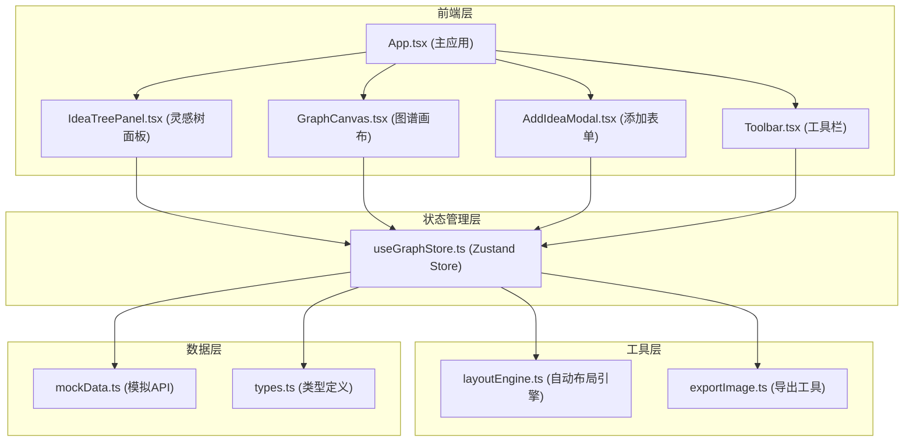

## 1. 架构设计



## 2. 技术描述

- **前端框架**：React 18 + TypeScript
- **构建工具**：Vite 5
- **状态管理**：Zustand
- **UI渲染**：Canvas API（图谱绘制）+ React DOM（界面组件）
- **字体**：Google Fonts - Inter
- **唯一ID生成**：uuid

### 项目依赖
- react: ^18.2.0
- react-dom: ^18.2.0
- zustand: ^4.5.0
- uuid: ^9.0.1
- @types/uuid: ^9.0.7
- typescript: ^5.3.0
- vite: ^5.0.0
- @vitejs/plugin-react: ^4.2.0

## 3. 项目结构

```
auto34/
├── index.html                 # 入口HTML
├── package.json              # 项目依赖
├── vite.config.ts            # Vite配置
├── tsconfig.json             # TypeScript配置
└── src/
    ├── main.tsx              # 应用入口
    ├── types.ts              # 类型定义
    ├── App.tsx               # 主应用组件
    ├── components/
    │   ├── IdeaTreePanel.tsx    # 左侧灵感树面板
    │   ├── GraphCanvas.tsx      # 右侧图谱画布
    │   ├── AddIdeaModal.tsx     # 添加灵感弹窗
    │   └── Toolbar.tsx          # 顶部工具栏
    ├── store/
    │   └── useGraphStore.ts     # Zustand状态管理
    ├── api/
    │   └── mockData.ts          # 模拟API数据
    └── utils/
        ├── layoutEngine.ts      # 自动布局引擎
        └── exportImage.ts       # 图片导出工具
```

## 4. 核心数据模型

### 4.1 类型定义

```typescript
// 标签类型
type Tag = 'urgent' | 'inspiration' | 'pending';

// 节点接口
interface InspirationNode {
  id: string;
  title: string;
  tag: Tag;
  color: string;
  priority: number; // 0-100
  x: number;
  y: number;
  parentId: string | null;
  children: string[];
  collapsed: boolean;
  createdAt: number;
}

// 连接线接口
interface Link {
  id: string;
  sourceId: string;
  targetId: string;
  type: 'strong' | 'weak';
}

// 动画节点
interface AnimatedNode {
  node: InspirationNode;
  scale: number;
  opacity: number;
  targetX: number;
  targetY: number;
}

// 碎片动画
interface Fragment {
  x: number;
  y: number;
  vx: number;
  vy: number;
  color: string;
  size: number;
  opacity: number;
}

// Store状态
interface GraphState {
  nodes: InspirationNode[];
  links: Link[];
  selectedNodeId: string | null;
  editingNodeId: string | null;
  searchKeyword: string;
  viewport: { x: number; y: number; scale: number };
  isModalOpen: boolean;
  modalParentId: string | null;
  animatedNodes: Map<string, AnimatedNode>;
  fragments: Fragment[];
  actions: {
    addNode: (node: Omit<InspirationNode, 'id' | 'createdAt' | 'children' | 'collapsed'>) => void;
    deleteNode: (id: string) => void;
    updateNode: (id: string, updates: Partial<InspirationNode>) => void;
    moveNode: (id: string, x: number, y: number) => void;
    selectNode: (id: string | null) => void;
    setEditingNode: (id: string | null) => void;
    setSearchKeyword: (keyword: string) => void;
    addLink: (sourceId: string, targetId: string, type: 'strong' | 'weak') => void;
    deleteLink: (id: string) => void;
    toggleCollapse: (id: string) => void;
    autoLayout: () => void;
    setViewport: (viewport: { x: number; y: number; scale: number }) => void;
    openModal: (parentId?: string | null) => void;
    closeModal: () => void;
    addFragment: (fragment: Fragment) => void;
    clearFragments: () => void;
  };
}
```

### 4.2 标签颜色映射

| 标签 | 颜色值 | 含义 |
|------|--------|------|
| urgent | #FF6B6B | 紧急 |
| inspiration | #4ECDC4 | 灵感 |
| pending | #FFD93D | 待定 |

## 5. 核心算法

### 5.1 自动布局算法

基于树形结构的分层布局：
1. 计算每个节点的深度层级
2. 同层级节点水平分布
3. 父节点居中于子节点上方
4. 避免节点重叠，保持最小间距
5. 使用ease-in-out缓动动画过渡

### 5.2 贝塞尔曲线绘制

使用二次贝塞尔曲线连接节点：
- 控制点位于两节点连线的中点，垂直偏移20-50px
- 根据节点层级动态调整曲线曲率
- 强关联使用紫色#6C63FF半透明，弱关联使用灰色#4A4A6A半透明

### 5.3 性能优化

- Canvas分层绘制：背景层、连线层、节点层、UI层
- requestAnimationFrame统一动画调度
- 视口裁剪：只绘制可见区域内的节点
- 离屏缓存：静态元素缓存到离屏Canvas

## 6. 性能指标

- 200个节点同时展示时，拖拽操作 ≥ 30FPS
- 节点添加动画：400ms，ease-out
- 节点删除动画：300ms，6个碎片飞散
- 自动布局动画：600ms，ease-in-out
- 搜索响应延迟 < 100ms
