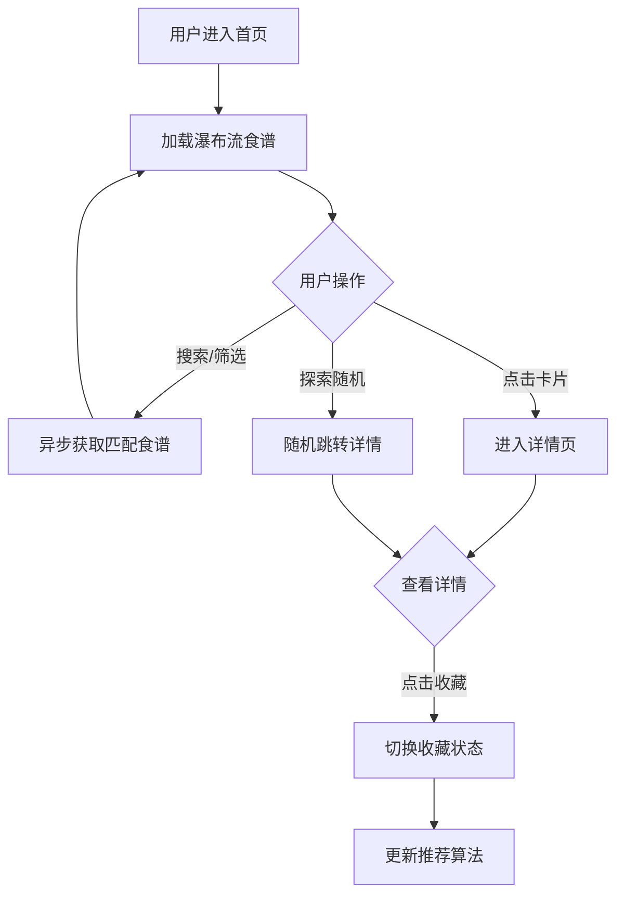

## 1. 产品概述
食谱交换站是一个面向家庭烹饪爱好者的食谱分享平台，用户可以上传拿手菜谱、浏览他人分享的美食、按标签搜索、收藏喜欢的食谱并获取个性化推荐。
- 解决家庭烹饪灵感匮乏、食谱查找不便的痛点，打造温暖的美食分享社区
- 核心价值在于丰富的家常菜谱库、精准的风味标签筛选和智能个性化推荐

## 2. 核心功能

### 2.1 用户角色
| 角色 | 注册方式 | 核心权限 |
|------|---------|---------|
| 普通用户 | 无需注册（本地收藏） | 浏览食谱、搜索筛选、收藏食谱、查看推荐、探索随机 |

### 2.2 功能模块
1. **首页**：搜索栏、食谱卡片瀑布流、探索随机按钮
2. **详情页**：高清大图展示、菜名标签、食材清单、制作步骤、收藏按钮

### 2.3 页面详情
| 页面名称 | 模块名称 | 功能描述 |
|---------|---------|---------|
| 首页 | 搜索栏 | 60%宽度居中，圆角12px，按食材或口味标签搜索食谱 |
| 首页 | 瀑布流卡片区 | 280px宽卡片，展示图片/菜名/简介/标签，悬停上移加阴影，点击进入详情 |
| 首页 | 探索随机按钮 | 圆角24px，点击随机跳转到食谱详情页 |
| 详情页 | 高清大图区 | 左侧展示，最大宽度60%，自适应高度 |
| 详情页 | 信息展示区 | 右侧依次展示菜名、标签、食材清单（橙色圆点）、编号步骤 |
| 详情页 | 收藏按钮 | 心形图标，灰色/红色切换，点击缩放动画 |

## 3. 核心流程
用户打开首页 → 浏览瀑布流食谱卡片或使用搜索栏筛选 → 点击卡片进入详情页查看食材和步骤 → 点击心形按钮收藏食谱 → 系统基于收藏记录推荐相似风味 → 或点击"探索随机"发现惊喜菜谱

## 4. 用户界面设计

### 4.1 设计风格
- **主色调**：暖橙色系 - 主色#FFCC80、强调色#FF7043、背景#FFF8E1
- **按钮风格**：圆角胶囊形，hover变亮10%，active缩小scale 0.95
- **标签风格**：胶囊形，背景#FF7043白色文字，12px字号，4x8px内边距
- **字体**：深灰色文字#333，菜名18px粗体，简介14px，标签12px
- **布局**：卡片式瀑布流，响应式单列适配

### 4.2 页面设计概览
| 页面名称 | 模块名称 | UI元素 |
|---------|---------|--------|
| 首页 | 搜索栏 | 60%宽度居中、圆角12px、背景#F5F0E8、字体#333 |
| 首页 | 食谱卡片 | 宽280px、上下间距24px、图片占60%高度cover模式、悬停上移5px + 阴影过渡0.25s |
| 首页 | 探索按钮 | 圆角24px、#FF8A65背景白色文字、悬停#FF7043 |
| 详情页 | 大图展示 | 左侧最大宽度60%、自适应高度 |
| 详情页 | 食材清单 | 无序列表、#FF7043圆点 |
| 详情页 | 收藏按钮 | 心形图标、未收藏#CCC/收藏#E53935、点击缩放1.15回弹0.2s |

### 4.3 响应式设计
- 桌面端：瀑布流多列布局，卡片宽度280px
- 移动端（max-width: 768px）：单列布局，卡片宽度95%
- 详情页移动端：大图居上，信息区在下的垂直排列

### 4.4 性能优化
- 搜索响应≤300ms
- 图片懒加载（滚动到视口才加载）
- 分页加载（每页12条）
