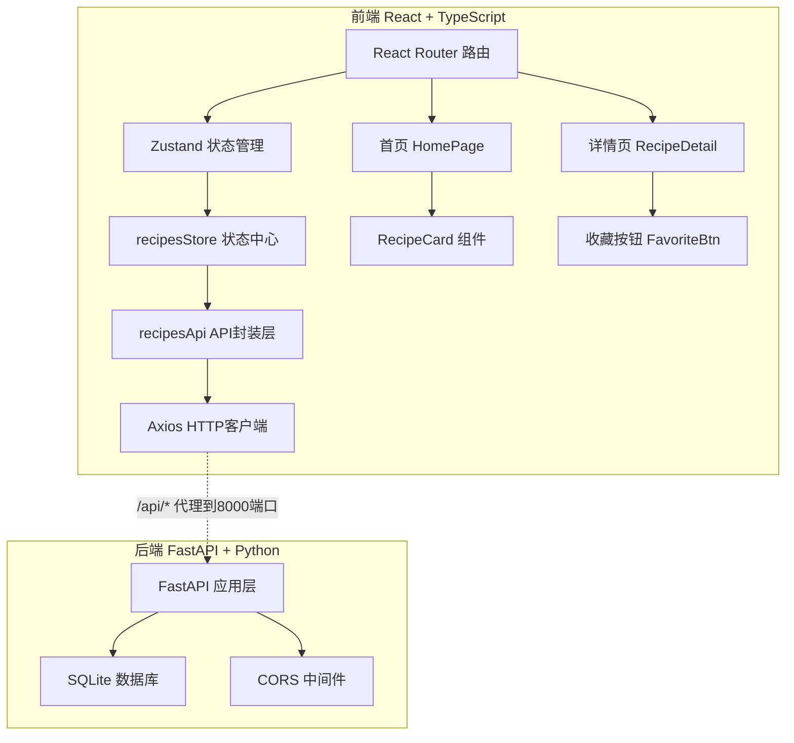
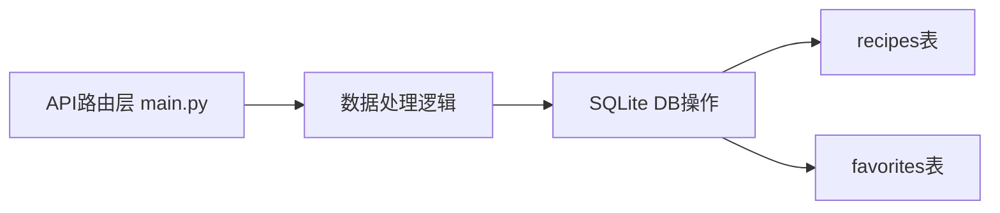
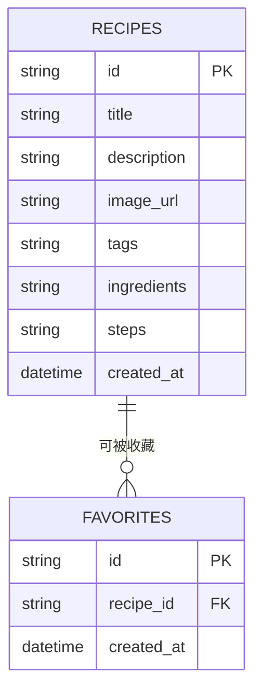

## 1. 架构设计


## 2. 技术选型
- **前端框架**：React 18 + TypeScript
- **构建工具**：Vite 5
- **状态管理**：Zustand 4
- **HTTP客户端**：Axios
- **路由**：React Router DOM 6
- **后端框架**：FastAPI 0.109
- **数据库**：SQLite（内置文件存储）
- **后端服务**：Uvicorn ASGI服务器
- **ID生成**：uuid

## 3. 路由定义
| 前端路由 | 页面用途 |
|---------|---------|
| `/` | 首页 - 搜索栏 + 瀑布流食谱卡片 + 探索随机 |
| `/recipe/:id` | 详情页 - 高清大图 + 食材 + 步骤 + 收藏 |

| 后端API路由 | 方法 | 用途 |
|-----------|------|-----|
| `/api/recipes` | GET | 获取食谱列表，支持tags参数筛选，分页 |
| `/api/recipes/random` | GET | 随机获取一个食谱 |
| `/api/recipes/{id}` | GET | 根据ID获取单个食谱详情 |
| `/api/recipes` | POST | 上传新食谱 |
| `/api/favorites` | POST | 添加收藏 |
| `/api/favorites/{id}` | DELETE | 取消收藏 |
| `/api/recommendations` | GET | 基于收藏历史获取推荐 |

## 4. API类型定义

```typescript
interface Recipe {
  id: string;
  title: string;
  description: string;
  image_url: string;
  tags: string[];
  ingredients: string[];
  steps: string[];
  created_at: string;
}

interface RecipesListResponse {
  recipes: Recipe[];
  total: number;
  page: number;
  page_size: number;
}

interface Favorite {
  id: string;
  recipe_id: string;
  created_at: string;
}
```

## 5. 服务端架构


## 6. 数据模型

### 6.1 ER图


### 6.2 DDL建表语句
```sql
CREATE TABLE IF NOT EXISTS recipes (
    id TEXT PRIMARY KEY,
    title TEXT NOT NULL,
    description TEXT NOT NULL,
    image_url TEXT NOT NULL,
    tags TEXT NOT NULL,
    ingredients TEXT NOT NULL,
    steps TEXT NOT NULL,
    created_at DATETIME DEFAULT CURRENT_TIMESTAMP
);

CREATE TABLE IF NOT EXISTS favorites (
    id TEXT PRIMARY KEY,
    recipe_id TEXT NOT NULL,
    created_at DATETIME DEFAULT CURRENT_TIMESTAMP,
    FOREIGN KEY (recipe_id) REFERENCES recipes(id)
);

CREATE INDEX IF NOT EXISTS idx_recipes_tags ON recipes(tags);
CREATE INDEX IF NOT EXISTS idx_favorites_recipe ON favorites(recipe_id);
```
