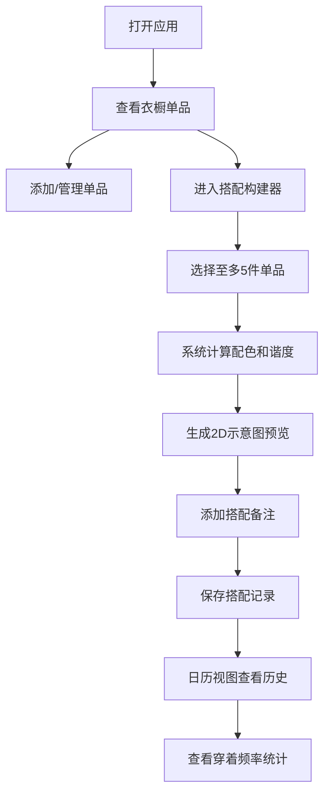

## 1. 产品概述

每日穿搭规划应用，帮助用户解决早晨面对衣柜选择困难、缺乏整体搭配预览的问题。用户可以管理衣橱单品、创建搭配、查看配色和谐度、记录穿搭历史并进行穿着统计。

### 1.1 产品定位
- 目标用户：注重日常穿搭、追求穿搭效率的都市人群
- 核心价值：通过数字化衣橱管理和智能配色分析，提升穿搭决策效率
- 市场价值：填补穿搭预览与穿着统计结合的细分市场空白

## 2. 核心功能

### 2.1 用户角色
| 角色 | 注册方式 | 核心权限 |
|------|----------|----------|
| 普通用户 | 无需注册（本地数据） | 管理衣橱、创建搭配、查看历史记录与统计 |

### 2.2 功能模块
1. **衣橱管理页**：单品列表展示、添加/编辑/删除单品、侧边栏统计
2. **搭配构建器**：单品选择、配色和谐度计算、2D示意图、保存搭配
3. **日历视图**：历史穿搭记录展示、日期展开详情、月份切换
4. **穿着统计**：周/月/年穿着次数统计、单品频率计数

### 2.3 页面详情
| 页面名称 | 模块名称 | 功能描述 |
|----------|----------|----------|
| 衣橱管理页 | 侧边栏统计 | 显示总花费、单品数量、平均价格 |
| 衣橱管理页 | 单品网格 | 响应式网格展示所有单品卡片，支持悬停动画 |
| 衣橱管理页 | 添加单品表单 | 表单包含名称、类别、颜色、季节、照片、购买日期、价格 |
| 搭配构建器 | 单品选择区 | 从衣橱中选择至多5件单品 |
| 搭配构建器 | 配色和谐度 | 实时计算并显示分数（0-100），带颜色标识和动画 |
| 搭配构建器 | 2D示意图 | Canvas绘制服装组合示意图 |
| 搭配构建器 | 搭配备注 | 最多100字的整体搭配说明 |
| 日历视图 | 月份日历 | 展示每日搭配数量，点击展开详情 |
| 日历视图 | 月份切换 | 带淡入淡出动画的月份导航 |

## 3. 核心流程

用户打开应用 → 查看衣橱单品列表 → 选择单品进行搭配 → 查看配色和谐度和预览效果 → 保存搭配 → 日历中查看历史记录 → 统计穿着频率

## 4. 用户界面设计

### 4.1 设计风格
- **主色调**：米白（#FAF0E6）与深灰（#2C3E50）
- **点缀色**：淡紫（#B39DDB）用于按钮和选中态
- **卡片样式**：圆角12px，阴影box-shadow: 0 2px 8px rgba(0,0,0,0.08)，悬停时上移3px并增强阴影
- **背景纹理**：重复CSS径向渐变点阵，间距20px，颜色#E8DCD0，透明度0.3
- **字体**：显示字体使用Playfair Display，正文字体使用Lato
- **动效**：卡片悬停过渡0.2s，分数闪烁0.3s，日历切换淡入淡出0.4s

### 4.2 页面设计概述
| 页面名称 | 模块名称 | UI元素 |
|----------|----------|--------|
| 衣橱管理页 | 侧边栏统计 | 卡片式布局，¥符号前置，20px粗体#222 |
| 衣橱管理页 | 单品卡片 | 1:1缩略图100x100px，类别SVG图标，12px颜色小圆点 |
| 搭配构建器 | 配色分数 | 右上角圆角徽章，<40红#FF4444，40-69橙#FFA500，≥70绿#44AA44 |
| 搭配构建器 | 缩略图列表 | 左侧纵向排列选中单品小图 |
| 搭配构建器 | Canvas示意图 | 上衣/下装/鞋子按比例叠放，1px深色描边#333333 |
| 日历视图 | 日期格子 | 12px浅灰色#999数字显示搭配数量 |

### 4.3 响应式设计
- **桌面端（>1024px）**：三列网格布局
- **平板端（768-1024px）**：两列网格布局
- **移动端（<768px）**：单列布局
- 所有卡片最小宽度280px，自适应宽度

### 4.4 性能指标
- 日历视图切换月份渲染时间 ≤ 100ms
- 衣橱网格首次加载（≤200件单品）渲染时间 ≤ 500ms
