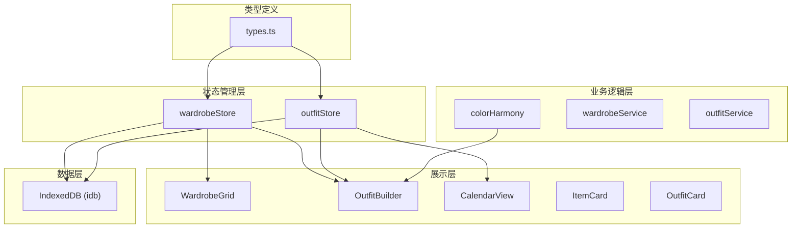
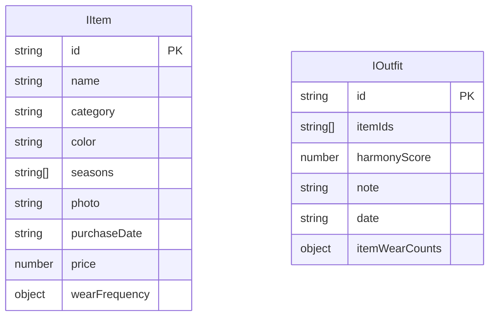

## 1. 架构设计

纯前端应用架构，使用React组件化开发，Zustand进行状态管理，IndexedDB进行本地数据持久化。



## 2. 技术栈

- **前端框架**：React@18 + TypeScript
- **构建工具**：Vite 5.x + @vitejs/plugin-react
- **状态管理**：Zustand
- **本地数据库**：IndexedDB (idb库)
- **工具库**：uuid（生成唯一ID）

## 3. 项目结构

```
├── src/
│   ├── types.ts              # 共享接口类型定义
│   ├── store/
│   │   ├── wardrobeStore.ts  # 衣橱状态管理
│   │   └── outfitStore.ts    # 搭配状态管理
│   ├── components/
│   │   ├── WardrobeGrid.tsx  # 衣橱网格视图
│   │   ├── OutfitBuilder.tsx # 搭配构建器
│   │   ├── CalendarView.tsx  # 日历视图
│   │   ├── ItemCard.tsx      # 单品卡片
│   │   ├── OutfitCard.tsx    # 搭配卡片
│   │   ├── AddItemModal.tsx  # 添加单品弹窗
│   │   └── Sidebar.tsx       # 侧边栏统计
│   ├── utils/
│   │   └── colorHarmony.ts   # 配色和谐度算法
│   ├── App.tsx
│   ├── main.tsx
│   └── index.css
├── index.html
├── package.json
├── vite.config.js
└── tsconfig.json
```

## 4. 数据模型

### 4.1 数据模型定义



### 4.2 类型定义

```typescript
// src/types.ts
export type Category = 'top' | 'bottom' | 'outer' | 'shoes' | 'accessory';
export type Season = 'spring' | 'summer' | 'autumn' | 'winter';

export interface IItem {
  id: string;
  name: string;
  category: Category;
  color: string;
  seasons: Season[];
  photo: string; // base64 or blob URL
  purchaseDate: string;
  price: number;
  wearFrequency: {
    weekly: number;
    monthly: number;
    yearly: number;
    total: number;
  };
}

export interface IOutfit {
  id: string;
  itemIds: string[];
  harmonyScore: number;
  note: string;
  date: string; // YYYY-MM-DD
  itemWearCounts: Record<string, number>;
}

export interface IWardrobeStats {
  totalSpent: number;
  itemCount: number;
  averagePrice: number;
}

export interface ColorPalette {
  [key: string]: string;
}
```

### 4.3 IndexedDB 配置

- 数据库名：`WardrobeDB`
- 版本：1
- 对象仓库：
  - `items`：存储单品数据，keyPath: `id`
  - `outfits`：存储搭配记录，keyPath: `id`，索引：`date`

## 5. 核心模块说明

### 5.1 衣橱管理模块 (wardrobeStore)
- 功能：单品CRUD、穿着频率增加、统计计算
- 持久化：调用idb进行数据读写
- 导出：useWardrobeStore

### 5.2 搭配管理模块 (outfitStore)
- 功能：创建搭配、历史记录管理、按日期查询
- 持久化：调用idb进行数据读写
- 导出：useOutfitStore

### 5.3 配色和谐度算法 (colorHarmony)
- 输入：颜色数组（hex格式）
- 输出：0-100分数
- 算法：基于HSL色彩空间计算色相/饱和度/明度差异
- 无React依赖，纯函数实现

### 5.4 2D示意图生成 (OutfitBuilder内)
- 使用Canvas API绘制
- 上衣/下装/鞋子按比例叠放
- 颜色与所选单品一致
- 1px深色描边#333333

## 6. 性能优化策略

1. **React.memo**：CalendarView、ItemCard使用memo避免不必要重渲染
2. **虚拟列表**：单品数量超过200时考虑使用，但需求中限制首次加载≤200件
3. **批量更新**：状态更新使用批量处理减少渲染次数
4. **图片优化**：上传图片自动压缩，使用object-fit: cover显示
5. **Canvas复用**：2D示意图Canvas使用ref复用，避免重复创建
