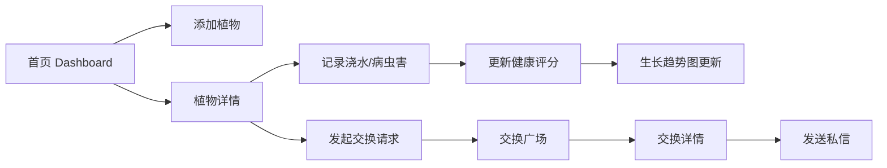

## 1. 产品概述

绿手指物语是一个面向社区园艺爱好者的植物种植日记与社区交换平台。用户可以记录植物生长过程、分享养护经验，并与其他成员交换种子或幼苗。

- **核心价值**：为园艺爱好者提供植物成长记录工具和社区交流平台，促进园艺知识分享和植物资源交换
- **目标用户**：社区园艺爱好者、植物种植初学者、种子/幼苗交换需求者
- **产品定位**：轻量级、社交化的植物种植管理与社区交换平台

## 2. 核心功能

### 2.1 用户角色

| 角色 | 注册方式 | 核心权限 |
|------|---------|---------|
| 普通用户 | 默认单用户模式 | 管理植物日记、发起交换请求、查看交换广场、发送私信 |

### 2.2 功能模块

1. **植物日记管理模块**：添加植物、记录生长过程、标记浇水/病虫害、查看生长记录时间线
2. **社区交换模块**：发起交换请求、浏览交换广场、查看交换详情、发送私信
3. **植物生长可视化模块**：健康评分折线图、生长趋势展示

### 2.3 页面详情

| 页面名称 | 模块名称 | 功能描述 |
|---------|---------|----------|
| 首页 Dashboard | 植物日记列表 | 网格展示所有植物卡片、FAB添加按钮、搜索筛选 |
| 植物详情页 PlantDetail | 植物详情 + 生长可视化 | 大图展示、基本信息、生长记录时间线、健康评分折线图、操作按钮（浇水/病虫害/交换） |
| 交换广场 ExchangeSquare | 社区交换列表 | 列表展示所有交换请求、发起者头像、植物缩略图、交换意愿预览 |
| 交换详情 ExchangeDetail | 交换详情 + 私信 | 完整交换信息、私信聊天记录、发送私信功能 |

## 3. 核心流程

### 3.1 植物日记管理流程

用户在首页点击 FAB 按钮 → 弹出添加植物模态框 → 填写植物信息并上传照片 → 保存后植物卡片显示在首页网格 → 点击卡片进入详情页 → 查看生长记录并执行操作（浇水/病虫害）→ 操作时手动评分 → 评分数据更新到折线图

### 3.2 社区交换流程

用户在植物详情页点击"发起交换" → 填写交换意愿 → 提交后交换请求出现在交换广场 → 其他用户浏览交换广场 → 点击感兴趣的交换请求 → 查看详情并发送私信 → 私信记录保存在本地状态

## 4. 用户界面设计

### 4.1 设计风格

- **主色调**：墨绿色 #2E7D32、米白色 #F1F8E9
- **辅助色**：亮绿色 #4CAF50、浅绿色 #A5D6A7、深绿 #1B5E20
- **健康状态色**：好（绿色）、一般（黄色）、差（红色）
- **字体**：系统默认 sans-serif 字体
- **卡片风格**：白底、圆角、阴影、hover 上浮效果
- **图标风格**：Emoji 表情图标（笑脸/中性脸/哭脸表示健康状态）
- **整体氛围**：自然、清新、柔和的园艺主题

### 4.2 页面设计概览

| 页面名称 | 模块名称 | UI 元素 |
|---------|---------|--------|
| 首页 | 植物卡片网格 | 4列网格布局、240px 卡片、动态间距、hover 上浮动画 |
| 首页 | FAB 添加按钮 | 圆形56px、#4CAF50 背景、白色加号、右下角固定定位 |
| 首页 | 添加模态框 | 半透明深色遮罩、400px宽度、白底16px圆角、16px字段间距 |
| 详情页 | 植物大图 | object-fit: cover、250px高度 |
| 详情页 | 生长时间轴 | 垂直时间轴、12px绿色圆点、日期+文字描述 |
| 详情页 | 健康评分折线图 | recharts 平滑曲线、绿色渐变、浅灰虚线网格 |
| 交换广场 | 交换请求列表 | 发起者圆形头像（40px、#A5D6A7背景）、植物缩略图、两行文字省略 |
| 所有按钮 | 涟漪动画 | CSS 实现点击涟漪效果 |

### 4.3 响应式设计

- **桌面端（>768px）**：4列网格、卡片240px、图表正常高度
- **平板端（≤768px）**：单列网格、卡片100%宽度、图表高度200px
- **手机端（≤500px）**：卡片全屏宽度、内边距12px、紧凑布局
- **设计原则**：Desktop-first，移动端适配

### 4.4 性能优化

- 使用 React.memo 优化 PlantCard 组件渲染
- 使用 useMemo 优化图表数据计算
- 50株植物数据下首次渲染 ≤ 500ms
