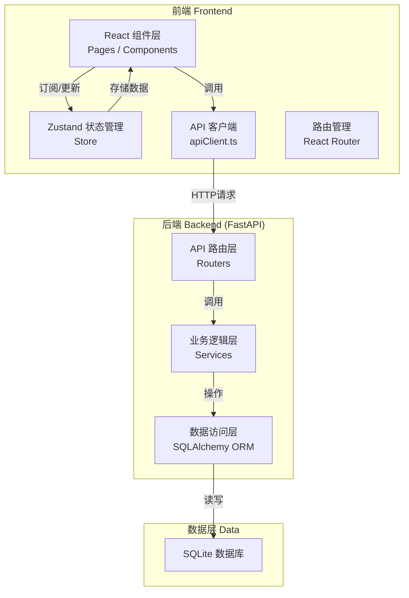
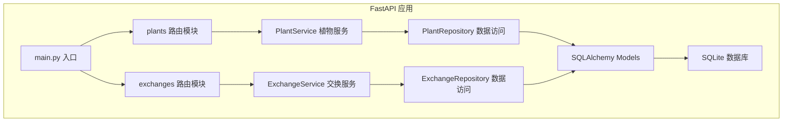
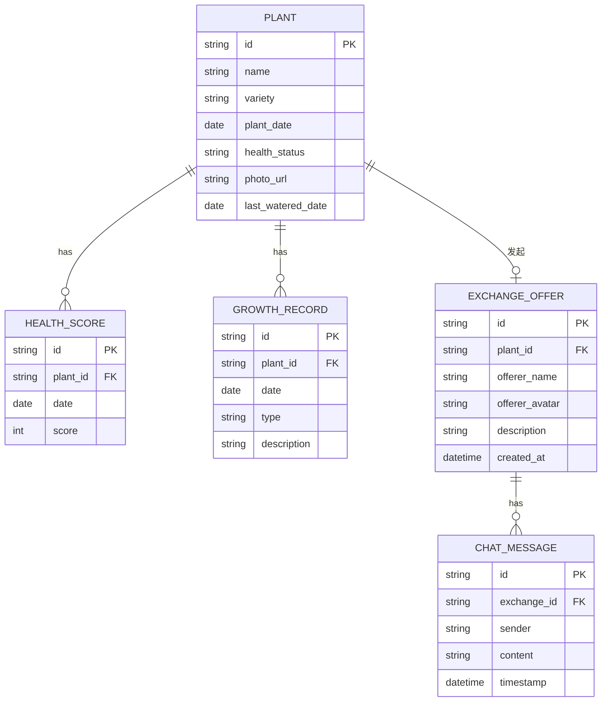

## 1. 架构设计



## 2. 技术描述

### 2.1 前端技术栈

- **框架**：React 18 + TypeScript
- **构建工具**：Vite
- **状态管理**：Zustand
- **路由**：React Router DOM
- **图表库**：Recharts
- **日期处理**：date-fns
- **唯一ID**：uuid
- **样式方案**：原生 CSS（CSS Modules 风格内联样式）

### 2.2 后端技术栈

- **Web 框架**：FastAPI（Python）
- **ORM**：SQLAlchemy
- **数据库**：SQLite
- **文件上传**：FastAPI UploadFile

### 2.3 项目初始化

前端使用 Vite + React + TypeScript 模板初始化，后端使用 Python FastAPI 手动搭建。

## 3. 路由定义

### 3.1 前端路由

| 路由路径 | 页面组件 | 用途 |
|---------|---------|------|
| `/` | Dashboard | 首页 - 植物日记列表 |
| `/plant/:id` | PlantDetail | 植物详情页 |
| `/exchange` | ExchangeSquare | 交换广场 |
| `/exchange/:id` | ExchangeDetail | 交换详情页 |

### 3.2 后端 API 路由

| 方法 | 路径 | 用途 |
|------|------|------|
| GET | `/api/plants` | 获取所有植物列表 |
| GET | `/api/plants/{id}` | 获取单株植物详情 |
| POST | `/api/plants` | 创建新植物 |
| PUT | `/api/plants/{id}` | 更新植物信息 |
| DELETE | `/api/plants/{id}` | 删除植物 |
| POST | `/api/plants/{id}/water` | 标记浇水 |
| POST | `/api/plants/{id}/pest` | 记录病虫害 |
| GET | `/api/plants/{id}/records` | 获取生长记录 |
| GET | `/api/exchanges` | 获取交换请求列表 |
| GET | `/api/exchanges/{id}` | 获取交换请求详情 |
| POST | `/api/exchanges` | 创建交换请求 |
| POST | `/api/exchanges/{id}/messages` | 发送私信 |
| GET | `/api/exchanges/{id}/messages` | 获取私信列表 |

## 4. API 定义

### 4.1 TypeScript 类型定义

```typescript
// 植物健康状态
type HealthStatus = 'good' | 'fair' | 'poor';

// 植物信息
interface Plant {
  id: string;
  name: string;
  variety: string;
  plantDate: string;
  healthStatus: HealthStatus;
  photoUrl: string;
  lastWateredDate: string | null;
  healthScores: HealthScore[];
  records: GrowthRecord[];
}

// 健康评分记录
interface HealthScore {
  id: string;
  date: string;
  score: number; // 1-5
}

// 生长记录
interface GrowthRecord {
  id: string;
  date: string;
  type: 'water' | 'pest' | 'note';
  description: string;
}

// 交换请求
interface ExchangeOffer {
  id: string;
  plantId: string;
  plantName: string;
  plantPhotoUrl: string;
  offererName: string;
  offererAvatar: string;
  description: string;
  createdAt: string;
  messages: ChatMessage[];
}

// 私信消息
interface ChatMessage {
  id: string;
  sender: string;
  content: string;
  timestamp: string;
}
```

### 4.2 请求/响应示例

**创建植物请求**：
```json
{
  "name": "多肉植物",
  "variety": "景天科",
  "plantDate": "2026-06-18",
  "healthStatus": "good",
  "photo": "文件上传"
}
```

**创建植物响应**：
```json
{
  "id": "uuid-string",
  "name": "多肉植物",
  "variety": "景天科",
  "plantDate": "2026-06-18",
  "healthStatus": "good",
  "photoUrl": "/uploads/xxx.jpg",
  "lastWateredDate": null,
  "healthScores": [
    {"id": "...", "date": "2026-06-18", "score": 5}
  ],
  "records": []
}
```

## 5. 服务器架构图



### 后端模块文件结构

```
backend/
├── main.py              # FastAPI 入口
├── database.py          # 数据库连接
├── models.py            # SQLAlchemy 模型
├── schemas.py           # Pydantic 数据模型
├── routers/
│   ├── plants.py        # 植物相关API
│   └── exchanges.py     # 交换相关API
├── services/
│   ├── plant_service.py # 植物业务逻辑
│   └── exchange_service.py # 交换业务逻辑
└── uploads/             # 图片上传目录
```

## 6. 数据模型

### 6.1 ER 图



### 6.2 数据初始化

- 应用启动时自动创建数据库表
- 初始化若干示例植物和交换请求数据
- 提供默认用户（"园艺爱好者"）用于演示

### 6.3 前端状态管理 (Zustand)

```typescript
interface AppState {
  plants: Plant[];
  exchangeOffers: ExchangeOffer[];
  currentPlant: Plant | null;
  currentExchange: ExchangeOffer | null;
  isLoading: boolean;
  modalOpen: boolean;
  
  // Actions
  fetchPlants: () => Promise<void>;
  addPlant: (plant: CreatePlantData) => Promise<void>;
  waterPlant: (plantId: string, score: number) => Promise<void>;
  recordPest: (plantId: string, description: string, score: number) => Promise<void>;
  fetchExchanges: () => Promise<void>;
  createExchange: (data: CreateExchangeData) => Promise<void>;
  sendMessage: (exchangeId: string, content: string) => void;
  toggleModal: () => void;
}
```
